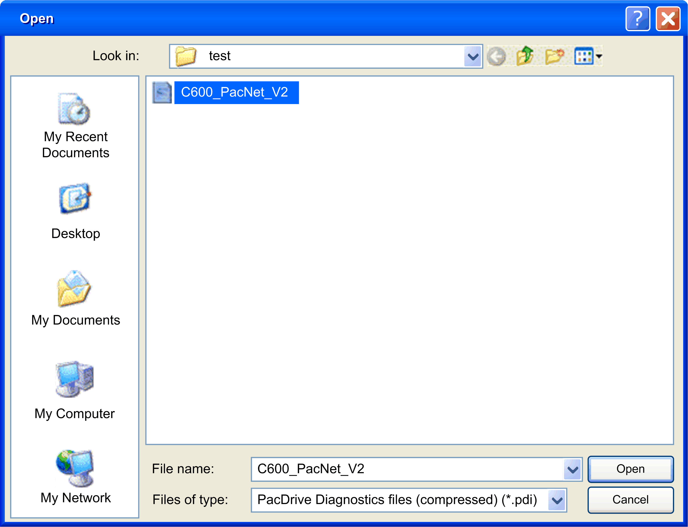

# Opening Data Files

## Overview

Click the  Open... button in the  Home window to open a standard Windows Open dialog box for opening the data file.

Open dialog box:

Enter the desired path and file name and confirm with  Open.

You can select files of type .pdi ([compressed file format](D-SE-0041403.html#D-SE-0041403)) or .xml (no compression).

EIO0000002005.05