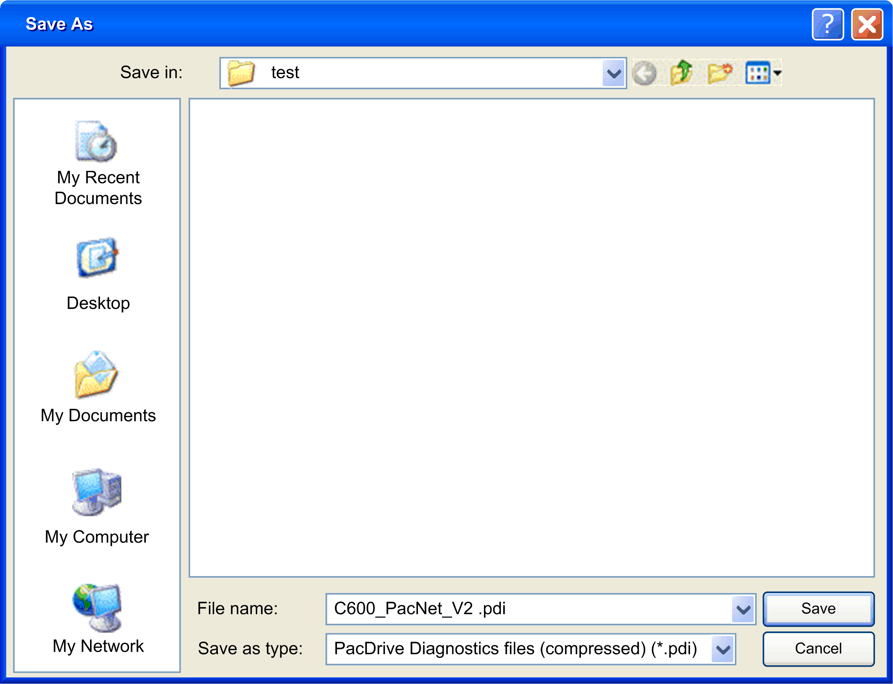

# Saving Data

## Overview

Click the  Save... button in the  Home window to save diagnostics data to a file. The Machine info  [dialog box opens](D-SE-0041429.html#D-SE-0041429).

Enter the hardware code of your controller (see nameplate  HW: xxx) and further information. Click OK to open a Save As dialog box

Save As dialog box:

Enter the desired path and file name and click  Save to confirm.

You can save the files as type .pdi ([compressed file format](D-SE-0041403.html#D-SE-0041403)) or .xml (no compression).

EIO0000002005.05