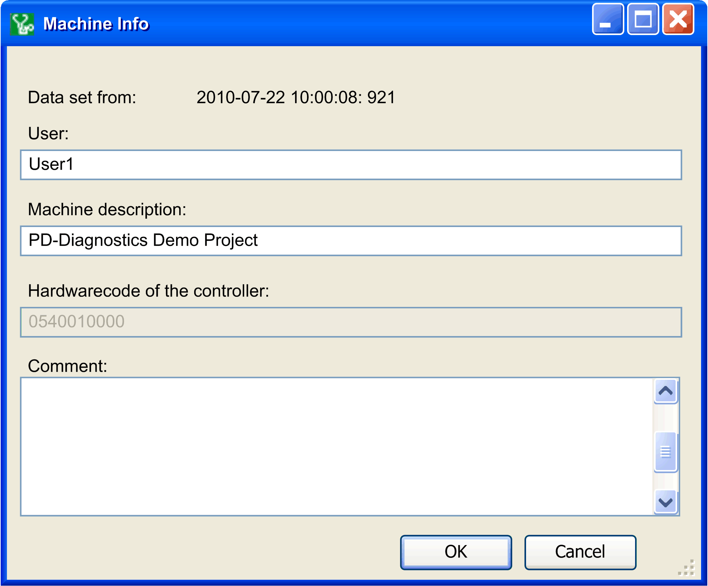

# Machine Information

## Overview

Click the  Machine info button in the  Home window to open the  Machine info dialog box. It allows you to enter additional information about the controller or the operator.

The Machine info dialog box is displayed automatically every time before you [save](D-SE-0041428.html#D-SE-0041428) and [send data](D-SE-0041435.html#D-SE-0041435).

| Element | Description |
| --- | --- |
| Data set from: | Displays the date and time of the last time data was downloaded from the controller. This information changes every time the data is updated. |
| User: | Information about the machine operator. |
| Machine description: | You can enter a meaningful name for the controller here for easier identification. |
| Hardwarecode of the controller: | You can find the hardware code of the controller on the nameplate (HW:xxx ). |
| Comment | You can enter an individual comment about this data collection here. |
| OK | Accepts the entered data and closes this dialog box. (This button is only shown upon an inquiry.) |
| Cancel | Discards the entered data and closes this dialog box. (This button is only shown upon an inquiry.) |

EIO0000002005.05