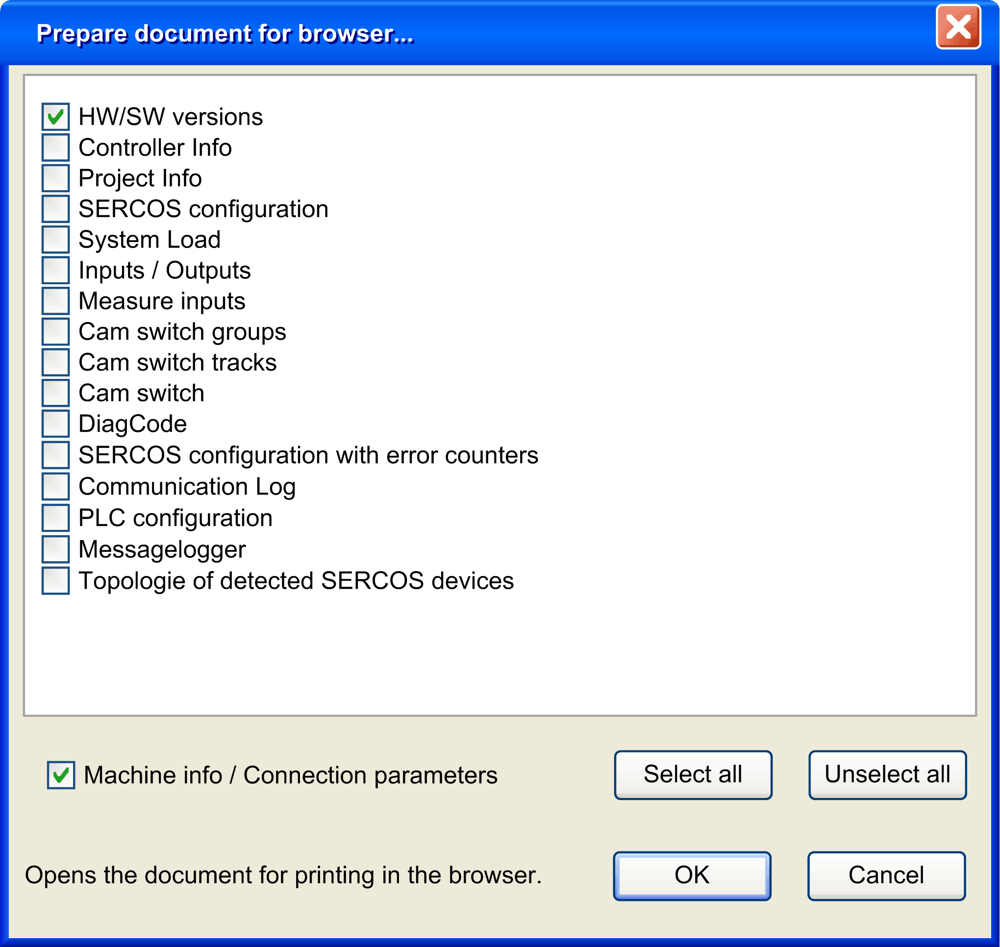

# Printing

## Overview

Click the  Print ... button in the [toolbar](D-SE-0041404.html#D-SE-0041404) to open the following dialog box:

All elements to be displayed are listed. Depending on where you are in the program, a varying number of partial documents are proposed.

You can modify this selection by adding or removing check marks.

If you select the option Machine info/Connection parameters, this information is added to the target document.

If you click the  OK button, an .html file is created from the documents you have chosen and [displayed in the default browser](D-SE-0043031.html#D-SE-0043031). Use your browser to view, save or print the .html file using the browser functionalities.

NOTE: It may take some time to process or print the data in your browser. It depends on the size of the document.

EIO0000002005.05