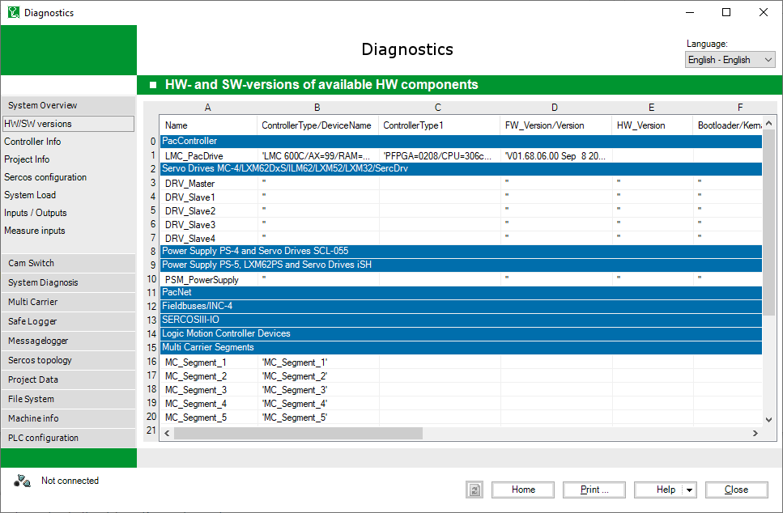

# General Information

## Overview

For a general description of this window, refer to [Displaying Data](D-SE-0041406.html#D-SE-0041406).

The following sections provide insight into the available views.

The various views provide a display of the [objects of the controller and their values](D-SE-0041415.html#D-SE-0041415). For example, a detailed view of the [hardware and software versions of the controller](D-SE-0041413.html#D-SE-0041413) and the actively connected slaves, such as motors and power supply units, is provided.

If errors are detected as the data is downloaded from the controller, these are shown in a [**Communication Log** view](D-SE-0041416.html#D-SE-0041416).

The controller itself records the events and error states. Use the [message logger](D-SE-0041414.html#D-SE-0041414) to view and supplement these with your own comments.

The group Multi Carrier provides various objects regarding the Multi Carrier product line.

The group Project Data provides information about the applications and tasks of the controller.

The group File System provides information about the file system of the controller.

NOTE: The message logger is not added via the refresh button . This is performed via the contextual menu in the message logger data view. You can manage several message loggers in this way. Message logger version states selected are retained and will not be overwritten by frequently clicking the refresh button.

EIO0000002005.05