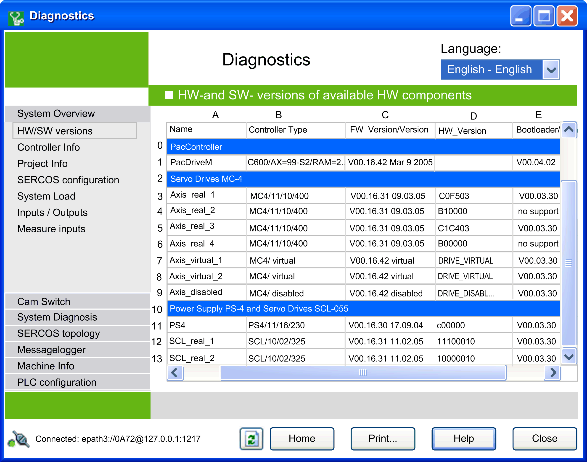

# Hardware and Software Versions

## Overview

The  HW- and SW-versions of available HW components  view provides a summary of the hardware and software versions of the controller as well as the actively connected slaves. This gives you an overview of incompatibilities.

EIO0000002005.05