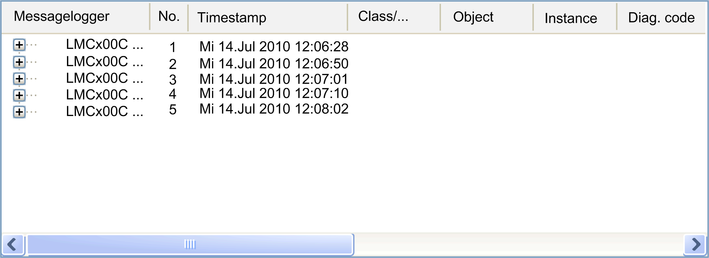
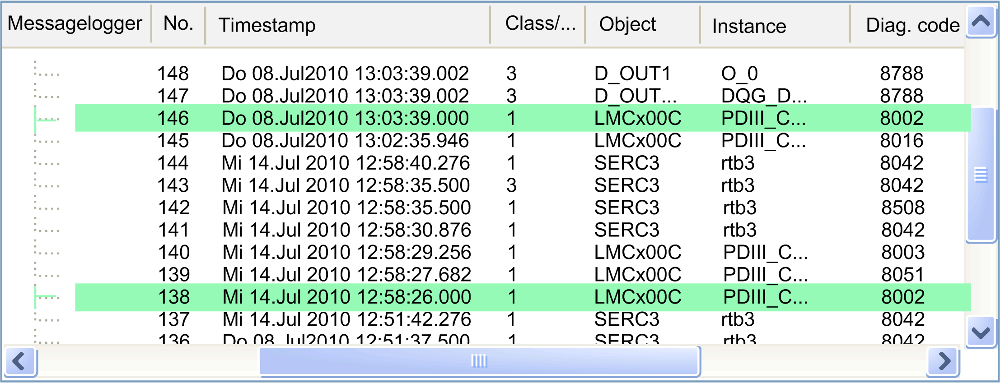
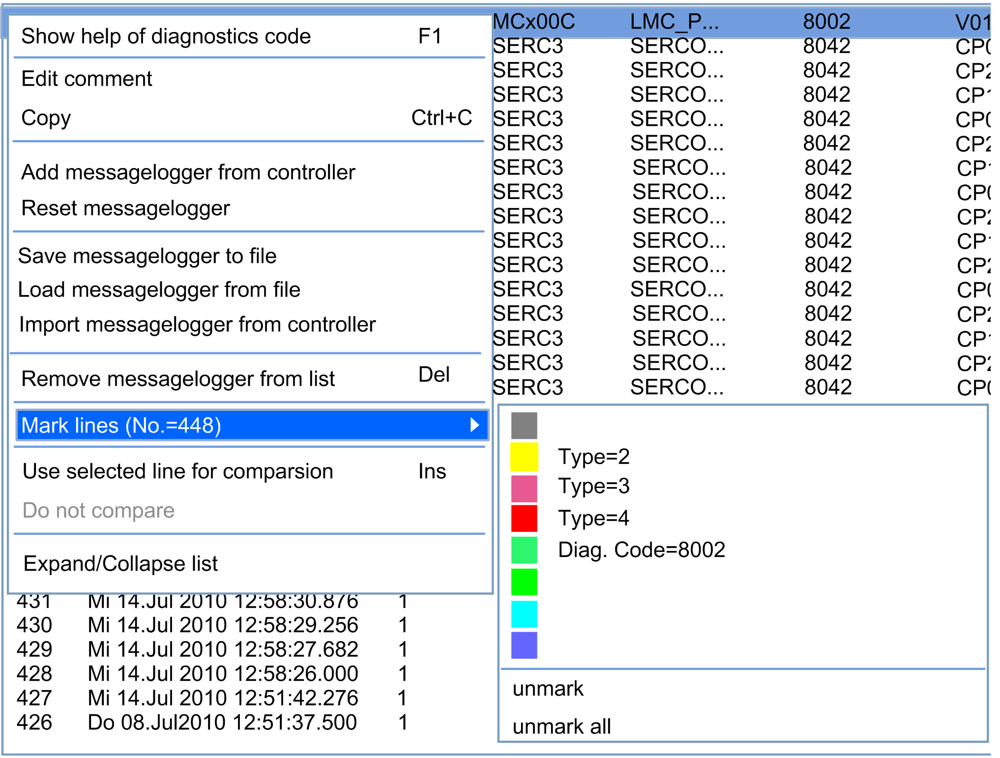

# Message Logger

## Overview

The message logger records the events on the controller. This information is categorized, evaluated, and clearly displayed in Diagnostics. In case an error is detected, this information helps to solve a problem or locate the error.

This data view displays the information of the message logger. For example, you can consecutively call and process data of various message loggers from the controller. You can also add message logger files which have previously been saved with Diagnostics.

It is also possible to

* Save the displayed message loggers as a file.
* Remove the displayed message loggers from the list.

Further, it is possible to

* Provide every line with its own comment.
* Mark lines with certain properties in a different color.

These options are available directly through the contextual menu (right-click).

The following dialog box shows five message loggers.

The displayed time corresponds to the time the item was added to this dialog box. The numbering is continuous.

You can open the selected message logger by clicking the plus (+) icon to the left of the logger. To close it, click the minus ( –) icon.

Some entries are highlighted in color. This helps you to find lines with comparable properties within the message logger. You can adjust it using the contextual menu. After saving or sending and then opening the file, the last selected color settings are retained.

## Display Diagnostic Code Help

Select Desplay diagnostic code help  from the contextual menu. This opens the help file corresponding to the Diag. code  of the selected entry.

## Edit Comment

Select  Edit comment from the contextual menu. You can add any comment for each entry. In this way, you can add additional information, which provides an overview of the detected errors in case service is required, even after a long time.

## Copy

Select  Copy from the contextual menu or press Ctrl + C. You can copy the contents of the selected line to the Clipboard and then paste them into any text processing application.

## Download Additional Message Logger from the Controller

Select Download additional message logger from the controller from the contextual menu. The action creates a new message logger in the data view. A new continuous numbering with the time stamp is created.

## Reset Message Logger (Only Available in Logic Builder)

Select Reset message logger  from the contextual menu. This action locally creates an empty message logger (that does not contain any messages) in the data view and also deletes the message logger on the controller. All message logger entries of the controller are removed.

## Save Message Logger to File

Select Export message logger  from the contextual menu. A Windows dialog box opens. Enter a file name and save the selected message logger to any directory.

## Load Message Logger from File

Select Import message logger  from the contextual menu. A Windows dialog box opens. Use this dialog box to select the desired message logger which is saved in any directory. The action creates a new message logger in the data view. A continuous numbering without the time stamp is created.

## Import Message Logger from Controller (Only Available in Logic Builder)

Select Import message logger from controller from the contextual menu. A Windows dialog box opens. Use this dialog box to select the desired message logger which is saved on the controller. The action creates a new message logger in the data view. A continuous numbering without the time stamp is created.

## Remove Message Logger from List

Select Remove message logger from the list from the contextual menu or press the Delete key. This deletes the selected message logger(s) from the list.

You can select several message loggers by pressing the Ctrl key.

## Mark Lines

In the message logger, you can mark (highlight) lines which contain certain properties in common in different colors. For example, you can highlight all rows of Type (corresponds to the column header) 2  (corresponds to the cell value itself) in pink. Or you can highlight all lines with Diag. code = 8002 in lime green.

The following contextual menu shows the configuration that is described in the preceding paragraph. The selection criteria are shown after the color highlighting.

Select Mark lines (xxx=yyy)  from the contextual menu. A submenu which already shows some color entries with their corresponding selection text opens. Here, as described in the example, with Type=2  and Diag. code=8002 .

You can define your own selection criteria. The selected text is determined by the last column selected before the contextual menu was called. Proceed as follows:

Add/Change a color entry:

| Step | Action |
| --- | --- |
| 1 | Right-click the column with the desired selection criterion (for example, column header  Diag. code and cell value  8014).  **Result:** The contextual menu opens. |
| 2 | Click Mark lines (Diag. code=8014).  **Result:** The submenu with the color selections opens. |
| 3 | Choose a highlighting color, for example, blue.  **Result:** All lines with the selection criterion (Diag. code=8014)  are highlighted in blue. |

Delete a color entry:

| Step | Action |
| --- | --- |
| 1 | Right-click the line with the color you want to remove in the message logger.  **Result:** The contextual menu opens. |
| 2 | Click Mark lines.  **Result:** The submenu with the color selections opens. |
| 3 | Click Unmark .  **Result:** All line highlighting with this color is unmarked. |

Delete all color entries:

| Step | Action |
| --- | --- |
| 1 | Right-click the line with the color you want to remove in the message logger.  **Result:**The contextual menu opens. |
| 2 | Click Mark lines.  **Result:** The submenu with the color selections opens. |
| 3 | Click Unmark all.  **Result:** All color markings are removed. |

NOTE: It may happen that one line matches several valid color selection criteria. For example, the colors green and red could correspond to the Diag. code=8014 . In this case, the color used is the color that is listed lower in the contextual menu.

NOTE: If a color selection criterion has been applied to several colors, the marking with the highest priority is removed first when unmarking.

## Use Selected Line for Comparison

Select Use selected line for comparison  from the contextual menu or press the Insert key. Thus, you can highlight the selected line in **bold** in order to facilitate comparison with other lines. If you click a different message, the time difference to this line marked in bold is shown in the status bar (for example, Time difference: 0.00:03:36.992 of 500(1) with regard to 481(1)).

## Do Not Compare

Select  Do not compare from the contextual menu to reset a preliminary selected line for comparison again and to remove the bold marking.

## Expand/Collapse List

By selecting Expand/collapse list  from the contextual menu, all message loggers can alternatively be fully collapsed or expanded.

EIO0000002005.05