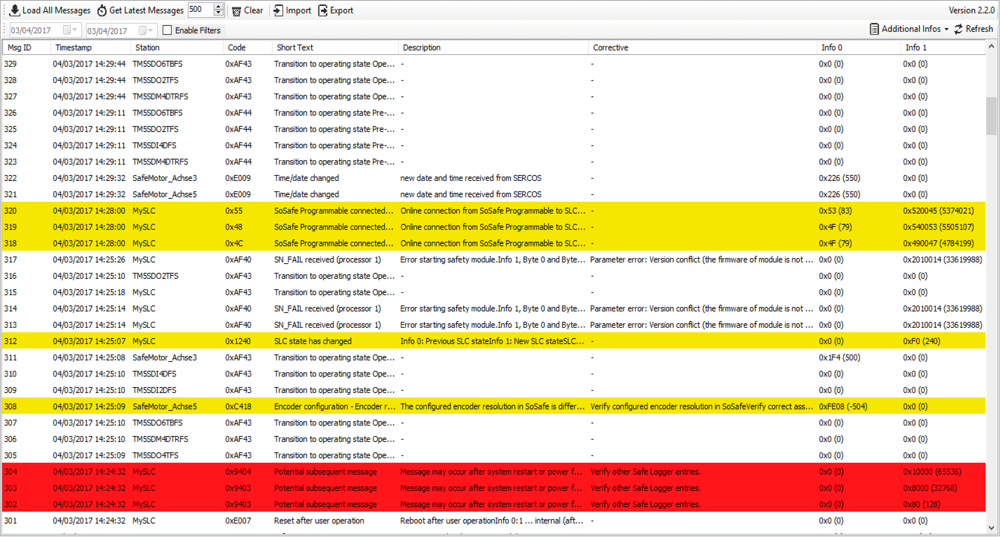

# Safe Logger Window

## Overview

The Safe Logger is a module of the EcoStruxure Machine Expert - Safety. The safe logger allows you to manage the messages generated by the safety-related devices. The messages allow you to monitor the status of your machine, installation or process, and support you in diagnostics and troubleshooting (refer to chapter Diagnostics and Troubleshooting in the ).

The messages originate from the safety-related equipment connected to the Safety Logic Controller (SLC) of your machine via the Sercos fieldbus and managed by EcoStruxure Machine Expert - Safety.

The messages are stored in an XML file on the Logic Controller. The Safe Logger allows you to display and manage the messages and the corresponding XML file.

The Safe Logger provides the following functions:

* Display messages with the associated additional information
* Sort messages
* Filter messages
* Search messages
* Import and export messages from and to XML files

The following graphic presents the Safe Logger window:

## Message List

Each row in the message list contains one message. The following information is provided on a message in the columns of the message list:

| Column | Meaning |
| --- | --- |
| Msg ID | The message ID is a consecutive number assigned in the sequence in which the messages are generated. By default, the list of messages is sorted by the message ID. |
| Timestamp | The timestamp indicates the date and time when the message was generated.  If a message is generated immediately after the start of the SLC while the SLC has not yet completed the timestamp synchronization routine, the timestamp 01/01/1970 00:00:00 is used for the message. |
| Station | Station identifies the device which generated the message. This column shows the same name that is used in the Devices tree for the corresponding device. |
| Code | The message code in hexadecimal format. The message code identifies a message. |
| Short Text | Title of the message. |
| Description | Message details. In the case of an error message or an alert message, the description contains information on the potential cause of the error or alert. |
| Corrective | In the case of an error message or an alert message, possible remedies to remove the cause of the error or alert are displayed. |
| Info 0 and Info 1 | Additional information on messages, the circumstances, and events that triggered the message, and corrective actions. The information is shown in hexadecimal format, followed by the decimal number in parentheses. The [list of messages](../../../../../api/crossBook?lang=en-US&virtualBookName=SafeLog&topicID=D_SE_0067350) explains the meaning of the values in Info 0 and Info 1 in conjunction with the message descriptions. |

If the Safe Logger window displays a message with a message code that is not contained in the [list of messages](../../../../../api/crossBook?lang=en-US&virtualBookName=SafeLog&topicID=D_SE_0067350), you may not be using the latest software version. In such a case, update to the latest software version. If the condition persists, contact your Schneider Electric service representative.

## Message Types

The messages are classified according to three message types:

* Information messages
* Alert messages
* Error messages

Information messages are displayed with a **white** background.

Alert messages are displayed with a **yellow** background. An alert indicates a potential issue that was detected by a monitoring function. An alert does not trigger a transition of the operating state.

Error messages are displayed with a **red** background. An error is a discrepancy between a computed, measured, or signaled value or condition and the specified or theoretically correct value or condition detected by a monitoring function. A detected error triggers a transition of the operating state.

For further information about error messages, refer to the chapter Diagnostics and Troubleshooting in the .

The SLC determines the classification of a message during runtime. This means that the same message can be used to indicate a detected error or an alert. The classification during runtime depends, among other things, on the circumstances in which an event occurs and on the severity of the event in a given circumstance.

## Functions

The Safe Logger window provides the following functions via buttons at the top of the window:

| Button/Function | Description |
| --- | --- |
| Load All Messages | Online mode (Diagnostics is connected to the controller):   * Click this button to load the messages from the SLC. |
| Offline mode (Diagnostics is not connected to the controller):   * Click this button to load the messages from internal repository of Diagnostics. |
| Get Latest Messages | Click this button to display the latest messages stored on the SLC. Use the control next to this button if you want to load a specific number of messages. In the field, you can enter a number of messages to be loaded or click the Up and Down buttons to modify the number shown in the field.  This button is disabled in Offline mode (Diagnostics is not connected to the controller). |
| Clear | Click this button to clear the list of displayed messages. This function clears the message list, but it does not delete the messages from the XML file, or the internal repository of Diagnostics. |
| Import | Click this button to import messages from an XML file that was previously exported with the  Export function. |
| Export | Click this button to export the displayed messages to an XML file. |
| Enable Filter | Click this check box if you want to display messages by date. |
| Date controls | Click these controls to specify the date range for displaying messages by date.  The left date control specifies the start date, the right date control specifies the end date of the date range. |
| Additional Infos | Click this button to show/hide the columns Info 0 and Info 1. |
| Refresh | Click this button to refresh the message list. |

EIO0000002005.05