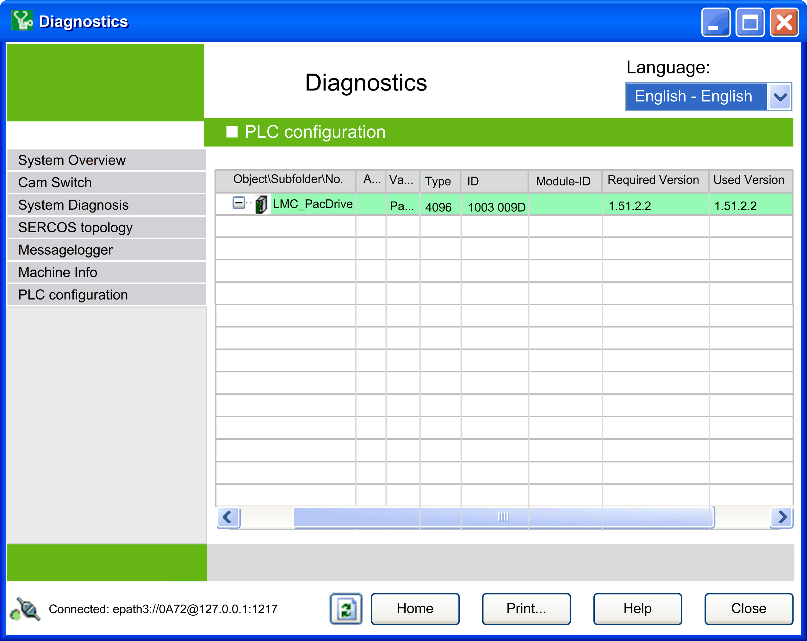
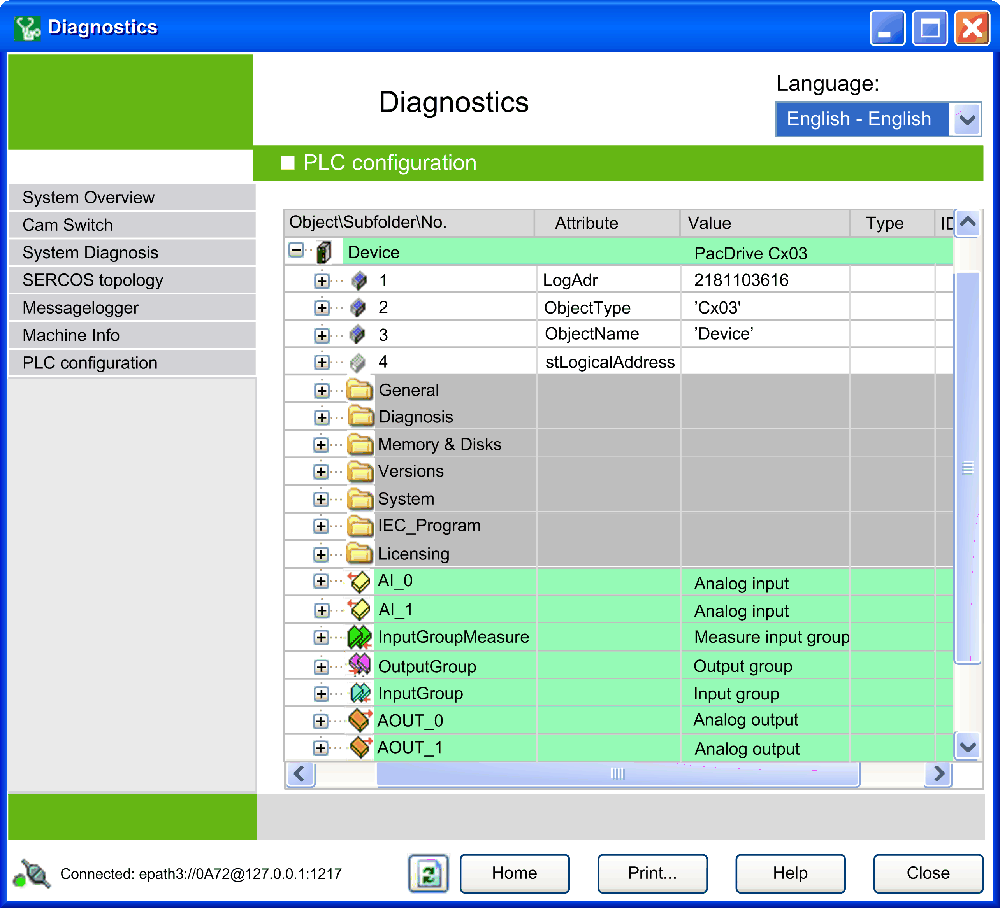

# PLC Configuration

## Overview

In the  Views window, select  PLC configuration to open the  PLC Configuration view. This view summarizes the objects of a controller and their values in a tree structure.

While the other data views cover only a certain perspective of the data, this view includes all objects of the controller and their values.

The following figure shows an example of the  PLC configuration view. The information displayed in this view varies, depending on the selected controller:

Some controllers provide information on the  Required Version and the  Used Version in this view. The column Required Version  shows the versions of the device descriptions that are required by the project. The column Used Version shows the version that is used by Diagnostics to request the data from the controller. If Diagnostics detects the appropriate device description inside the installation of the PC, both columns have the same value. However, if the appropriate device description is not available, a fallback version can be used with the latest available version. In this case, the version number is displayed in bold.

Click the plus (+) sign to open a subelement.

By choosing Expand/Collapse list  from the contextual menu, you can fully collapse or expand all elements.

EIO0000002005.05