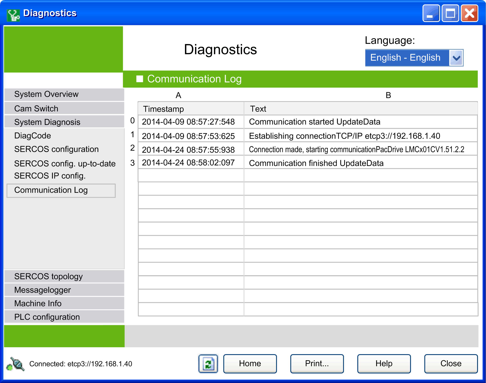

# Communication Log

## Overview

Select the data view button communication log  below the System Diagnosis  group button in the [**HW- and SW-versions of available HW components** window](D-SE-0041406.html#D-SE-0041406) to open the Communication Log view.

The communication events to and from the controller are recorded here. Detected errors are also logged in this view.

EIO0000002005.05