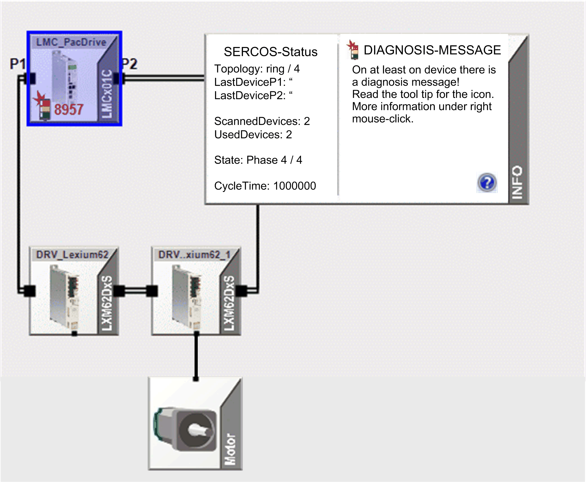
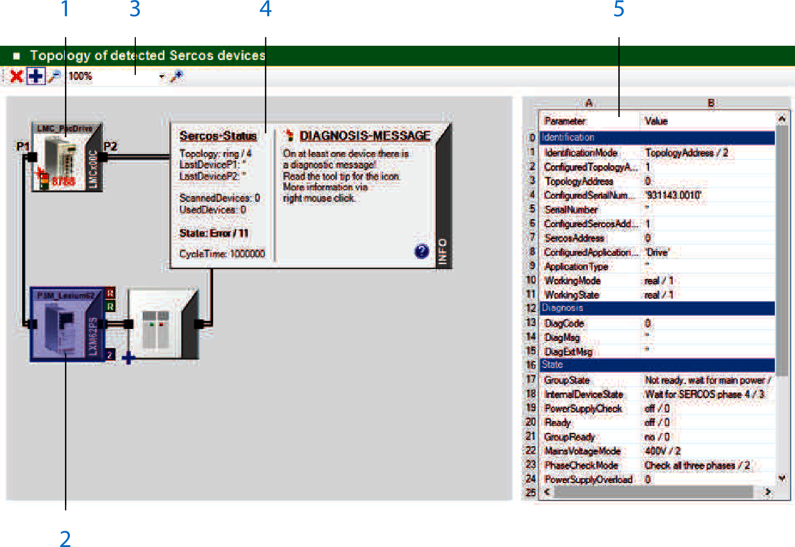
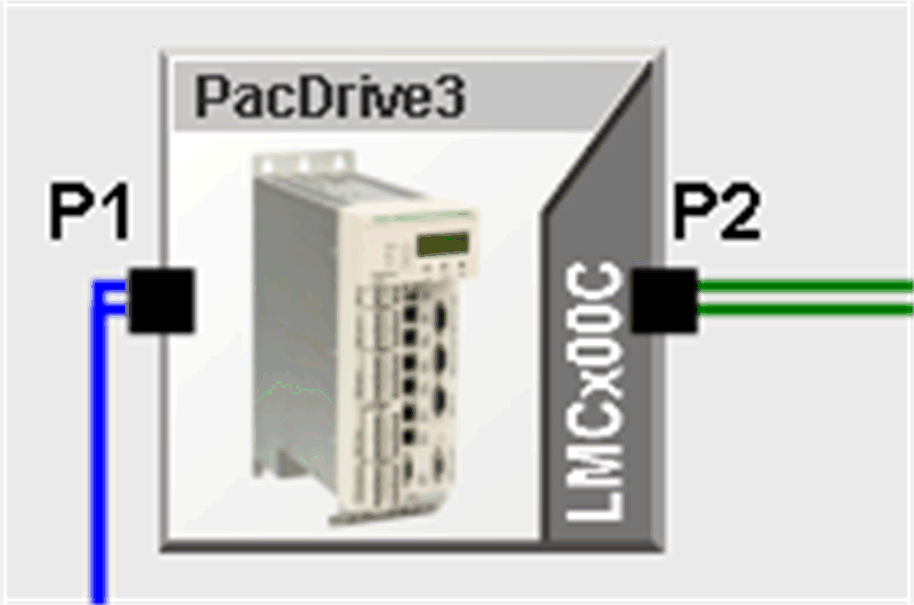
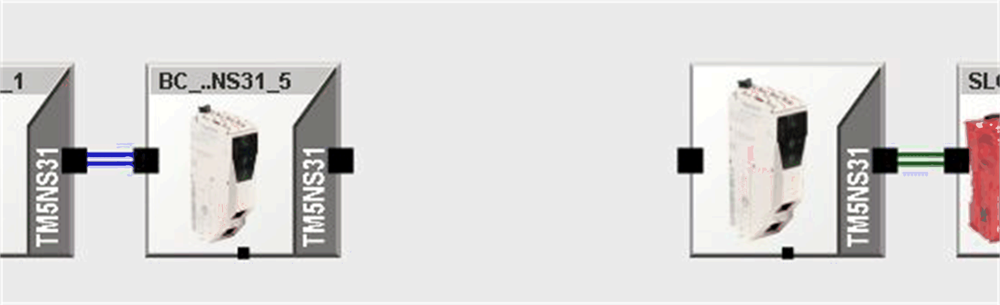
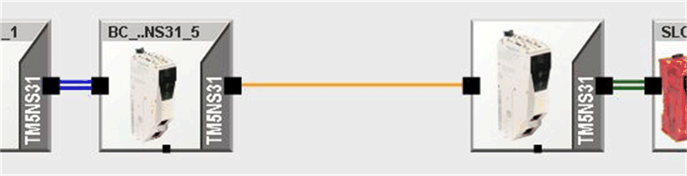
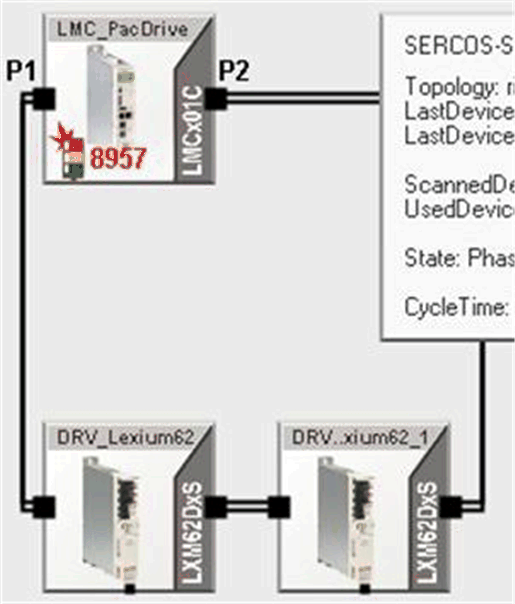
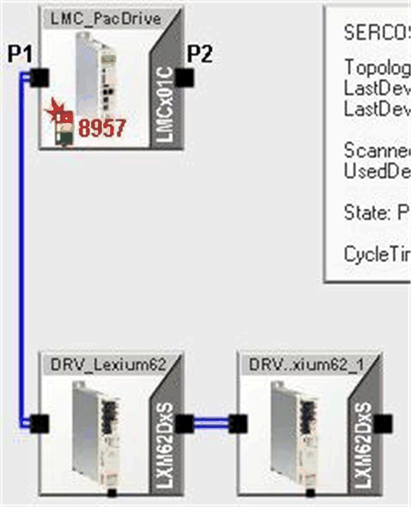
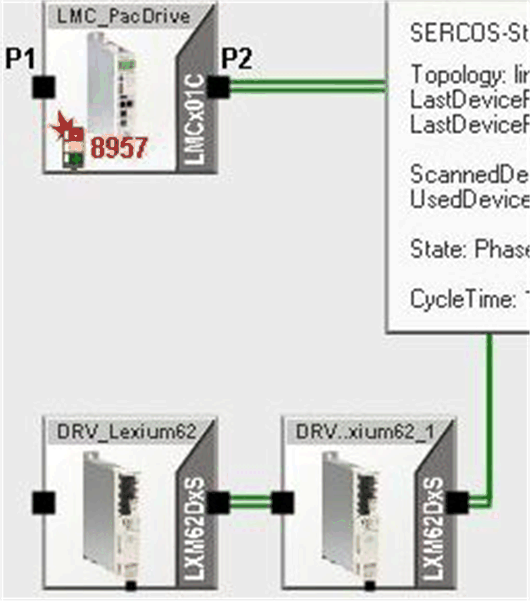
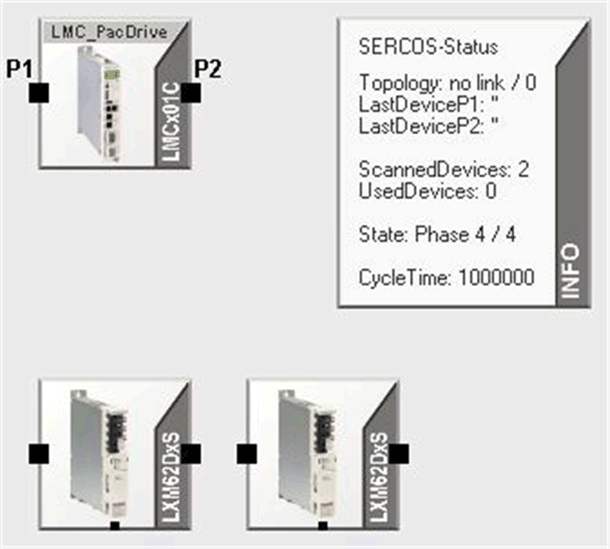

# General and Sercos III-Specific Information

## General

The topology describes the arrangement of devices and their connections to one another.

NOTE: The graphic displays only the actually determined, real topology. This is dynamically generated during every startup of the Sercos bus (in phase 2 and 3) and stored in the memory of the controller.

When shutting down the controller, the data is lost. If the expected devices are not shown in the graphic, verify the following:

* Is there a ring interruption?
* Has a value greater than 1 been entered in the parameter  PhaseSet?
* Has an error been detected for the parameter  State of the Sercos bus?
* Are only virtual devices configured (parameter  RealTimeBusAdr) in the [**PLC configuration** view](D-SE-0041415.html#D-SE-0041415)?
* Has an error been detected in the [message logger](D-SE-0041414.html#D-SE-0041414)?

This view simplifies diagnostic of detected Sercos bus errors and the diagnostic messages of the devices. The graphical display of the devices and connections helps to localize Sercos bus errors and the diagnostic messages of the devices.

The devices are displayed according to their physical sequence in the Sercos loop.

## Overview

**1** Controller (Sercos master)

**2** Device (Sercos slave)

**3** Toolbar

**4** General information about the Sercos bus, such as the ring status or the phase, is displayed in the **INFO** field. You can extend the information window as required. It serves as a legend for the graphical display.

**5** Parameters of the selected device. Click a device to select it. The device is highlighted in a blue frame.

## Toolbar

The toolbar provides the following buttons:

|  |  |
| --- | --- |
|  | This button provides a filter function. Click this button to display Sercos devices that are contained in the controller configuration, but that are not physically present on the Sercos bus, or that could not be assigned. The corresponding devices are marked with a red “x” in the Topology View window.  NOTE: The function Browse Sercos devices does not allow for an assignment. This means that the devices contained in the controller configuration are marked with a red "x" if you use this function.  If the filter is active, the button is displayed with a blue frame. |
|  | This button provides a filter function. Click this button to display Sercos devices that are physically present on the Sercos bus, but that are not contained in the controller configuration, or that could not be assigned. The corresponding devices are marked with a blue “+” in the Topology View window.  NOTE: The function Browse Sercos devices does not allow for an assignment. This means that the devices physically present on the Sercos bus are marked with a blue "+" if you use this function.  If the filter is active, the button is displayed with a blue frame. |
|  | Click this button to zoom out in the Topology View window. |
|  | Use this control to select one of the zoom levels between 10 % and 500 %. The control also provides an option to fit all devices into the Topology View window. |
|  | Click this button to zoom in in the Topology View window. |

## Device Display

The graphic shows the display of a controller with, for example, two Sercos master ports P1 and P2:

The graphical display shows the device type (in the example  LMCx00C) and the device name in the PLC configuration (here PacDrive3 ). Unknown third-party devices are displayed without the icon and the device type name is replaced by  ???.

If you select the device, the parameters of the selected device from the  PLC configuration are shown on the right-hand side of the Diagnostics screen. The device is highlighted in a blue frame.

The parameters are from the areas of

* Diagnostic
* Status
* Device type name and
* Version number

If Sercos topology double line is detected, the devices at the end of both lines are displayed with more distance to one another and are not connected:

A broken Sercos III ring is marked by a single orange line:

In Sercos III, the devices of a ring topology are connected by double black lines:

Devices connected to P1  are connected by a double line in blue.

Devices connected to P2  are connected by a double line in green.

Devices which are not connected are displayed as follows:

## Contextual Menu

Right-click a device to open the contextual menu of a device. It provides the following commands:

* Go to object in PLC configuration  displays the device directly in the [**PLC configuration** view](D-SE-0041415.html#D-SE-0041415).
* Show help of DiagCode  opens the Diagnostics online help.
* Collect data with new instance of Diagnostics  is available for C2C Slaves.

  A new instance of Diagnostics connects to the selected C2C Slave and retrieves its diagnostic information.
* Copy copies the content of the tooltip of the device to the clipboard.

Right-click the parameters of a selected device to open the contextual menu of the parameters. It provides the following commands:

* Copy copies the parameter name and the parameter value of the selected parameter to the clipboard.
* Copy Value copies the parameter value of the selected parameter to the clipboard.
* Copy All copies the parameter names and the parameter values of the parameter list to the clipboard.

## Tooltip

When you move the mouse over the device, additional brief information is shown in a tooltip.

## Customizing the Graphical Display

To shift the display, click in a free area inside the screen and move the mouse while holding the button. In doing so, a hand appears as the pointer.

You can set the magnification (zoom) of the display using the magnifying glass symbol and the selection box. You can also set the magnification with the mouse wheel. Double-clicking the mouse wheel magnifies the display over the entire topology in the window.

EIO0000002005.05