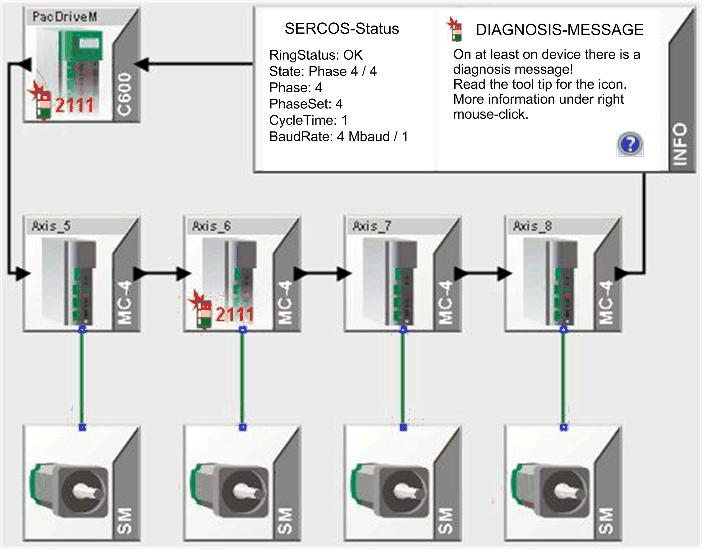

# Diagnostic Message

## Overview

Devices with a diagnostic message are indicated by a traffic light symbol in the lower left of the device symbol. The diagnostic code is shown next to the traffic light symbol.

Using the contextual menu (right-clicking the device), the description for the diagnostic message can be directly shown in the online help. The causes of the diagnostic message and solution are described there.

The MC-4 Axis\_6 has the diagnostic message  2111: Excessive following error.

EIO0000002005.05