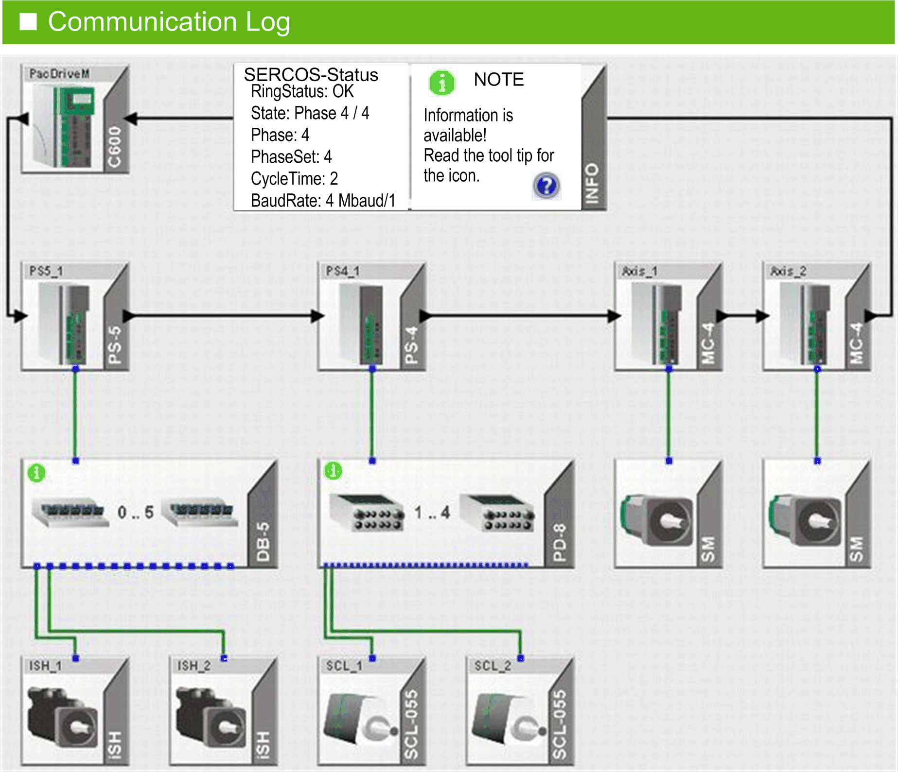
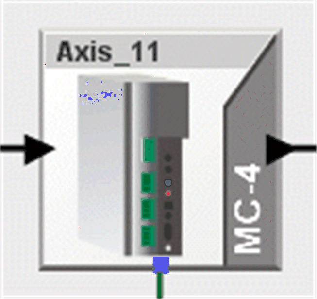
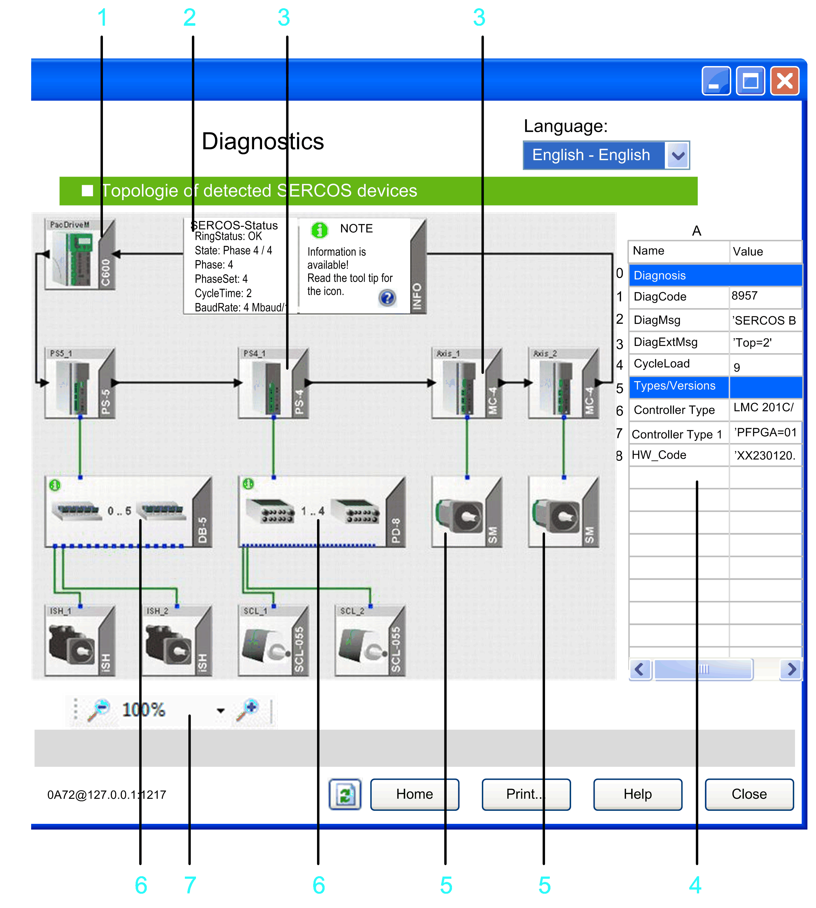

# Specific Information for PacDrive M Controllers

## Overview

The Sercos view described in this chapter only applies to PacDrive M with firmware version superior or equal to V00.16.40 and inferior to V01.00.00.

The topology describes the arrangement of devices and their connections to one another to help to ensure collective data exchange.

NOTE: The graphic displays only the actually determined, real topology. This is dynamically generated during every startup of the Sercos bus (in phase 2 and 3) and stored in the memory of the controller.

When shutting down the controller, the data is lost. If the expected devices are not shown in the graphic, verify the following:

* Is there a ring interruption?
* Has a value greater than 1 been entered in the parameter  PhaseSet?
* Has an error been detected for the parameter  State of the Sercos bus?
* Are only virtual devices configured (parameter  RealTimeBusAdr) in the [**PLC configuration** view](D-SE-0041415.html#D-SE-0041415)?
* Has an error been detected in the [message logger](D-SE-0041414.html#D-SE-0041414)?

This view simplifies diagnostic of detected Sercos bus errors and the diagnostic messages of the devices. The graphical display of the devices and connections helps to localize Sercos bus errors and the diagnostic messages of the devices.

The devices are displayed according to their physical sequence in the Sercos loop. You can recognize the wiring of the system by the different cable types:

* Green: hybrid cable
* Black: fiberoptic conductor

The motor types connected to the servo amplifiers are also displayed differentially. SCL  systems with the PD-8  distribution boxes and iSH  systems with the DB-5  distribution boxes and their wiring are also displayed.

## Device Display

The graphic shows the display of a device in normal operation:

The graphical display shows the device type (in the example  MC-4) and the device name in the PLC configuration (here Axis\_11 ). Using the Go to object in PLC configuration command from the contextual menu (right-clicking the device), the device is displayed directly in the [**PLC configuration** view](D-SE-0041415.html#D-SE-0041415). When you move the mouse over the device, additional brief information is shown in a tooltip.

If you select the device, the parameters of the selected device from the PLC configuration  are shown. The device is highlighted in a blue frame.

The parameters are from the areas of

* Diagnostic
* Status
* Device type name and
* Version number

**1** Controller (Sercos master)

**2** General information about the Sercos bus, such as the ring status or the phase, is shown in the INFO field. You can extend the information window as required. It serves as a legend for the graphical display.

**3** Sercos slave (for example, **MC-4**)

**4** Properties of the selected device. Click a device to select it. The device is highlighted in a blue frame.

**5** **SM**-motor connected to the **MC-4**.

**6** Distribution clamps **DB-5** and **PD-8** with green info symbol **i** (Refer to the *Info Symbol* chapter.)

**7** Zoom for the graphical display.

## Contextual Menu

Right-click a device to open the contextual menu. It provides two commands:

* Go to object in PLC configuration  displays the device directly in the [**PLC configuration** view](D-SE-0041415.html#D-SE-0041415).
* Show help of DiagCode  opens the Diagnostics online help.

## Tooltip

When you move the mouse over the device, additional brief information is shown in a tooltip.

## Customizing the Graphical Display

To shift the display, click in a free area inside the screen and move the mouse while holding the button. In doing so, a hand appears as the pointer.

You can set the magnification (zoom) of the display using the magnifying glass symbol and the selection box. You can also set the magnification with the mouse wheel. Double-clicking the mouse wheel magnifies the display over the entire topology in the window.

## Sercos Bus Diagnostics

If a Sercos error is detected in the system, the affected devices are identified with a colored frame. The affected connections are also marked with a color.

* Orange: A Sercos [error](D-SE-0041421.html#D-SE-0041421) has been detected.
* Orange (with interrupted frame): Sercos errors have been detected in the last operating phase (Phase 4). Once a slave recognizes an error in the current operating state, the display changes back to orange (unbroken-line frame).
* Red: [Permanent Sercos loop interruption](D-SE-0041422.html#D-SE-0041422) detected.

EIO0000002005.05