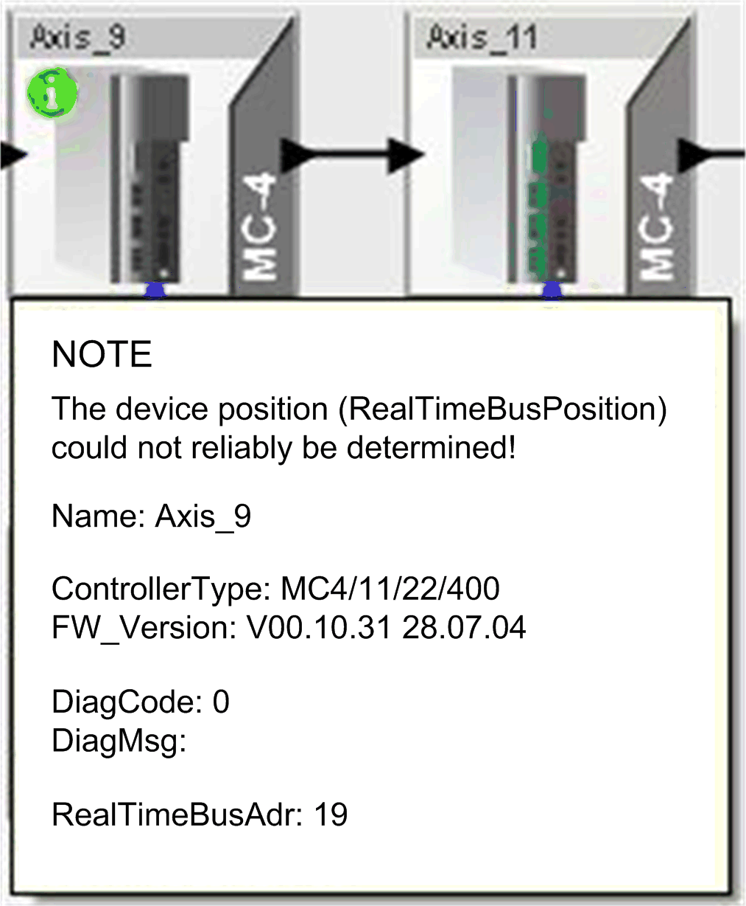
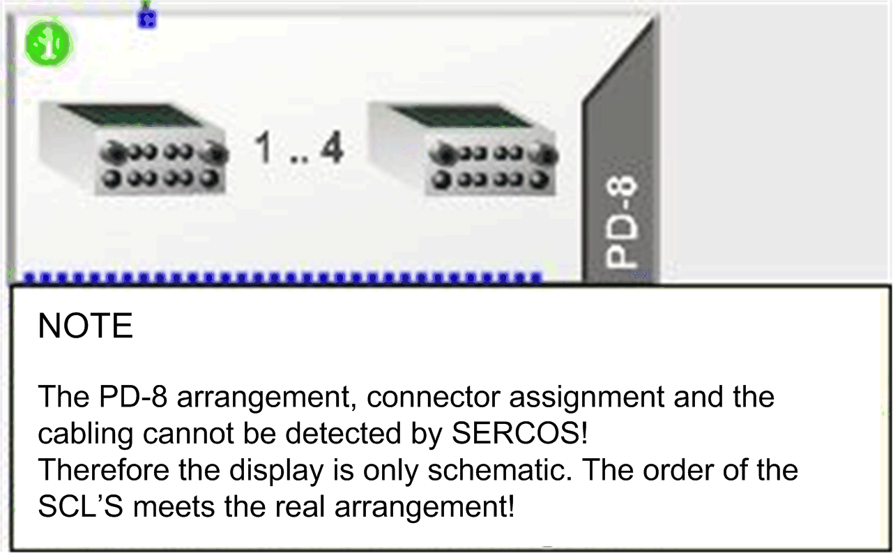
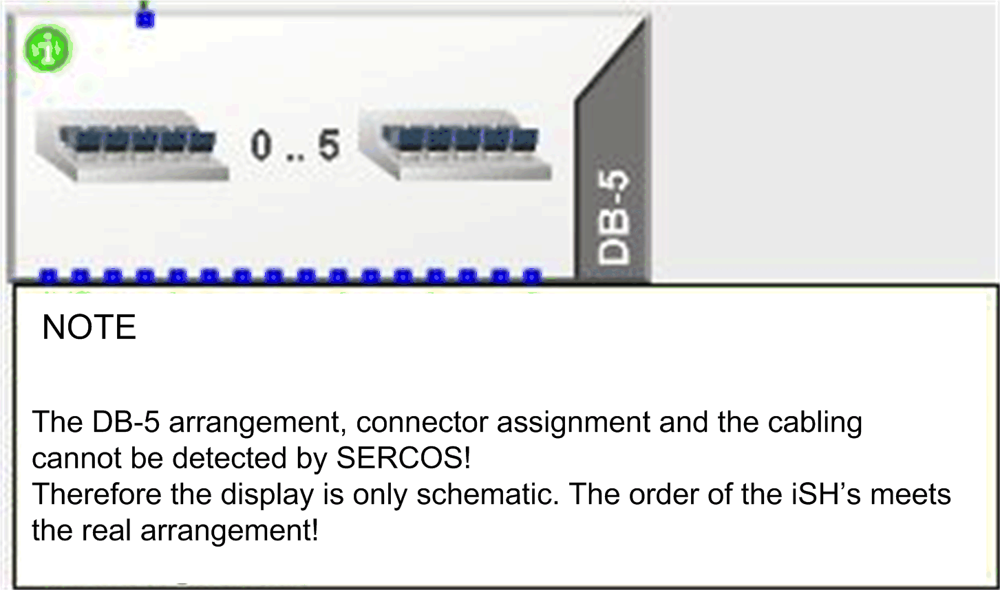
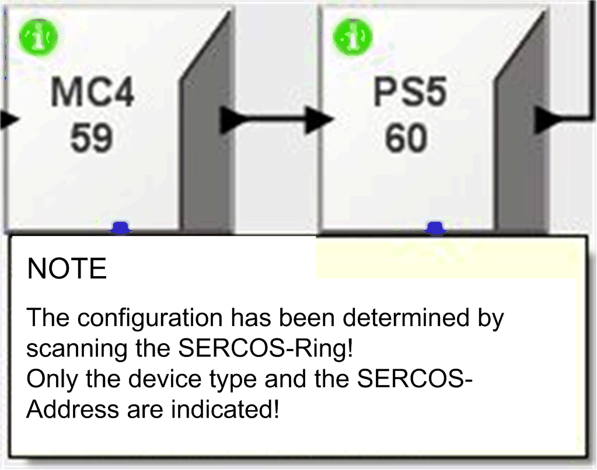

# Info Symbol

## Overview

The green info symbol indicates additional information. This helps to avoid misinterpretations of the illustrated topology.

## MC-4 Servo Amplifier

The servo amplifier MC-4 supports determination of the device position as of firmware version 00.16.00. If a servo amplifier is equipped with an earlier firmware version in the Sercos bus, the device is shown at a free device position. This can have the effect that the device is shown at an incorrect position.

## PD-8 Power Distribution Box

The PD-8 power distribution box is the link between the power supply PS-4 and the integrated servo drive SCL. It serves as a distributor, to which 1 to 8 SCL hybrid cables can be connected, depending on the number of drives. You can easily expand the system using one or more distributors PD-8 when more than 8 drives are operating.

PD-8 is not a Sercos slave with a separate address. It is only a cable distributor. This is not entered in the PLC configuration .

Based on this, it is not possible to determine the arrangement of the power distribution boxes PD-8, the connector assignment and the wiring via the controller and the Sercos bus. Therefore, only one schematic display is shown.

The sequence of the SCLs corresponds to the actual arrangement since their position can be determined in the Sercos bus.

## DB-5 Distribution Box

The DB-5 distribution box is the link between the power supply PS-5 and the integrated servo drive iSH. It serves as a distributor, to which 1 to 4 iSH hybrid cables can be connected, depending on the number of drives. You can easily expand the system using one or more distributors DB-5 when more than 4 drives are operating.

DB-5 is not a Sercos slave with a separate address. It is only a cable distributor. This is not entered in the PLC configuration .

Based on this, it is not possible to determine the arrangement of the power distribution boxes DB-5, the connector assignment and the wiring via the controller and the Sercos bus. Therefore, only one schematic display is shown.

The sequence of the iSHs corresponds to the actual arrangement since their position can be determined in the Sercos bus.

## Devices After Scanning the Sercos Bus

The Sercos bus was searched for devices (Sercos slaves) with the Sercos Firmware Assistant (or using the parameter  Scan of the  PLC configuration) (Sercos slaves). The Sercos bus is then in phase 0.

In this state, only the device type and the Sercos address can be determined. The devices are displayed according to their physical sequence in the Sercos loop. Servo amplifiers MC-4 with a firmware version earlier than 00.16.00 may not be displayed in the correct position (refer to the paragraph [MC-4 Servo Amplifier](#D-SE-0041419__D-SE-0041419.3)). The motors and the distributors PD-8 and DB-5 coupled to the servo amplifier are not shown.

EIO0000002005.05