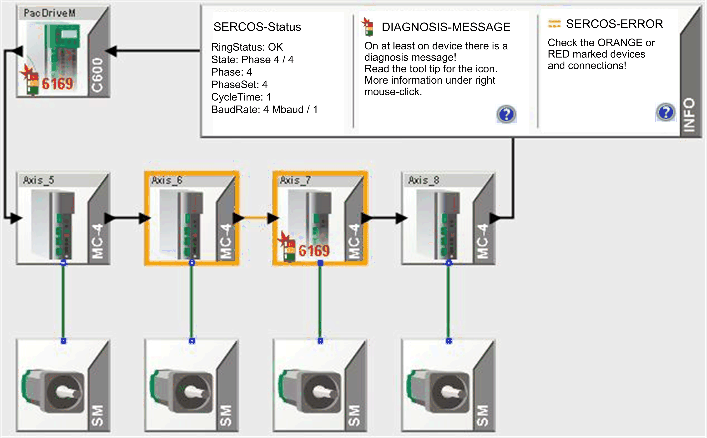
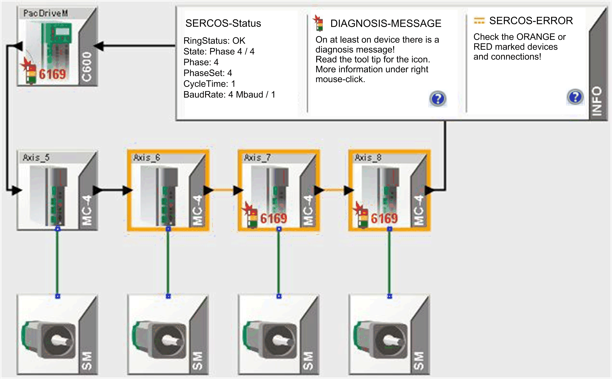
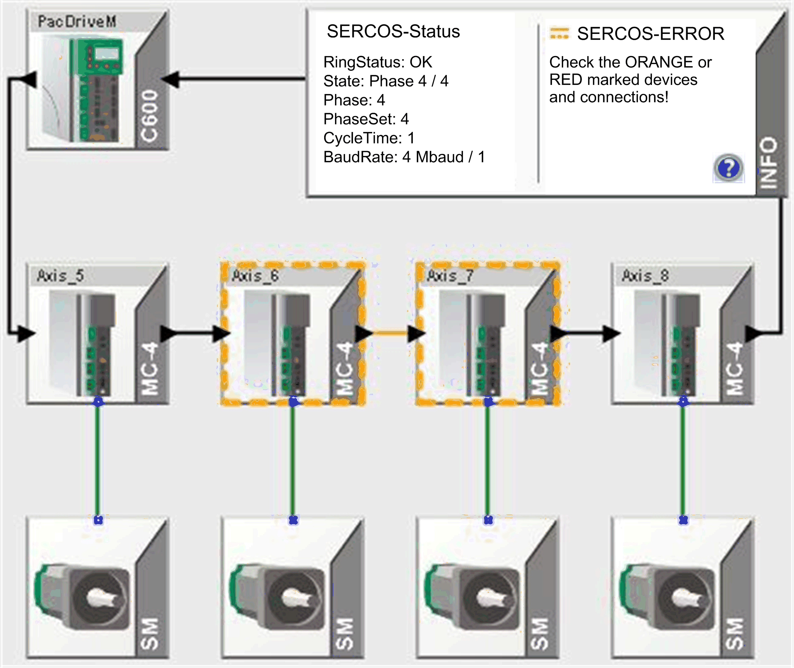
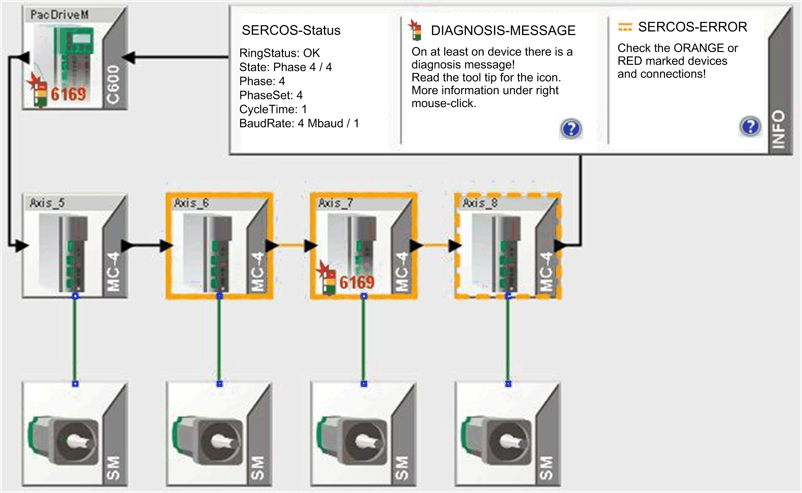

# Detected Sercos Error

## Overview

If a Sercos error is detected in the system, the affected devices are identified with a colored frame. The affected connections are also marked with a color.

* Orange: A Sercos [error](#D-SE-0041421) has been detected.
* Orange (with interrupted frame): Sercos errors have been detected in the last operating phase (Phase 4). Once a slave recognizes an error in the current operating state, the display changes back to orange (unbroken-line frame).
* Red: [Permanent Sercos loop interruption](D-SE-0041422.html#D-SE-0041422) detected.

NOTE: If several devices are marked orange, generally begin to search for the detected error from left to right. With PS-5 and subordinate iSH drives, the search direction is from right to left.

In the above example, single Sercos errors are detected repeatedly between the MC-4 Axis\_6 and the MC-4 Axis\_7 . A possible cause for this is, for example, a kinked fiberoptic conductor or an incorrectly set intensity on the transmitting MC-4 Axis\_6 .

Single Sercos error detected before MC-4  Axis\_7

If the whole telegrams are lost by single Sercos errors, these single errors can also affect the subsequent drives. In this case, several slaves are marked orange.

Single Sercos errors of the last cycle detected

If single Sercos errors are detected in the last operating phase (Sercos phase 4), this information is displayed with an orange broken line.

Single Sercos errors of the last cycle and current detected

If current errors in addition to the errors in the last operating phase are detected, the corresponding orange marking is shown over the broken-line marking.

EIO0000002005.05