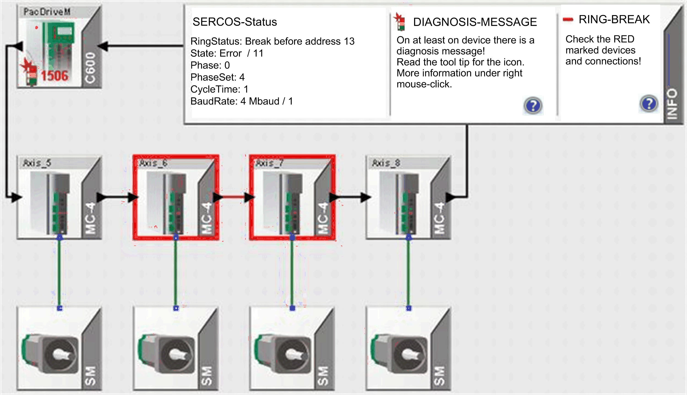
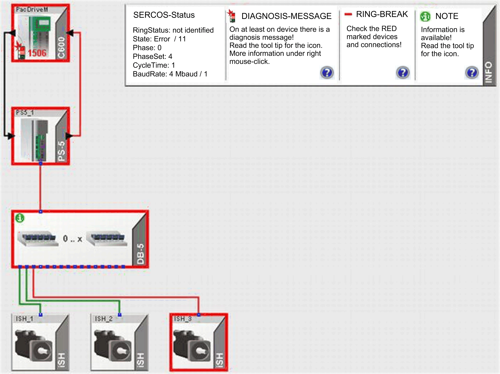

# Permanent Sercos Loop Interruption

## Overview

If a permanent Sercos loop interruption is detected in the system, the affected devices are identified with a colored frame. The affected connections are also marked with a color.

* Orange: A Sercos [error](D-SE-0041421.html#D-SE-0041421) has been detected.
* Orange (with interrupted frame): Sercos errors have been detected in the last operating phase (Phase 4). Once a slave recognizes an error in the current operating state, the display changes back to orange (unbroken-line frame).
* Red: Permanent Sercos loop interruption detected.

Ring interruption between MC-4  Axis\_6 and MC-4 Axis\_7

Before the MC-4  Axis\_7, the Sercos loop is continuously interrupted. Possible causes for this are, for example, a defective fiberoptic conductor or if the previous MC-4 Axis\_6  cannot communicate. To help to correct the error, verify the points marked red (MC-4  Axis\_7 and MC-4 Axis\_6 and the connection cable).

Ring interruption between iSH and C600

The interruption here is between the last iSH iSh\_3 and the controller C600 PacDriveM. Since the signal is also forwarded on the path from iSH to the controller by a distribution terminal DB-5 and the power supply PS-5, the possible cause of the detected error can also be in one of these devices. For example, disconnection of the power supply with PS-5 or DB-5, damaged cable,…

EIO0000002005.05