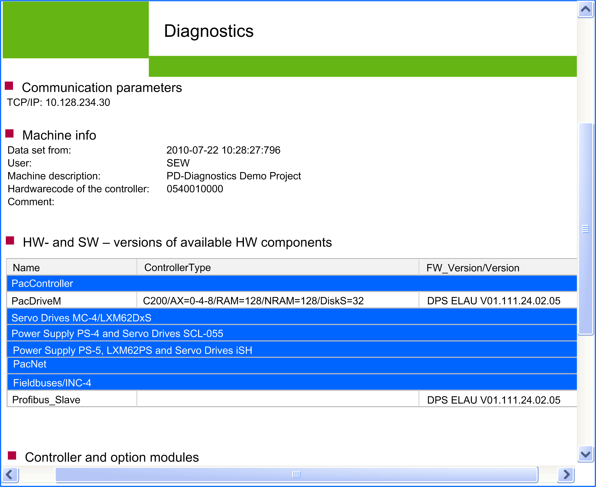

# Print ...

## Overview

Click the  Print ... button to open the dialog box for preparing a document to [print in the browser](D-SE-0041431.html#D-SE-0041431).

Click  OK to open the default browser.

The following description of the printing process is based on Microsoft Internet Explorer which is provided by the operating system:

Proceed as follows:

| Step | Action |
| --- | --- |
| 1 | Verify the page layout in the  File > Print preview menu. |
| 2 | Click the Print ... button in the toolbar. |

NOTE: Depending on the size of the data to be printed, texts may be cut off. The page setup depends on the browser and printer used.

If the data to be printed is too extensive for one page width, you can manually adjust the printout to the page width in the print preview via print scaling of your browser (refer to the instructions of your browser or printer).

NOTE: Printing can take some time depending on the number of pages. You can set the number of pages in the Print ...  dialog box.

The files are saved in the [temporary directory](D-SE-0041407.html#D-SE-0041407) of Diagnostics.

EIO0000002005.05