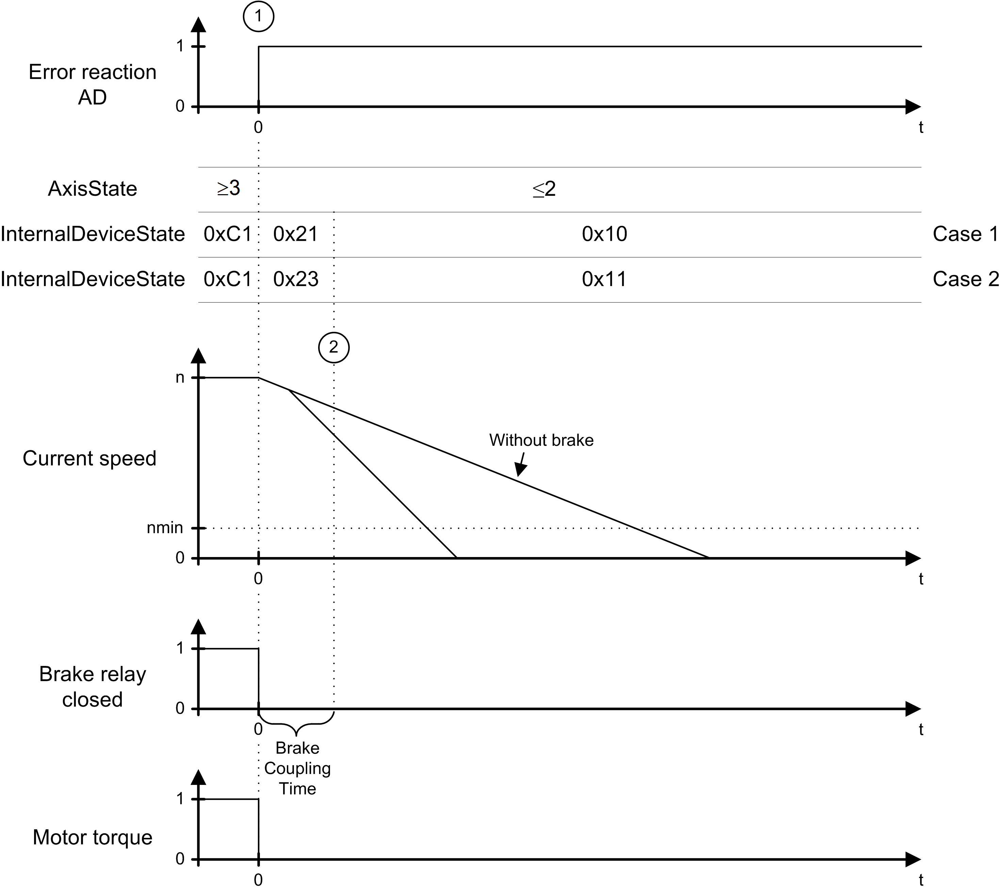
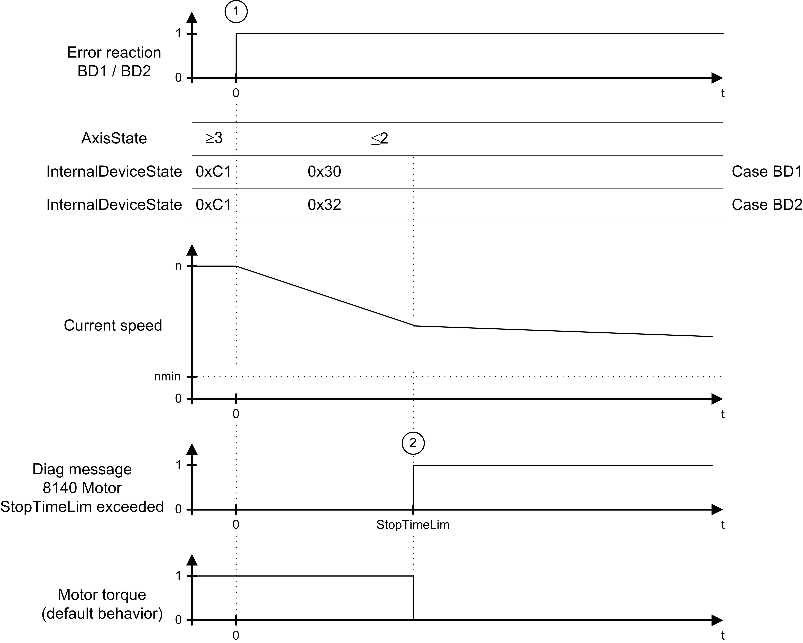

# Device Reactions - Drive

## Overview

In the following table, the device reactions are sorted according to their priority (from High to Low).

| Device reaction | Diagnostic class | Subclass | Meaning | Diagnostic example |
| --- | --- | --- | --- | --- |
| AD | 3 | 6 | * The motor is immediately switched to a torque-free state. By default, the brake engages immediately. * The brake behavior can be changed via the BrakeMode parameter. | [8119 Power stage short-circuit /ground fault](D-SE-0063858.html#D-SE-0063858) |
| BD1 | 3 | 5 | * Best possible stop: drive is stopped with peak current MaxDrivePeakCurrent. * MaxDrivePeakCurrent can be influenced via UserDrivePeakCurrent.  An additional limit with UserCurrentLimit is ineffective. * The brake engages at a speed of rotation of less than 10 rpm.  The brake behavior can be changed via the BrakeMode parameter. * The drive becomes torque free after StopTimeLim + BrakeCouplingTime at the latest. If the speed of rotation is greater than 10 rpm after StopTimeLim (default value: 400 ms), then the diagnostic message [8140 Motor ramp down time exceeded](D-SE-0063876.html#D-SE-0063876) is triggered. | [8140 Motor StopTimeLim exceeded](D-SE-0063876.html#D-SE-0063876) |
| BD2 | 3 | 4 | * Standstill after user default (user-defined stop). The drive is brought to a standstill with the delay ControllerStopDec and the jerk ControllerStopJerk. * The current is limited with the peak current MaxDrivePeakCurrent. MaxDrivePeakCurrent can be influenced via UserDrivePeakCurrent.  An additional limit with UserCurrentLimit is ineffective. * The actual values (standard) or reference values are used as start values for the stop profile depending on the UserDefinedStopMode parameter. * The brake engages at a speed of rotation of less than 10 rpm.    + The drive becomes torque free after StopTimeLim + BrakeCouplingTime at the latest.   + If the speed of rotation is greater than 10 rpm after StopTimeLim (default value: 400 ms), then the diagnostic message [8140 Motor ramp down time exceeded](D-SE-0063876.html#D-SE-0063876) is triggered. | [8112 SERCOS telegram invalid](D-SE-0063853.html#D-SE-0063853) |
| CD | 3 | 3 | * Standstill due to specified reference value. * The axis must be shut down by the application program. This has to be done by a user-defined motion profile. The standstill has to be reached at the latest after StopTimeLim (default value: 400 ms) and ControllerEnable must be disabled.  Otherwise the diagnostic message [8140 Motor ramp down time exceeded](D-SE-0063876.html#D-SE-0063876) is triggered. | For this device reaction there is no diagnostic message defined by default. |
| D | 2 | 2 | Informing message to PacDrive LMC. The program can be used for controlled, synchronous shutdown.  If the PacDrive LMC does not trigger a reaction in the drive a diagnostic message with the device reaction AD, BD1, BD2, or CD may occur. | [8125 Motor load high](D-SE-0063864.html#D-SE-0063864) |
| E | 1 | 1 | Message | [8190 Current control parameter reduced](D-SE-0094304.html#D-SE-0094304) |

The device reaction can be reconfigured by using the function FC\_DiagConfigSet2 or FC\_DiagConfigSubClassGroupSet. The priority of the configured device reaction must always be equal to or greater than the priority of the minimum device reaction. The minimum device reactions are indicated in the respective diagnostic message or in the [overview table](D-SE-0064519.html#D-SE-0064519).

The above-mentioned device reactions are also triggered by the following events:

* If ControllerEnable is set to FALSE and the AxisState is > 2, device reaction BD2 is triggered by default. The reaction can be changed by using the ControllerEnableStopMode parameter.
* If TorqueEnable is set to FALSE and the AxisState is > 2, the device reaction AD is triggered.

In the event of reaction BD2, you can decide whether the defined shutdown profile starts with actual or reference values. In the PacDrive system, the term "actual" refers to real time, real world measured values. The term "reference" refers to values that are derived or otherwise calculated. By default, the profile is started with actual values:

|  |  |
| --- | --- |
| Starting with actual values | * Detected tracking errors are considered in the shutdown profile. * If the reaction is triggered by the drive colliding with an obstacle, the approach of a position which is located behind the obstacle is avoided as a result. * Since no permissible value is available in the drive for the actual acceleration, the start acceleration is performed with zero. * If the actual values differ from the reference values, a jump occurs at the reference velocity and the reference position. |
| Starting with reference values | * No jumps occur in the reference value profile. * This mode is useful to achieve a coordinated ramp down of several drives. The reference value can be located behind an obstacle. The drive will attempt to approach the target position. In case it gets blocked before reaching the target position the current is limited to the peak current MaxDrivePeakCurrent. * If the drive is slowed down by the obstacle, the drive attempts to move along the requested reference value profile with MaxDrivePeakCurrent. * If the drive has been additionally limited with UserCurrentLimit before the reaction, the drive presumably accelerates until the tracking error is corrected. |

## Time Diagram for Reaction AD

In the case of an error detected with the reaction AD ([Drive](#D-SE-0063389)) (1), the axis is switched torque-free immediately and the brake relay is released. The axis behavior depends on whether the motor is equipped with a holding brake or not.

Upon expiration of the BrakeCouplingTime, the axis is in the error state 0x10 or 0x11. To return from these states to a controlled state the diagnostic message has to be acknowledged and the axis has to come to a standstill.

The graphic shows the time diagram for reaction AD:

## Time Diagram for Reactions BD1 / BD2

In case of a diagnostic message with reaction `BD1` or `BD2`, two sequences can occur:

* [Ramping Down Within the Maximum Ramp-Down time](#D-SE-0063389__D-SE-0063389.5)
* [Maximum Ramp-Down time Exceeded](#D-SE-0063389__D-SE-0063389.6)

## Ramping Down Within the Maximum Ramp-Down time

| If... | Then... |
| --- | --- |
| An error is detected with reaction BD1 (1). | The axis ramps down at maximum current (MaxDrivePeakCurrent). |
| An error detected with reaction BD2 (1). | The axis ramps down according to the parameter ControllerStopDec and ControllerStopJerk. |

As soon as the actual speed becomes lower than the speed threshold (actual speed < nmin) (2), the brake relay is switched to couple the brake.

The axis comes to a standstill before expiration of the maximum ramp-down time (parameter StopTimeLim) (4). After expiration of the brake coupling time (parameter BrakeCouplingTime) (3), the motor is switched to a torque-free state.

The graphic shows the time diagram for reaction BD1 / BD2 (ramping down within the max. ramp down time):

## Maximum Ramp-Down time Exceeded

| If... | Then... |
| --- | --- |
| An error is detected with reaction BD1 (1). | The axis ramps down at maximum current (MaxDrivePeakCurrent). |
| An error is detected with reaction BD2 (1). | The axis ramps down according to the parameter ControllerStopDec and ControllerStopJerk. |

The axis does not come to a standstill before expiration of the maximum ramp-down time (parameter StopTimeLim) (2) (actual speed < nmin). Therefore, error message [8140 Motor ramp-down time exceeded](D-SE-0063876.html#D-SE-0063876) is triggered.

The graphic shows the time diagram for reaction BD1 / BD2 (maximum ramp down time exceeded):

EIO0000003533.07