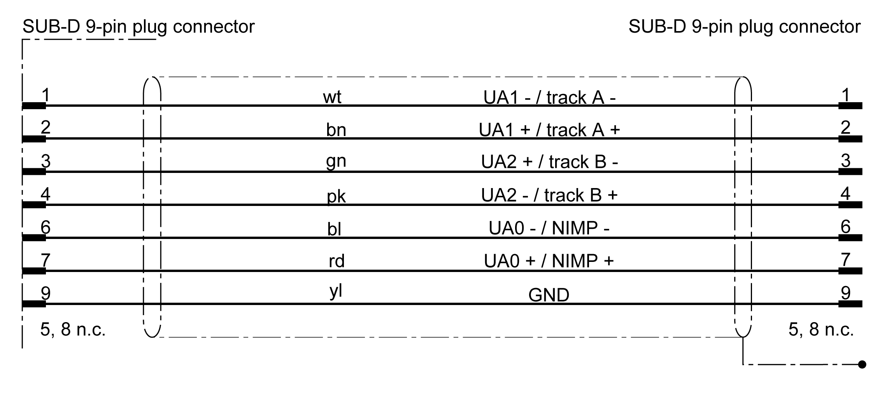

# 8788 Wiring error detected

## Description

[Refer to Diagnostic class (standard): 3](D-SE-0063169.html#D-SE-0063169)

| [Device reactions](D-SE-0063393.html#D-SE-0063393__D-SE-0063393.2) | Default reaction | [Minimum reaction](D-SE-0063393.html#D-SE-0063393__D-SE-0063393.4) |
| --- | --- | --- |
| [Drive](D-SE-0063389.html#D-SE-0063389) | D | E |
| [Power supply](D-SE-0063391.html#D-SE-0063391) | - | - |

There is a detected wiring error.

| Ext. diagnosis | Meaning |
| --- | --- |
| `Overload` | The affected output is short circuited or overloaded.  For outputs of a Lexium 62, there is no special diagnostic message stating that the supply voltage of the OnBoard I/O modules is not connected.  Therefore, when setting an output of a Lexium 62, this diagnostic message `Overload` is shown.   * Verify and correct if necessary the wiring of the output. * Only for drives: Verify and correct or replace if necessary the wiring of 24 V supply voltage for the OnBoard I/Os. |

NOTE: To use the DIO8 module (optional module of Lexium 62 ILM Module), the following must be taken into account: by PowerSupply = `Intern / FALSE` this message is assigned to the object of the DIO8 module. An assignment to an output is not possible. If PowerSupply = `External / TRUE`, then the message is assigned to the relevant output.

| Ext. diagnosis | Meaning |
| --- | --- |
| Openload | The output is not connected or only slightly loaded.   * Verify and correct if necessary the wiring of the output. * It may be useful to disable the diagnostic message.   (Openload detection is not possible for Lexium 62 and Lexium 62 ILM because it is not supported by hardware.) |
| PowerFail | The external power supply of the digital output was not connected. The supply of the digital output is verified if at least one bit is set to 1 in the `DiagMask` parameter of the output group object.   * Verify and correct if necessary the power supply of the digital output. * Verify the DiagMask parameter. |
| PowerFail (BT-4/ENC1) | The power supply of the encoder is too low.  Parameter EncPowerSupply = Intern / FALSE:  Short-circuit of the power supply (pins 5 and 9) of the connected encoder or inoperable bus terminal BT-4/ENC1  Parameter EncPowerSupply = Extern / TRUE:  There is no or not enough power at the X5 plug connector or there is a short-circuit of the power supply (pins 5 and 9) of the connected encoder.   * Verify and correct if necessary the power supply of the encoder. * Verify and correct or replace if necessary the encoder cable. |
| PowerFail (BT-4/ENC1) | A SinCos encoder (physical encoder) was entered in the PLC configuration, but no SinCos encoder is recognized at connector X2 or X3 of BT-4/ENC1.   * Plug the SinCos encoder cable into the BT-4/ENC1 X2 or X3 connections. * Verify and correct or replace if necessary the encoder cable. |
| type not supp. | The connected encoder type is not supported by the system.  Connect an encoder supported by the system. |
| out <-> out | Power is supplied externally to the connectors X2, X3, or X4 (pin 5 and 9) of the bus terminal BT-4/ENC1. The connector for the incremental encoder output may have been plugged into an encoder input.  Verify and correct if necessary the assignment of the encoder connectors. |
| IncIn <- IncIn | Power is supplied from both sides.   * Verify and correct if necessary the wiring. Refer to the section regarding wiring (SUB-D 9-pin plug connector) hereafter. * Verify and replace if necessary the encoder type. Refer to the section regarding supported encoders hereafter. |

NOTE: In certain cases, another diagnostic code or diagnostic class is entered in the message logger of the controller for DIO8 module and Lexium 62 Drive/Lexium 52 Drive onboard I/O modules in the message logger of the drive.

Wiring (SUB-D 9-pin plug connector)

## Supported Encoders

Absolute encoder (single turn/multi turn)

Controller interface characteristics

|  |  |
| --- | --- |
| Encoder type | SINCOS© encoder, Hiperface |
| Power supply | 9 V / 400 mA (protected against overcurrent) |
| Diagnosis | Cable damage, encoder damage |
| Analog input frequency | Max. 200 kHz |
| Analog input signal | Differential amplifier with high CMRR and HF filter  0.9 V-1.1 V pp  2.2 V-2.8 V offset |
| Parameter channel | RS-485, 9600 baud, 8O1 |
| Cable length | ≤ 50 m tested |

Incremental encoder

Controller interface characteristics

|  |  |
| --- | --- |
| Encoder type | Incremental |
| Power supply | 5 V / 400 mA (protected against overcurrent) |
| Diagnosis | Cable damage, encoder damage |
| Input frequency | 1 MHz (maximum) |
| Input signal | Logic: RS422 standard  High: >1.5 V (encoder input)  Low: <1.3 V (encoder input) |
| Impulse multiplication | \* 4, not configurable |
| Cable length | ≤ 50 m tested |

EIO0000003533.07