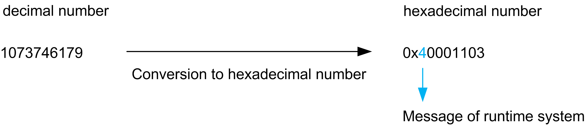

# Diagnostic Messages of the Runtime System

## Overview

In addition to the listed messages in the section [Diagnostic messages](D-SE-0064519.html#D-SE-0064519), the message logger can display diagnostic messages of the runtime system in Logic Builder and Diagnostics.

These messages have a diagnostic code that deviates from the normal format:

A decimal greater than 1073741824 is displayed as diagnostic code.

The graphic shows the composition of the diagnostic code:

If the decimal diagnostic code of the message is converted into a hexadecimal, then the digit 4 displays in the first place that it is a runtime system message.

## Examples

The following examples describe some possible runtime system messages:

Task cycle time monitoring:

| Column message logger | Value | Description |
| --- | --- | --- |
| Class | 4 | [Refer to Diagnostic class (standard): 4](D-SE-0063169.html#D-SE-0063169) |
| Object | LZS | Runtime system |
| Instance | LZS | Runtime system |
| DiagCode | 1073746179 (4000 1103 hex) | Diagnostic code |
| Ext. Diag | 16 | External diagnostic: Indicates the time the task required (in ms). |
| Message | \*EXCEPTION\* Watchdog Application <Task name that caused the cycle time overrun> | Exception occurred by the task cycle time monitoring:  Example: \*Exception\* Watchdog Application TASK\_S |

Application is not loaded:

| Column message logger | Value | Description |
| --- | --- | --- |
| Class | 3 | [Refer to Diagnostic class (standard): 3](D-SE-0063169.html#D-SE-0063169) |
| Object | LZS | Runtime system |
| Instance | LZS | Runtime system |
| DiagCode | 1073742337 (4000 0201 hex) | Diagnostic code |
| Ext. Diag | 1 | External diagnostic |
| Diagnostic text | Application <Application name> not found to start | The application could not be loaded.  Example: Application Prepare not found to start |

Boot project is not loaded:

| Column message logger | Value | Description |
| --- | --- | --- |
| Class | 3 | [Refer to Diagnostic class (standard): 3](D-SE-0063169.html#D-SE-0063169) |
| Object | LZS | Runtime system |
| Instance | LZS | Runtime system |
| DiagCode | 1073742350 (4000 020E hex) | Diagnostic code |
| Ext. Diag | 16 | External diagnostic |
| Diagnostic text | Boot project <Boot project name> corrupt | The boot project could not be loaded. |

Exception FC\_SysUserCallStack:

| Column message logger | Value | Description |
| --- | --- | --- |
| Class | 4 | [Refer to Diagnostic class (standard): 4](D-SE-0063169.html#D-SE-0063169) |
| Object | LZS | Runtime system |
| Instance | LZS | Runtime system |
| DiagCode | 1073746179 (4000 1103 hex) | Diagnostic code |
| Ext. Diag | 8192 | External diagnostic: Number given |
| Diagnostic text | \*EXCEPTION\* <Exception type> Application | Exception occurred by the function FC\_SysUserCallStack.  Example: \*EXCEPTION\* VendorException Application |

Fieldbus is not running:

| Column message logger | Value | Description |
| --- | --- | --- |
| Class | 3 | [Refer to Diagnostic class (standard): 3](D-SE-0063169.html#D-SE-0063169) |
| Object | LZS | Runtime system |
| Instance | LZS | Runtime system |
| DiagCode | 1079970304 (405F 0A00 hex) | Diagnostic code |
| Ext. Diag | -2146697191 | External diagnostic |
| Diagnostic text | Could not get destination queue handle | Diagnostic of the CAN driver: Fieldbus is not running |

Fieldbus configuration:

| Column message logger | Value | Description |
| --- | --- | --- |
| Class | 3 | [Refer to Diagnostic class (standard): 3](D-SE-0063169.html#D-SE-0063169) |
| Object | LZS | Runtime system |
| Instance | LZS | Runtime system |
| DiagCode | 1073746433 (4000 1201 hex) | Diagnostic code |
| Ext. Diag | 1 | External diagnostic |
| Diagnostic text | Update configuration failed from driver | Message is related to fieldbus. Verify PLC configuration or replace the controller / optional card. Restart the controller. |

Fieldbus configuration:

| Column message logger | Value | Description |
| --- | --- | --- |
| Class | 3 | [Refer to Diagnostic class (standard): 3](D-SE-0063169.html#D-SE-0063169) |
| Object | LZS | Runtime system |
| Instance | LZS | Runtime system |
| DiagCode | 1074791425 (4010 0401 hex) | Diagnostic code |
| Ext. Diag | 1 | External diagnostic |
| Diagnostic text | DriverMemoryPointer failed | Message is related to fieldbus. Verify PLC configuration or replace the controller / optional card. Restart the controller. |

| Column message logger | Value | Description |
| --- | --- | --- |
| Class | 3 | [Refer to Diagnostic class (standard): 3](D-SE-0063169.html#D-SE-0063169) |
| Object | LZS | Runtime system |
| Instance | LZS | Runtime system |
| DiagCode | 1074791442 (4010 0412 hex) | Diagnostic code |
| Ext. Diag | 1 | External diagnostic |
| Diagnostic text | TCP/IP service failed | Message is related to fieldbus. Verify PLC configuration or replace the controller / optional card. Restart the controller. |

Fieldbus configuration:

| Column message logger | Value | Description |
| --- | --- | --- |
| Class | 3 | [Refer to Diagnostic class (standard): 3](D-SE-0063169.html#D-SE-0063169) |
| Object | LZS | Runtime system |
| Instance | LZS | Runtime system |
| DiagCode | 1074791448 (4010 0418 hex) | Diagnostic code |
| Ext. Diag | 1 | External diagnostic |
| Diagnostic text | Firmwarename is not correct / Max. number of channels per board exceeded | Message is related to fieldbus. Verify PLC configuration or replace the controller / optional card. Restart the controller. |

Loss of communication:

| Column message logger | Value | Description |
| --- | --- | --- |
| Class | 3 | Diagnostic class 3 |
| Object | LZS | Runtime system |
| Instance | LZS | Runtime system |
| DiagCode | 1074791536 (4010 0470 hex) | Diagnostic code |
| Ext. Diag | 0 | – |
| Diagnostic text | No cyclic telegrams | The exchange of cyclical data was interrupted. |

Loss of fieldbus communication:

| Column message logger | Value | Description |
| --- | --- | --- |
| Class | 1 | [Refer to Diagnostic class (standard): 1](D-SE-0063169.html#D-SE-0063169) |
| Object | LZS | Runtime system |
| Instance | LZS | Runtime system |
| DiagCode | 1074791453 (4010 041D hex) | Diagnostic code |
| Ext. Diag | 1 | (Internal diagnostic) |
| Diagnostic text | Hardware watchdog exceeded. Reset of application is necessary. | – |

Loss of fieldbus communication:

| Column message logger | Value | Description |
| --- | --- | --- |
| Class | 1 | [Refer to Diagnostic class (standard): 1](D-SE-0063169.html#D-SE-0063169) |
| Object | LZS | Runtime system |
| Instance | LZS | Runtime system |
| DiagCode | 1074791491 (4010 0443 hex) | Diagnostic code |
| Ext. Diag | 1 | (Internal diagnostic) |
| Diagnostic text | 16#800C0019 | Internal diagnostic code.  Contact your Schneider Electric service representative. |

Loss of Ethernet communication:

| Column message logger | Value | Description |
| --- | --- | --- |
| Class | 1 | [Refer to Diagnostic class (standard): 1](D-SE-0063169.html#D-SE-0063169) |
| Object | LZS | Runtime system |
| Instance | LZS | Runtime system |
| DiagCode | 1073754127 (4000 300F hex) | Diagnostic code |
| Ext. Diag | 1 | (Internal diagnostic) |
| Diagnostic text | Failed to send data to <IP address> port. | The Ethernet communication was interrupted. |

State of EtherCAT:

| Column message logger | Value | Description |
| --- | --- | --- |
| Class | 4 | [Refer to Diagnostic class (standard): 4](D-SE-0063169.html#D-SE-0063169) |
| Object | LZS | Runtime system |
| Instance | LZS | Runtime system |
| DiagCode | 1074791424 (4010 0400 hex) | Diagnostic code |
| Ext. Diag | 0 | – |
| Diagnostic text | EtherCAT Master: At least one slave state not OK. | Verify connection to the EtherCAT device.  Read diagnostic information of the EtherCAT device. |

State of IO-Link parameter write:

| Column message logger | Value | Description |
| --- | --- | --- |
| Class | 1 | [Refer to Diagnostic class (standard): 1](D-SE-0063169.html#D-SE-0063169) |
| Object | LZS | Runtime system |
| Instance | LZS | Runtime system |
| DiagCode | 1127221504 (4330 0900 hex) | Diagnostic code |
| Ext. Diag | 0 | – |
| Diagnostic text | Parameter cannot be written to the module port. | If the channel is ready, it is attempted to write the parameter. If this is not successful, an error is detected. |
| Module was not ready in time to get its parameters configured at download. | If the channel is not ready, it is not attempted to write the parameter and an error is detected. |

## Display in the PLC Configuration

NOTE: The individual diagnostic values of the messages are also displayed in the diagnostic parameters of the PLC configuration (for example, PacDrive LMC x00C > Configuration > Section Diagnostic).

| Value | Parameters of the PLC configuration |
| --- | --- |
| Class | DiagClass |
| DiagCode | DiagCode |
| Diagnostic text | DiagMsg |
| Ext. Diag | DiagExtMsg |

EIO0000003533.07