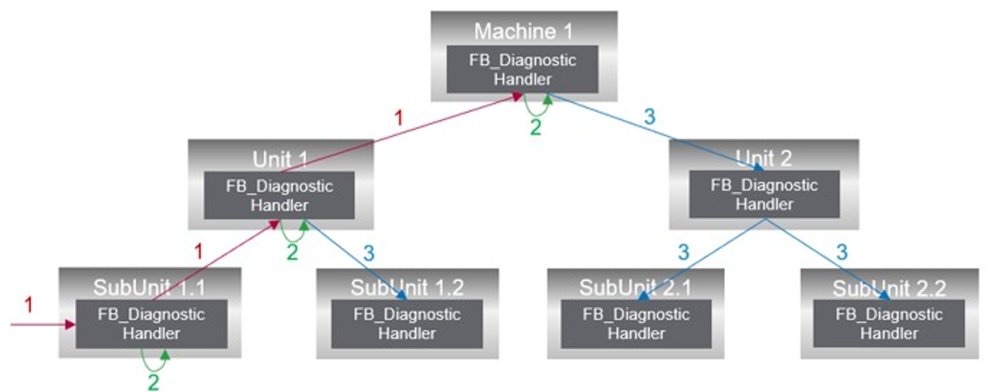

# General Information

## Library Overview

The ApplicationDiagnostic library provides functionalities to support you with the diagnostic handling in your application.

The FB\_DiagnosticHandler function block is used to receive diagnostic messages, process them and forward them. In addition, it offers various options to influence the processing and forwarding of diagnostic messages.

For diagnostic management, each logical unit in your application must contain an instance of the FB\_DiagnosticHandler. The individual instances are linked according to the structure of your machine application. Each instance can be assigned a parent instance of the FB\_DiagnosticHandler during initialization. This allows a hierarchical structure to be created across multiple levels with parent-child relationships between instances.

The following figure shows an example structure of a machine application including the instances of the FB\_DiagnosticHandler and their information exchange.

1. A diagnostic message is added at an instance of the FB\_DiagnosticHandler. The diagnostic message is forwarded to the higher-level instance according to the forwarding rules.
2. When a diagnostic message is received, a local reaction is triggered.
3. A reaction is forwarded to the subordinate instances according to the forwarding rules.

Diagnostic messages are divided into three different categories: Information, Advisory or Error. For diagnostic messages in the Error category, a severity level can also be defined for additional granulations.

Reactions can only be triggered by diagnostic messages in the Error category. The ReactionLevel parameter is provided for defining a reaction. The value for the ReactionLevel is determined by the severity of a diagnostic message. The mapping of severity to reaction level can be configured. The mapping can be determined individually for each diagnostic source.

Reactions are forwarded to child instances of the FB\_DiagnosticHandler. The reaction level that should be forwarded can be set individually for each recipient based on the local reaction level.

## Characteristics of the Library

The following table indicates the characteristics of the library:

| Characteristic | Value |
| --- | --- |
| Library title | ApplicationDiagnostic |
| Company | Schneider Electric |
| Category | Application |
| Default namespace | APDIAG |
| Language model attribute | [Qualified-access-only](../../../../../api/crossBook?lang=en-US&virtualBookName=SoLibref&topicID=D_SE_0081219) |
| Forward compatible library | Yes (FCL) |

NOTE: For this library, qualified-access-only is set. This means, that the POUs, data structures, enumerations, and constants must be accessed using the namespace of the library. The default namespace of the library is AppDiag.

## General Considerations

NOTE: Schneider Electric adheres to industry best practices in the development and implementation of control systems. This includes a "Defense-in-Depth" approach to secure an Industrial Control System. This approach places the controllers behind one or more firewalls to restrict access to authorized personnel and protocols only.

| WARNING | |
| --- | --- |
|  | UNAUTHENTICATED ACCESS AND SUBSEQUENT UNAUTHORIZED MACHINE OPERATION  * Evaluate whether your application environments are connected to your critical infrastructure and, if so, take appropriate steps in terms of prevention, based on Defense-in-Depth, before connecting the automation system to any network. * Limit the number of devices connected to a network to the minimum necessary. * Isolate your industrial network from other networks inside your company. * Protect any network against unintended access by using firewalls, VPN, or other, proven security measures such as an Intrusion Prevention System or Intrusion Detection System. * Monitor activities within your systems. * Prevent subject devices from direct access or direct link by unauthorized parties or unauthenticated actions. * Install certificates that are issued by publicly known Trusted Certificate Authorities. * Keep your systems up to date and rely only on legitimate sources. * Prepare a recovery plan including backup of your system and process information.  Failure to follow these instructions can result in death, serious injury, or equipment damage. |

For more information on organizational measures and rules covering access to infrastructures, refer to ISO/IEC 27000 series, Common Criteria for Information Technology Security Evaluation, ISO/IEC 15408, IEC 62351, ISA/IEC 62443, NIST Cybersecurity Framework, Information Security Forum - Standard of Good Practice for Information Security and refer to [Cybersecurity Guidelines for EcoStruxure Machine Expert, Modicon and PacDrive Controllers and Associated Equipment](https://www.se.com/ww/en/download/document/EIO0000004242/).

EIO0000005555.01