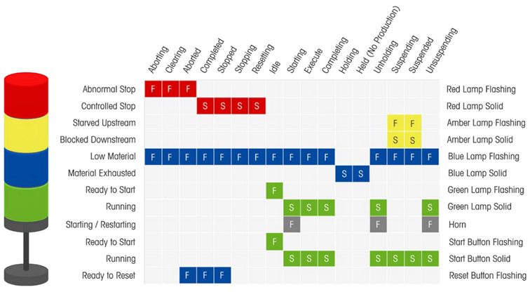

# FB\_StackLightsAndButtons - General Information

## Overview

|  |  |
| --- | --- |
| Type: | Function block |
| Available as of: | V1.0.0.0 |

## Task

The function block FB\_StackLightsAndButtons provides inputs and outputs for controlling stack lights at PackML-based machines.

## Description

The function block FB\_StackLightsAndButtons provides a common interface for controlling a stack light at a PackML-based machine. It supports input signals from four buttons: Start, Stop, Reset and Emergency Stop. Additionally, is provides status output through a stack light with four colors (green, blue, amber/yellow and red).

## Functioning

The function block FB\_StackLightsAndButtons monitors the PackML state of the machine at the input i\_etState and sets the light outputs as shown in the following illustration defined by PackML:

If a light is indicated as flashing, the corresponding output switches on and off with a time interval defined by the input i\_timFlashTime.

The output q\_xRedLightOn transitions between TRUE and FALSE (causing the red light to flash) in the PackML states Aborting, Aborted and Clearing to indicate the machine state Abnormal Stop. In the PackML states Completed, Stopped, Resetting and Idle, the output remains TRUE (resulting in a steady red light) to indicate a Controlled Stop. In all other cases, the output is set to FALSE.

The output q\_xGreenLightOn transitions between TRUE and FALSE (causing the green light to flash) in the PackML state Idle to indicate the machine state Ready to Start. In the PackML states Starting, Execute, Completing, Unholding, and Unsuspending, the output remains TRUE (resulting in a steady green light) to indicate the machine state Ready to Start. In all other cases, the output is set to FALSE.

The output q\_xAmberLightOn transitions between TRUE and FALSE (causing the amber/yellow light to flash) in the PackML states Suspending and Suspended to indicate the machine state Starved where the upstream system is not able to supply material to the machine. In the PackML states Suspending and Suspended, the output remains TRUE (resulting in a steady amber/yellow light) to indicate the machine state Blocked where the downstream system is not able to accept products. In all other cases, the output is set to FALSE.

If the input i\_xMaterialLow is TRUE, the output q\_xBlueLightOn remains TRUE (resulting in a steady blue light) in the PackML states Holding and Held to indicate the machine state Material Exhausted where the production cannot continue because the machine is not provided with enough material. In all other PackML states, the output q\_xBlueLightOn transitions between TRUE and FALSE (causing the blue light to flash) if the input i\_xMaterialLow is TRUE to indicate the machine state Low Material where the machine can continue working but will run out of material soon. In all other cases, the output is set to FALSE.

The output q\_xStartButtonLightOn  transitions between TRUE and FALSE (causing the start button to flash) in the PackML state Idle to indicate the machine state Ready to Start. In the PackML states Starting, Execute, Completing, Unholding, Suspending, Suspended, and Unsuspending, the output remains TRUE (resulting in a steady light) to indicate the machine state Running. In all other cases, the output is set to FALSE.

The output q\_xResetButtonLightOn transitions between TRUE and FALSE (causing the reset button to flash) in the PackML states Aborted, Completed, and Stopped to indicate the machine state Ready to Reset. In all other cases, the output is set to FALSE.

## Inputs

| Input | Data type | Description |
| --- | --- | --- |
| i\_xEnable | BOOL | TRUE: The function block monitors the input signals and provides the signals for the stack light. FALSE: The function block ignores the input signals and shows default values on its outputs. |
| i\_etState | [PackML.ET\_States](../../../../../api/crossBook?lang=en-US&virtualBookName=PackMLli&topicID=D_SE_0077937) | The PackML state of the unit for which the function block provides the interface. |
| i\_xStopButtonPressed | BOOL | TRUE: The stop button is pressed. FALSE: The stop button is released. |
| i\_xResetButtonPressed | BOOL | TRUE: The reset button is pressed. FALSE: The reset button is released. |
| i\_xStartButtonPressed | BOOL | TRUE: The start button is pressed. FALSE: The start button is released. |
| i\_xMaterialLow | BOOL | Indicates TRUE if an error is detected with the product flow of the machine. |
| i\_xStarvedUpstream | BOOL | TRUE: The machine is suspended because not enough material is supplied to the machine. FALSE: The machine is suspended because it is not possible to move all products out of the machine. |
| i\_timFlashTime | TIME | For flashing light signals, the specified time defines how long the light is on or off. |

## Outputs

| Output | Data type | Description |
| --- | --- | --- |
| q\_xActive | BOOL | Indicates TRUE if the function block is active. As long as the output is TRUE, the function block must be executed cyclically. |
| q\_xReady | BOOL | Indicates that the function block generates the command and signals for the lights. |
| q\_etCmd | [PackML.ET\_Cmd](../../../../../api/crossBook?lang=en-US&virtualBookName=PackMLli&topicID=D_SE_0077934) | The PackML command for the machine, generated from the button inputs. |
| q\_xRedLightOn | BOOL | TRUE: The red light of the stack lights is on. |
| q\_xAmberLightOn | BOOL | TRUE: The amber/yellow light of the stack lights is on. |
| q\_xBlueLightOn | BOOL | TRUE: The blue light of the stack lights is on. |
| q\_xGreenLightOn | BOOL | TRUE: The green light of the stack lights is on. |
| q\_xStartButtonLightOn | BOOL | TRUE: The light of the start button is on. |
| q\_xResetButtonLightOn | BOOL | TRUE: The light of the reset button is on. |

EIO0000005574.02