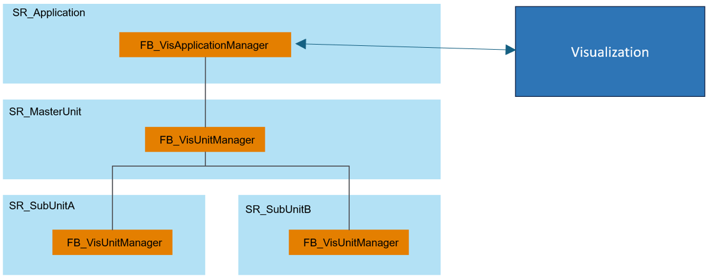

# Operating Principles of Visualization Managers

## General Information

The function blocks FB\_VisApplicationManager and FB\_VisUnitManager serve to navigate through a framework structure in a visualization and to provide data from the units.

## Framework

The instance of the FB\_VisApplicationManager is the communication interface to the visualization and also the register starting point for the unit visualization managers.

The instances of the FB\_VisUnitManager register to the higher-level visualization manager function block and thus create the framework tree for the visualization.

This is illustrated by the following example:



The higher-level visualization manager must be transferred to the lower-level visualization manager as a parent object by calling the [Init](VisUnitManager-Init-DC0E556C.html) method of the FB\_VisUnitManager.

The method requires the input i\_ifParent, which specifies the visualization manager object under which the visualization manager node must be registered.

In the following, you find a code example for the framework displayed above:

```
SR_MasterUnit.fbVisManager.Init(i_ifParent := SR_Application.fbVisManager)  
SR_SubUnitA.fbVisManager.Init(i_ifParent := SR_MasterUnit.fbVisManager)  
SR_SubUnitB.fbVisManager.Init(i_ifParent := SR_MasterUnit.fbVisManager)
```

## Navigation

The library provides the frame FR\_VisNavigationButtons that can be used to navigate in your framework. The frame requires the property rstVisNavigationData from the function block FB\_VisApplicationManager as reference.

The following examples illustrate the relationship between a framework structure and the appropriate navigation buttons from a visualization:

When SR\_MasterUnit is selected, the visualization navigation only offers the “Down” button.

NOTE: As the SR\_Application is no unit, you cannot navigate to it.

| Framework | Visualization example |
| --- | --- |
|  |  |

When SR\_SubUnitA is selected, the visualization navigation offers the ”Up” and "Right” buttons:

| Framework | Visualization example |
| --- | --- |
|  |  |

EIO0000005574.02