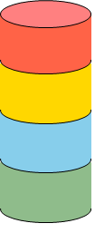

# FR\_StackLights

## Overview

|  |  |
| --- | --- |
| Type: | Visualization frame |
| Available as of: | V1.0.0.0 |
| Implements: | VisuElems.IVisualization |

## Task

Providing stack light information in a visualization.

## Functional Description

FR\_StackLights  is a visualization frame that shows a stylized stack light to provide stack light information in a visualization.

## Interface

| Input / Output | Data type | Description |
| --- | --- | --- |
| iq\_xGreenLightOn | BOOL | TRUE: Activates the green light. |
| iq\_xBlueLightOn | BOOL | TRUE: Activates the blue light. |
| iq\_xAmberLightOn | BOOL | TRUE: Activates the amber/yellow light. |
| iq\_xRedLightOn | BOOL | TRUE: Activates the red light. |

## Example

EIO0000005574.02