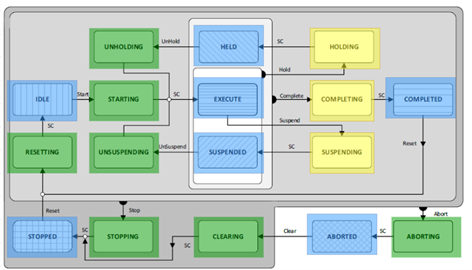

# FB\_PackMlSubUnitHandler – Operation

The operation of the function block FB\_PackMlSubUnitHandler depends on the PackML state of the leading unit, which is given at the input [i\_etState](FB_PackMlSubUnitHandler-Gen-3A6B3689.html#FB_PackMlSubUnitHandler-Gen-3A6B3689__Inputs-3A6B529B).

Depending on the input parameter i\_etState, the operation of FB\_PackMlSubUnitHandler can be divided into three categories:

* Monitoring of subunits (blue states)
* Generating commands to bring each subunit to a target state (green states)
* Monitoring of subunits while leading unit stops operation (yellow states)

For all three options, FB\_PackMlSubUnitHandler provides three elements in the structure [ST\_SubUnitDownStream](ST_SubUnitDownStream-3AF07B85.html#ST_SubUnitDownStream-3AF07B85__StructureElements-3AF081B2):

* a command for the subunit (etCmd)
* the information if the state of the subunit is congruent with the state of the leading unit (xAligned)
* the information whether the subunit has reached the target state in a command chain (xActingStateConcluded)

EIO0000005574.02