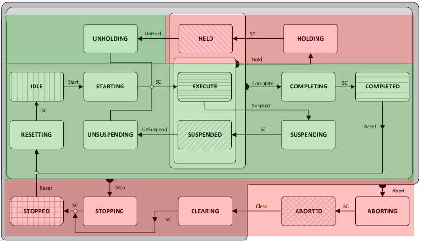

# Monitoring Subunits

When FB\_PackMlSubUnitHandler monitors the subunits without generating commands (see [FB\_PackMlSubUnitHandler – Operation](FB_PackMlSubUnitHandler-Bvr-3D7C2138.html#FB_PackMlSubUnitHandler-Bvr-3D7C2138), blue states), the function block compares the operative state of the leading unit to the operative state of the subunit.

In this case, the input etCmd of ST\_SubUnitDownStream is set to PackML.ET\_Cmd.Undefined. Since the subunits are not intended to change their state autonomously, xActingStateConcluded of ST\_SubUnitDownStream is FALSE.

To monitor the operation of the subunits, FB\_PackMlSubUnitHandler divides the states of the PackML state machine into two groups:

* States where the unit is operative (highlighted in green)
* States where the unit is inoperative (highlighted in red)

For the machine to be able to produce, all units must be in an operating state. Optional subunits, which do not contribute to the production, are flagged with xIgnoreSubUnit in the structure ST\_SubUnitUpStream and are excluded from this context. Therefore, if the leading unit is in an operative state (as indicated in green in the above graphic), all subunits must also be in an operative state or in the process of transitioning to one. Even if a unit is not actively producing in the PackML states Completing, Completed, Resetting and Idle, the states are considered as operative in this context. In batch operating of subunits, this allows a subunit to finish a product batch and to start a new one without transitioning to a non-operative state.

When monitoring the operation of the subunits, FB\_PackMlSubUnitHandler compares the operative state of the leading unit (i\_etState) to the operative state of the subunit (etState of ST\_SubUnitUpStream):

* If the leading unit is in an operative state, the subunit must also be in an operative state. Otherwise, the subunit is marked as misaligned with the leading unit by setting xAligned of ST\_SubUnitDownStream to FALSE.

  FB\_PackMlSubUnitHandler only marks the subunits that are misaligned. If all subunits are aligned, the output q\_xSubUnitsAligned is TRUE. The function block does not generate commands if a subunit becomes misaligned from the leading unit. A misalignment of the signal can be used to indicate an error in the machine and a corresponding error reaction, such as the leading unit transitioning to Holding, Stopping or Aborting.
* If the leading unit is in a non-operative state, the subunit can be in an operative or non-operative state. The subunits are not required to maintain a non-operative state if the leading unit is non-operative. This allows for separate use of the subunit, such as during commissioning. In this case, the subunits are always marked as aligned with the leading unit.

  If a subunit shows PackML.ET\_States.Undefined, it is marked as misaligned. If the PackML state of the leading unit is PackML.ET\_States.Undefined, all subunits are marked as misaligned.

EIO0000005574.02