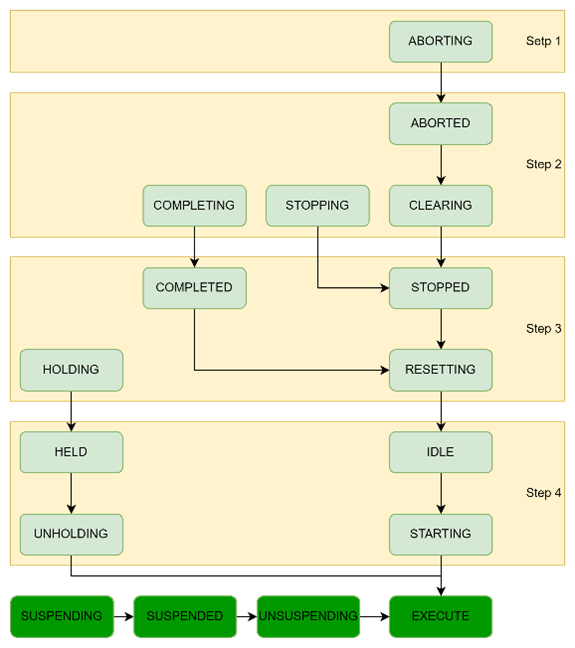
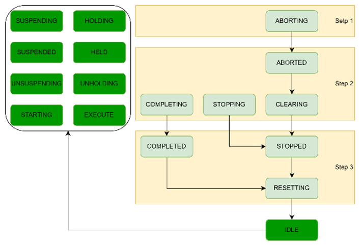
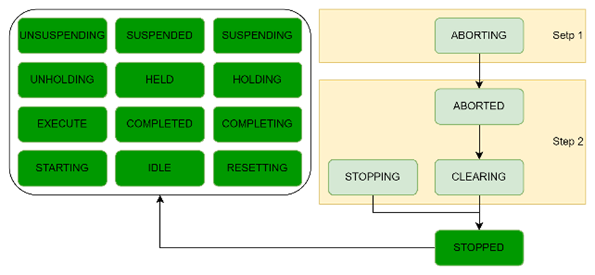
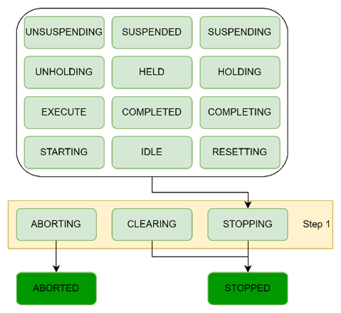
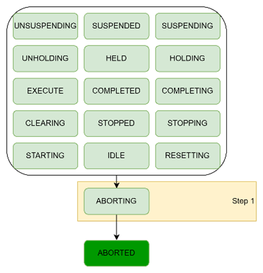

# Generating Command Chains for Subunits

## General

If the leading unit is in one of the green states, FB\_PackMlSubUnitHandler generates commands in ST\_SubUnitDownStream.etCmd to bring the subunit to the defined target state.

Depending on the state of the subunit, multiple steps are necessary to bring the subunit to its target state. If multiple subunits are in different steps of a command chain, first the subunits that are the least advanced in the chain receive the command to change their state. The other subunits do not receive any commands until all subunits have reached their required step in the command chain. This approach helps ensure that all subunits receive similar commands; for example, if they are mechanically dependent on each other, to prevent one subunit from starting while another subunit remains inactive.

While the subunits follow the command chain, ST\_SubUnitDownStream.xAligned is set to TRUE for the subunits. However, if a subunit moves backward in the chain, ST\_SubUnitDownStream.xAligned reverts to FALSE to indicate an issue with the subunit. This can occur, for example, when a subunit is in state Starting but detects an error, prompting it to transition to state Stopping or Aborting. Subunits that have become misaligned from the leading unit do not receive any new commands. The other subunits, which are still aligned, continue to operate within the command chain. If the misalignment of a subunit requires an error reaction of the leading unit or the machine, it is expected that the falling edge of the alignment signal triggers an error reaction in the leading unit, which causes the leading unit to transition to the state Aborting, for example.

When a subunit has reached the target state or has lost the alignment, ST\_SubUnitDownStream.xActingStateConcluded is set to TRUE to indicate that FB\_PackMlSubUnitHandler has completed its task on the subunit. The cumulated concluded signal of all subunits is given on the output q\_xActingStateConcluded of FB\_PackMlSubUnitHandler. This signal can be used to trigger the StateComplete command (see the method [StateComplete in the PackML Library Guide](../../../../../api/crossBook?lang=en-US&virtualBookName=PackMLli&topicID=TPC_PackMLli_IF_StateCommands_StateComplete)) on the PackML state machine to conclude the PackML acting state of the leading unit.

Depending on the state of the leading unit, different command chains are executed on the subunits.

## Leading Unit in Starting, Unholding or Unsuspending

The PackML target state of Starting, Unholding or Unsuspending is Execute. If a subunit is in the state Suspending, Suspended or Unsuspending, it is already in operation. However, it may have paused its activity due to not being supplied with material (machine state Starved) or being unable to supply material to downstream units (machine state Blocked). It is intended that it automatically returns to Execute when the neighboring units resume work. Therefore, the subunit states Suspending, Suspended and Unsuspending are considered as if the subunit is in a target state, such as Execute.

All other PackML states of the subunit can lead to Execute through four different chains.

## Leading Unit in Resetting

The PackML target state of Resetting is Idle. If the leading unit is in state Resetting, it prepares the machine to be started. If a subunit is already in Suspending, Suspended, Unsuspending, Holding, Held, Unholding, Starting or Execute, it is considered that the subunit is already producing. Therefore, these states are also considered as target states.

## Leading Unit in Clearing

The PackML target state of Clearing is Stopped. If the leading unit is in state Clearing, the machine is waiting for a reset command. Unlike the state Stopping, which also has a target state of Stopped, but is focused on ramping down the machine, Clearing aims to prepare the machine for ramping up. As a result, all PackML states further downstream towards Execute are also considered as target states.

## Leading Unit in Stopping

The PackML target state of Stopping is Stopped. If the leading unit is in state Stopping, the machine is brought to a defined safe state. In contrast to the state Clearing, which shares the same target of Stopped but aims to ramp up, Stopping focuses on ramping down the machine. Therefore, Aborted is also considered as a target state, because it is even further in the chain. While this is also true for Aborting, Aborting is not considered as a target state, because it is not a stable state of the subunit. And the intention of Stopping implies that all subunits are reaching a non-operational steady state.

## Leading Unit in Aborting

The PackML target state of Aborting is Aborted. From all other PackML states, you can transition to Aborting. Therefore, the only step here is to give the command Abort to all subunits that are not already in the states Aborting or Aborted, and wait until they have reached their target state.

EIO0000005574.02