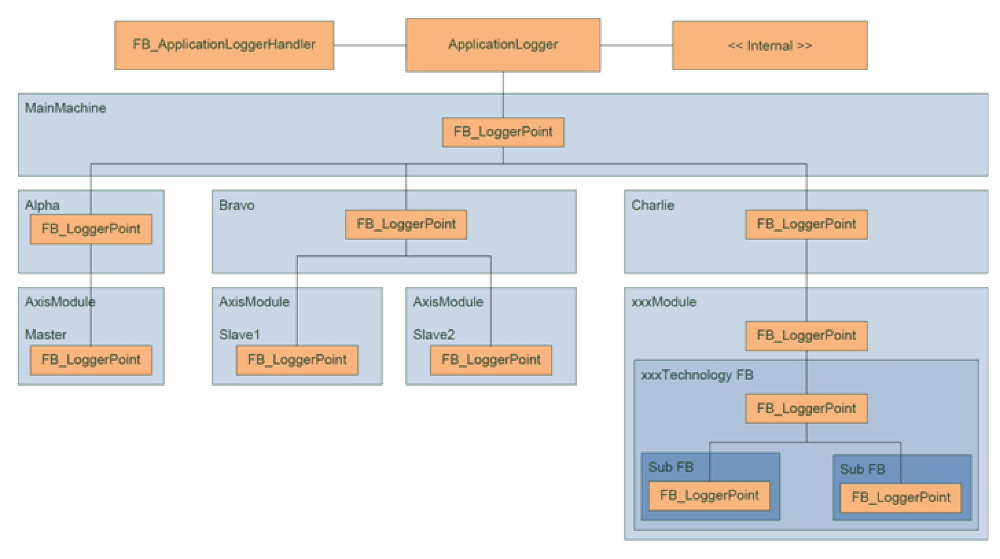

# General Information

## Description

The library "ApplicationLogger" supports the functionalities to establish a logging for the application program.

The library contains the functionality of the Application Logger, which is published by including the library into a project. The Application Logger only holds the functionality to store logger messages, to delete logger messages, and to manage a set of logger points. A logger point is a function block, which has to be implemented inside the project. A logger point can be registered as a child of the Application Logger or of another logger point.

By registering a set of logger points, a tree of logger points that represents the structure of the project can be built. The logger point supports the functionality to send a logger message to the Application Logger.

Because each logger point belongs to a given part of the project, the context of the logger message is clear. There is no need to include the machine part inside the logger message.

Logger messages can be read using the function block FB\_ApplicationLoggerHandler.

The FB\_ApplicationLoggerHandler has to be implemented, if needed.

Example on how to build a logger point tree for a project

NOTE: Activating the logger function in POUs increases the cycle load of the program. Ensure that the required system resources are available for the application.

## Characteristics of the Library

The following table indicates the characteristics of the library:

| Characteristics | Value |
| --- | --- |
| Library title | ApplicationLogger |
| Company | Schneider Electric |
| Category | Application |
| Component | CoreLibraries |
| Default namespace | APL |
| Language model attribute | [Qualified-access-only](../../../../../api/crossBook?lang=en-US&virtualBookName=Installer&topicID=D_SE_0081219) |
| Forward compatible library | Yes |

NOTE: For this library, qualified-access-only is set. Therefore, the POUs, data structures, enumerations, and constants have to be accessed using the namespace of the library. The default namespace of the library is APL.

EIO0000002636.02