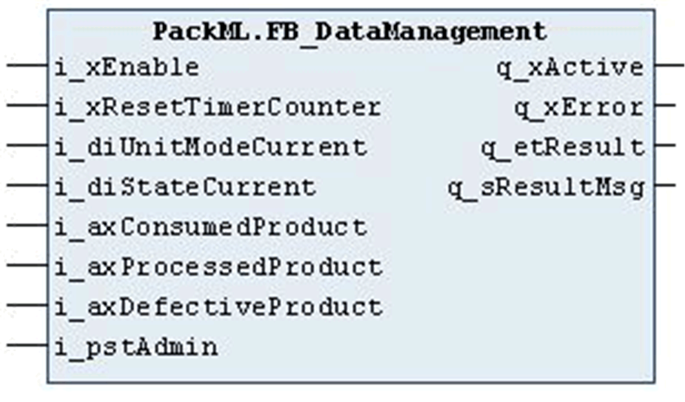

# Diagnostic Concept

## Overview

EcoStruxure Machine Expert provides a three-layer diagnostic concept for the libraries. This concept is applicable to the Technology/Module libraries (for example, the library CommonToolbox) and uses enumerations for diagnostic coding.

The diagnostic information has the following layers:

1. General information on the exception: Provides basic details about the exception without requiring specific knowledge of the POU functionality.
2. POU-specific diagnostic and status messages (part 1): Offers information on the source triggering the diagnostic or status messages.
3. POU-specific diagnostic and status messages (part 2): Provides detailed and dynamic information on the source triggering the diagnostic or status messages.

   This information changes at runtime (for example, information about the condition of the input parameters). This diagnostic output is optional for the POUs.

The diagnostic concept offers the following advantages:

* Diagnostic messages can be viewed online
* Detailed information on diagnostic events, including diagnostic codes
* Overview of the status or exceptional condition of a POU
* Pertinent suggested solutions to address the causes for exceptional conditions
* Enumerated diagnostic messages to facilitate multi-language support for HMI displays

## Diagnostic Outputs

Function blocks and functions or methods can have the three diagnostic outputs q\_xError, q\_etResult, and q\_sResultMsg. The outputs are defined in the POU one after another.

| Output | Data type | Meaning |
| --- | --- | --- |
| q\_xError | BOOL | The output q\_xError is set to TRUE when an error has been detected during execution of the function block.  The outputs q\_etResult and q\_sResultMsg provide the corresponding error code and a plain text information. |
| q\_etResult | ET\_Result(1) | Provides diagnostic and status information as a numeric value.  If q\_xError = FALSE, q\_etResult provides status information.  If q\_xError = TRUE, q\_etResult provides diagnostic/error information.  The enumeration ET\_Result contains the possible values of the POU operation results. |
| q\_sResultMsg | STRING | Provides additional information about the present status of the POU. If the POU is in error state (q\_xError = TRUE), the message provides additional information for the error cause and, if meaningful, a possible solution. If the POU is busy the present process or state is issued at this output. |
| (1) Each library provides its own, specific enumeration ET\_Result which contains the possible q\_etResult outputs for that library. | | |

Diagnostic information example:

EIO0000005549.01