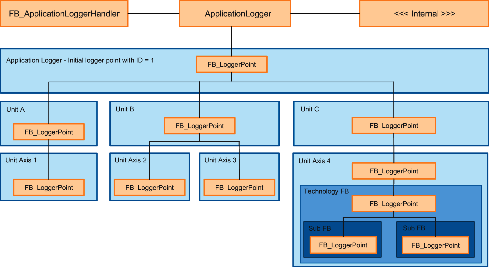

# Register Logger Points

## Enabling the Application Logger

The Application Logger has to be activated in the project in order to be used. To accomplish this, the method RegisterCommunicationService of the global interface GVL.G\_ifApplicationLogger has to be called once at the beginning of your program.

The logger messages can be read by [adding the object Application logger](../../../../../api/crossBook?lang=en-US&virtualBookName=SoMMenu&topicID=D_SE_0091294) to the Devices tree (Classic Navigators view) or to the Applications tree (Navigators view).

## Register Logger Points

It is not possible to give logger messages directly to the Application Logger. Instead, the Application Logger collects the logger messages that are given to the logger points that are distributed over the project. Therefore the messages can be simplified because the context in which they were given is clearer.

If there are, for example, two identical POUs in your project, then you have to provide the information on which instance of the module has sent the logger message to get a clear picture on what has happened. With the Application Logger, you assign a logger point to each POU. By doing this, it is clear which program part is affected if you send a message such as "Product is not available".

A logger point is an instance of the function block FB\_LoggerPoint. To send a logger message using a logger point, you have to register the logger point to the Application Logger first. This is done by calling the method RegisterLoggerPoint of the FB\_LoggerPoint once. The method needs the following information as input:

|  |  |
| --- | --- |
| i\_ifParent | This input specifies the logger object under which the logger point has to be registered.  The first logger point has to be registered below the Application Logger which is represented by the global interface GVL.G\_ifApplicationLogger. The next logger points can be registered underneath the Application Logger or below other logger points in order to build a logger point tree. |
| i\_sName | This input specifies the name of the logger point.  Every logger message that is sent using this logger point is connected to this logger point. The logger point has to represent a part of the machine or project or a special functionality. In order to help prevent confusion, the name of a logger point has to be unique in the project. |
| i\_sType | This input specifies the kind of machine part (for example AxisModule, FillingModule) the logger point represents. This information has to be defined here since the name of the logger point does not always provide the information.  Logger points that are part of Schneider Electric libraries set the name of the function block type that they are representing. |
| i\_sSource | This input specifies where the program part comes from. For example, which library contains the function block that provides the logger messages. This information can be used to identify non-unique information such as the enumeration ET\_DiagExt of a library.  Logger points that are part of Schneider Electric libraries set the namespace of the library to which they belong. |

The following example registers a logger point for the Unit A:

```
fbLoggerPointUnitA.RegisterLoggerPoint(
	i_ifParent := APL2.G_ifApplicationLogger,
	i_sName := 'Unit A',
	i_sType := 'UnitA',
	i_sSource := 'Project',
	q_xError => ,
	q_etResult => ,
	q_sResultMsg => );
```

## Building Logger Point Trees

With an increasing project size, the internal structure of the project becomes more complex. In order to illustrate the project structure inside the logging, the Application Logger gives the possibility to register one or more logger points underneath another logger point. This way it is possible to build a logger point tree that represents the structure of the project.

A logger point can only be registered under an already registered logger point. To register the new logger point underneath another logger point, the method RegisterLoggerPoint has to be called. By calling the method at the input i\_ifParent the already registered logger point has to be given, under which the logger point has to be registered.

The following example registers a logger point for the Unit Axis 1 below the already registered Unit A logger point.

```
fbLoggerPointUnitAxis1.RegisterLoggerPoint(
	i_ifParent := fbLoggerPointUnitA,
	i_sName := 'Unit Axis 1',
	i_sType := 'UnitAxis1',
	i_sSource := 'Project',
	q_xError => ,
	q_etResult => ,
	q_sResultMsg => );
```

The registered logger points of a project has to represent the project structure.



## Registering Logger Points That Are Inside Schneider Electric Library Function Blocks

If a function block shall support logger messages, it creates an instance of FB\_LoggerPoint with which it sends the logger messages. In order to register the logger point instance, the function block supports a RegisterLoggerPoint method. This method resembles the RegisterLoggerPoint method of the FB\_LoggerPoint, but it does not support the inputs i\_sType and i\_sSource.

When using a Schneider Electric library function block, the unavailable inputs i\_sType and i\_sSource are set to fixed values according to the type of the function block.

EIO0000005549.01