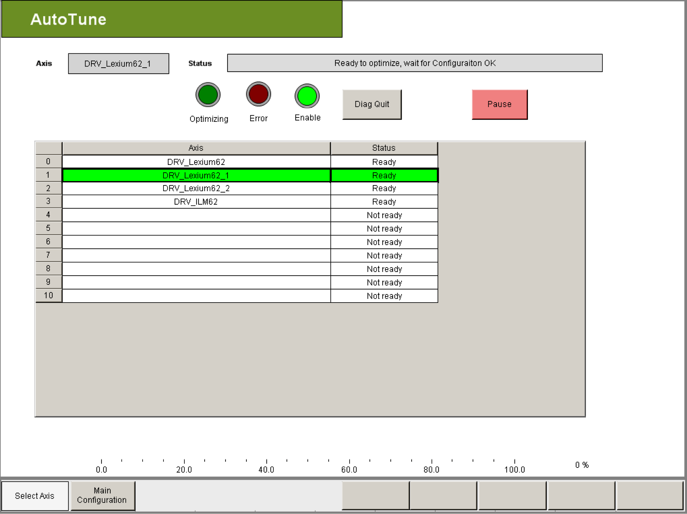

# Description

Description

In the Select Axis visualization, all configured axes (LXM62, LXM52 or ILM62) are automatically displayed. The axis that shall be optimized can be selected by clicking on one of the displayed axes. The selected axis is highlighted in green and shown as an axis name (Axis) with the corresponding status.