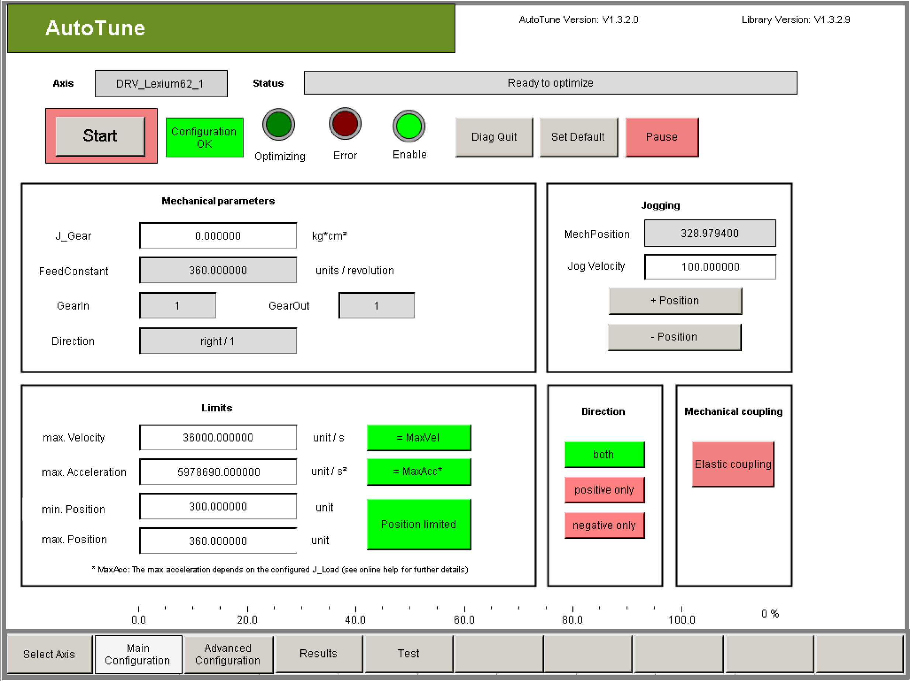

# Description

Description

The boundary conditions of the drive are set via the drive configuration.

|  |
| --- |
| Danger_Color.gifDANGER |
| Boundary conditions not specified before starting the optimization! |
| Serious risk of injury and/or damage to property!  oMaximum velocity  oAcceleration  oPosition range  Set or check the values. |
| Failure to follow these instructions will result in death or serious injury. |

| Element | Description |
| --- | --- |
| Button Configuration OK | If you select this button, you confirm that the configuration in this visualization window is correct. If the configuration is confirmed, then the configured limits in the drive are activated and the buttons Start, Advanced Configuration, Results, and Test, as well as the Jogging group are displayed. |
| Button Set Default | By clicking the Set Default button you can reset all configuration parameters of the visualization windows Main Configuration and Advanced Configuration to the respective default values.  If the configuration had already been confirmed with Configuration OK, this confirmation is reset. |