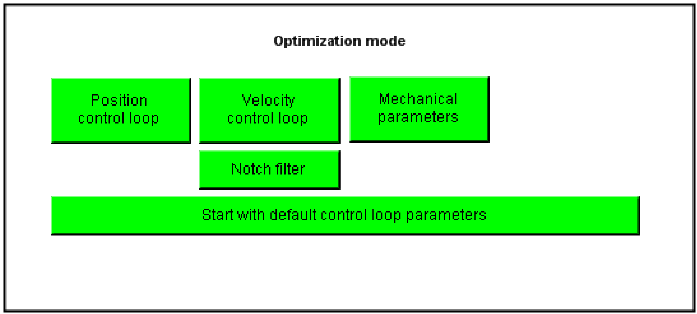

# Optimization Mode

Optimization Mode

You use this setting to select the section of the controller to be optimized. The optimization mode cannot be changed during optimization.

The following options are available:

| Element | Description |
| --- | --- |
| Button Velocity control loop | The velocity controller parameters Vel\_P\_Gain, Vel\_I\_Gain, VelFilter and CurrRefFilter are optimized. The current controller should already be parameterized correctly (usually with standard values). |
| Button Notch filter | During the optimization of the speed controller parameters the NotchFilter parameters are optimized also. The parameters NotchFilterDamping, NotchFilterFrequency and NotchFilterBandwidth are determined. With the NotchFilter the mechanical feedback is damped with the highest amplitude. To permanently achieve good controller settings with the NotchFilter the frequency and amplitude of this feedback has to be constant. |
| Button Position control loop | The Pos\_P\_Gain position control parameter is optimized. Good controller parameters should have already been found for the speed controller or the Velocity control loop button should be activated. |
| Button Mechanical parameters | By rotary drives the mechanical parameters J\_Load, StaticFriction and ViscousFriction are optimized. By linear drives the mechanical parameters LoadInertiaLinear, StaticFrictionLinear and ViscousFrictionLinear are optimized. Good controller parameters should have already been found for the control loops or the buttons Position control loop and Velocity control loop should be activated. |
| Button Start with default control loop parameters | By clicking this button you can change the start values for optimization.  oRed: Optimization is started with the current control parameters. Ensure that the controller with the selected parameters is stable!  oGreen: The controller is started with default parameters. The parameters J\_Gear and J\_Load or LoadInertiaLinear are set to zero. This always starts optimization with a robust controller setting. |
| Button Fixed Load Inertia | This button only appears if the optimization mode "Mechanical Parameters" is not activated. If the optimization mode "Mechanical Parameter" is activated, then FixedLoadInertia always is deactivated.  With the button FixedLoadInertia the values J\_Load and J\_Gear or LoadInertiaLinear can be "frozen". This means the values are not changed during optimization.  When enabling FixedLoadInertia, the input field for the J\_Load object parameter is displayed. The value entered here and the value of J\_Gear are (if FixedLoadInertia active = green) not changed by the optimization.  With the button FixedLoadInertia the pre-calculated values from J\_Load and J\_Gear or LoadInertiaLinear can be "frozen". The values will then be considered as constants during optimization and not changed.  J\_Load: When activating FixedLoadInertia an entry mask for J\_Load appears by rotary drives. A known value must be entered here for J\_Load.  LoadInertiaLinear: When activating FixedLoadInertia an entry mask appears for LoadIneartiaLinear by linear drives. A known value must be entered here for LoadInertiaLinear.  NOTE: The values that are entered by an activated FixedLoadIneartia for J\_Load or LoadInertiaLinear are not changed during the optimization. By a wrong specification of these values the feed forward will give incorrect characteristics after the optimization. This can lead to a distinctive increase of the tracking deviation.  The user is responsible that the correct values for J\_Load or LoadInertiaLinear are parameterized. |
| Button Start Load Inertia | This button only appears if the optimization mode "Mechanical Parameters" is activated and the optimization mode "Velocity control loop" is not activated. If the optimization mode "Mechanical Parameter" is not activated or the optimization mode Velocity control loop is activated, then Start Load Inertia is always deactivated.  With the button Start Load Inertia the start value J\_Load or LoadInertiaLinear can be predefined. This start value has effect on the motion profile during the optimization of the mechanical parameters and therefore it should be known with a deviation of +100%/- 50%.  When activating Start Load Inertia the input field for the object parameter J\_Load or LoadInertiaLinear appears.  J\_Load: When activating StartLoadInertia an entry mask for J\_Load appears by rotary drives. An estimated value must be entered here for J\_Load.  LoadInertiaLinear: When activating StartLoadInertia an entry mask appears for LoadIneartiaLinear by linear drives. An estimated value must be entered here for LoadInertiaLinear.  NOTE: The values that are entered by an activated FixedLoadIneartia for J\_Load or LoadInertiaLinear change the motion profile.  Values that are too small lead to an increased acceleration and possibly a movement at the current limit. By significantly too small set values the optimization is stopped due to a too large tracking error.  Values that are too large lead to a reduced acceleration. By significantly too small set values the optimization result is inaccurate and in the extreme case, it can detect completely wrong values.  This is why this functionality should only be used if the value of J\_Load or LoadInertiaLinear is known with an accuracy of about -50% to +100%. |