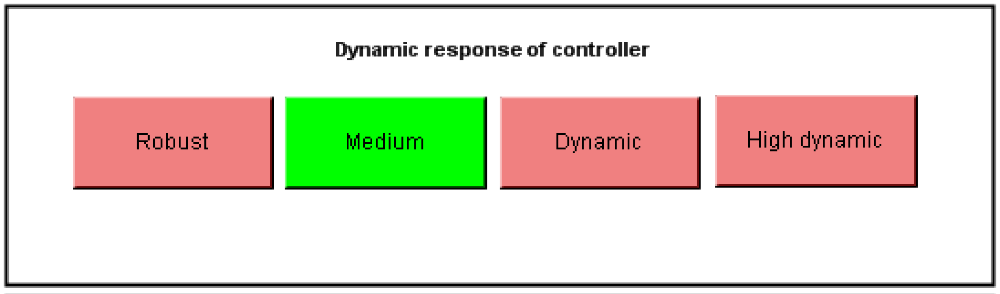

# Dynamic Response of the Controller

Dynamic Response of the Controller

This setting allows you to change the dynamics of the control loops. This dynamic depends on the mechanical properties of the machine. When you set a higher dynamic response, you can expect the build-up period to be shorter. However, the build-up period is not quantitatively determined by the dynamic response.

The dynamic response allow for statements on the stability and the tendency of the drive to oscillate. As the dynamic response increases, the stability (distance to the stability limit) decreases and the tendency to oscillate increases. At the same time, the increase of the controller amplification reduces the control deviation (tracking deviation). However, that only applies when the control loop is stable. On the other hand, if the stability requirements are too high (e.g. robust setting), in some no parameters may be found.

The dynamic response must not be changed during optimization.

The following settings can be selected:

| Element | Description |
| --- | --- |
| Button Robust | The drive generally steadies after oscillating up in the velocity. |
| Button Medium | The drive generally steadies after oscillating up and oscillating down in velocity. (Default setting) |
| Button Dynamic | In general the drive is in a steady state after about 2 to 3 oscillations. |
| Button High dynamic | In general the drive is in a steady state after about 3 to 5 oscillations. |