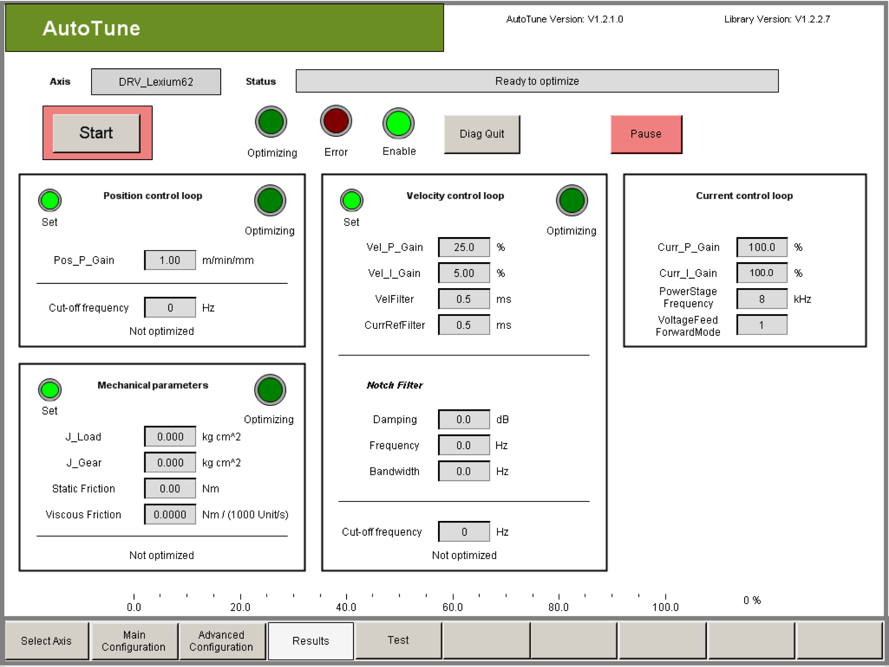
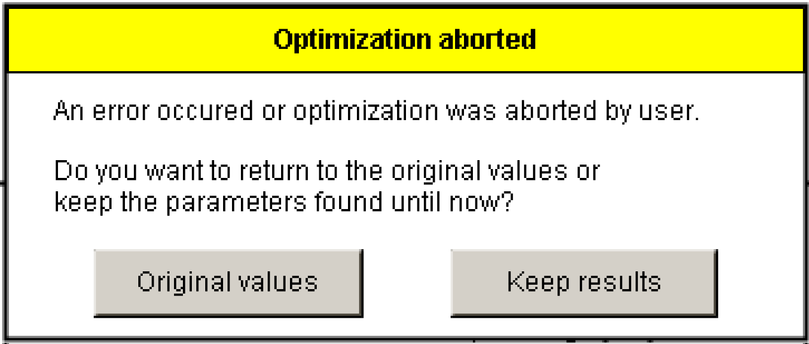

# Description

Description

The results of the automatic controller optimization are displayed in the ControllerOptimization­Results visualization.

The results are divided into four sub-areas:

oPosition control loop (position controller)

oVelocity control loop (speed controller inclusive NotchFilter)

The NotchFilter parameters are displayed as of the Version V4.0 (Drives Firmware Version V1.50.x.0; AutoTune Version V1.2.x.0).

oCurrent control loop (current controller)

oMechanical parameters (mass moment of inertia of the load and of the gear box)

The sub-area Current control loop displays the parameters that influence the current control loop. AutoTune does not change these parameters. Nevertheless these parameters are still important for the behavior of the control system and must be checked by the user, if necessary.

If a problem occurs during the optimization or the optimization is stopped by the user then the following window appears:

The user has to press one of the two buttons before further entries are possible:

oThe controller parameters and the mechanical parameters are reset to the values that were set by the start of the optimization with the button Original values.

oThe controller parameters and mechanical parameters that were already found through the canceled optimization are taken over into the PLC configuration with the button Keep results.

NOTE: When pressing the button Keep results the user has no statement on the quality of the controller- and mechanical parameters. These parameters can cause an unstable controller behavior!

This is why the user has to check if the set parameters result in a good controller behavior. He is responsible for the quality of the parameters himself!