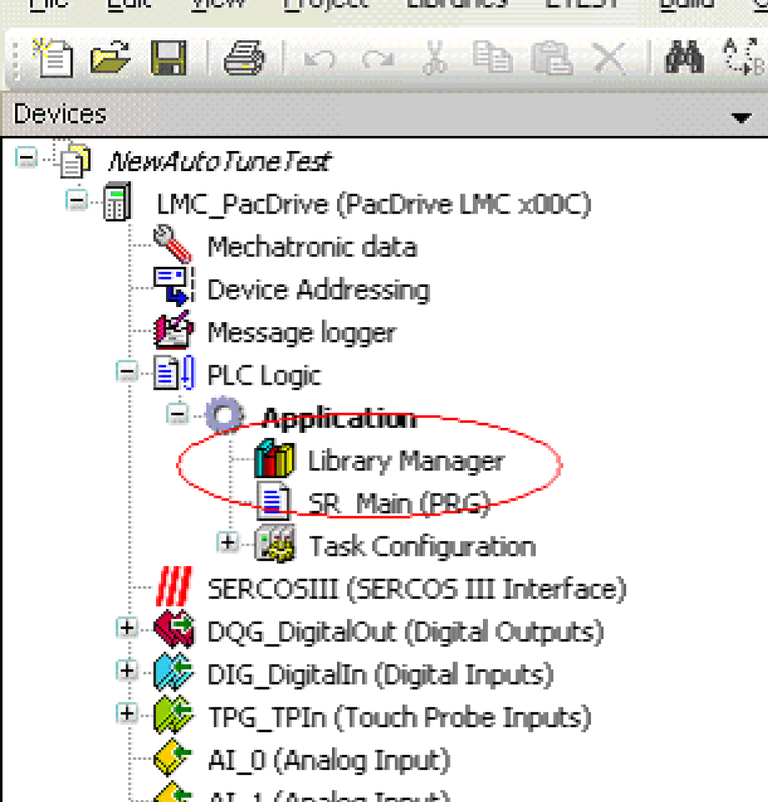

# Description

Description

The manual commissioning described in this chapter can be performed alternatively to the usual [Commissioning](../Commissioning/Commissioning-1.htm#XREF_D_SE_0091179_1). The expenditure of time for the manual commissioning is higher. This is why you should use the [Commissioning](../Commissioning/Commissioning-1.htm#XREF_D_SE_0091179_1).

| Step | Action |
| --- | --- |
| 1 | Double-click Library Manager in the PLC Configuration.  Result: The library manager with the libraries already connected is displayed. |
| 2 | Insert the AutoTune.lib library.  Click Add library....  Result: The window "Add Library" opens.  Select the AutoTune library from the Application category and add by clicking OK. |