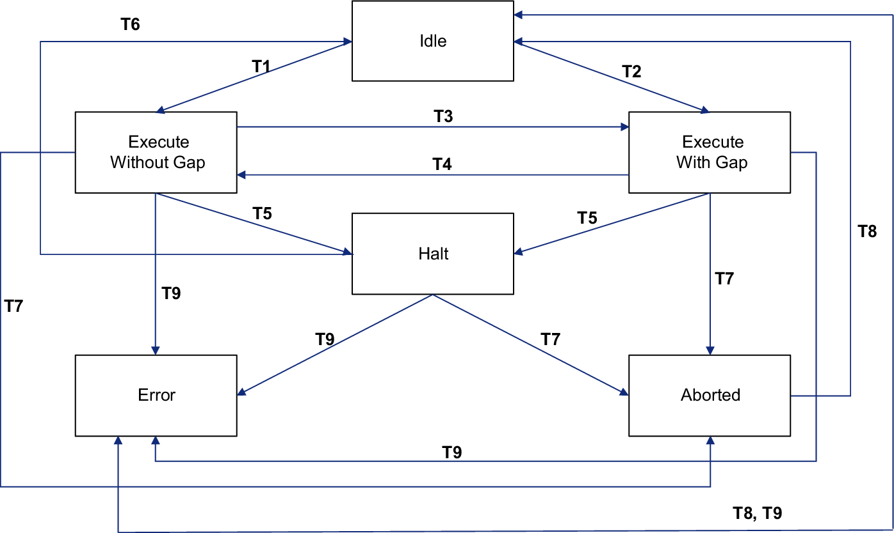

# Presentation of the Library

## General Information

The CNCExtension library lets you use specific functions of the SM3\_CNC library with a Modicon M262 Logic/Motion Controller, for example, to implement G-Code functionality. The present library guide assumes that you are familiar with creating CNC applications using the SM3\_CNC library.

The library provides the function block FB\_ControlAxisByPosCnc used to write target positions to a drive. It also monitors the sequence of target positions for gaps and provides a mechanism to perform a compensation movement if a gap is detected.

The library provides the function FC\_AxisConverterCnc which copies a variety of values from an MOIN.IF\_Axis structure to an SM3\_Basic.AXIS\_REF\_SM3 axis structure.

The CNCExtension library cannot be used with function blocks from the SM3\_Basic library.

## Characteristics of This Library

The following table summarizes the characteristics of the library:

| Characteristics | Value |
| --- | --- |
| Library title | CNCExtension |
| Company | Schneider Electric |
| Category | Application |
| Component | CNCExtension |
| Default namespace | CNCE |
| Language model attribute | [Qualified-access-only](../../../../../api/crossBook?lang=en-US&virtualBookName=SoLibref&topicID=D_SE_0081219) |
| Forward compatible library | Yes |

NOTE: For this library, qualified-access-only is set. Therefore, the POUs, data structures, enumerations, and constants have to be accessed using the namespace of the library. The default namespace of the library is CNCE.

## Referenced Libraries

The following libraries must be added for using G-Code functionality:

| Library | Remarks |
| --- | --- |
| SM3\_Basic (SM3\_Basic), CODESYS GmbH, formerly Smart Software Solutions GmbH | Required to use AXIS\_REF\_SM3 |
| SM3\_CNC (SM3\_CNC), CODESYS GmbH, formerly Smart Software Solutions GmbH | The function blocks of this library allow to read, interpret, and interpolate G-Code files (as per DIN 66025). |

Refer to the [M262 Synchronized Motion Library Guide](AboutTheBook-91929F63.html#AboutTheBook-91929F63__RelatedDocuments-9192A39A) for additional information.

## General Considerations

The following table summarizes considerations and requirements for the use of the CNCExtension library and outlines differences from the SoftMotion programming system, where applicable.

| CNCExtension library | SoftMotion programming system |
| --- | --- |
| The CNC path data must be generated in a low-priority task. | Identical |
| For control function blocks such as MC\_Power and MC\_Reset, the PLCopen MC part 1 library is used. There is no need to call such function blocks in a specific task. | Control function blocks such as MC\_Power and MC\_Reset must be called in a motion-synchronous task. |
| SMC\_Interpolator must be executed in an external event-triggered task "AFTER\_RTP". | Similar (different task name) |
| The instances of the function block FB\_ControlAxisByPosCnc (one per axis) must be executed in the same external event-triggered task as SMC\_Interpolator. | Similar implementation with slightly different function block SMC\_ControlAxisByPos. |
| The function block FB\_ControlAxisByPosCnc provides three inputs with the dynamic limits of the axis. | The function block SMC\_ControlAxisByPos does not have these inputs. The limits are set with the SoftMotion drive editor. |
| Function blocks performing transformations of coordinates must be executed in the same external event-triggered task as SMC\_Interpolator since they modify target positions. | Identical |

## Principles of Operation

The CNCExtension library uses the following state machine:

| State | Description |
| --- | --- |
| Idle | In this state, the function block has no effect on the axis. |
| Execute Without Gap | In this state, the interpolated movement is performed (no gap detected, no compensation movement). |
| Execute With Gap | In this state, a compensation movement is performed in response to a detected gap. |
| Halt | In this state, the movement is halted because the value at the input bEnable has not been TRUE for three consecutive cycles. |
| Aborted | The execution of the function block has been interrupted by a different function block. |
| Error | A transition to this state is the result of the detection of an error. |

| State transition | Description |
| --- | --- |
| T1 | Transition from state Idle to state Execute Without Gap  Conditions for this transition:   * Input bAvoidGaps = TRUE and no gap detected in sequence of target positions * Input bAvoidGaps = FALSE, gap detection deactivated * Input bEnable = TRUE * Input iStatus is not SMC\_INT\_STATUS.IPO\_INIT, SMC\_INT\_STATUS.IPO\_UNKNOWN, SMC\_INT\_STATUS.IPO\_FINISHED * No errors detected at the other inputs.   Result:   * Values at inputs fGapVelocity, fGapAcceleration, fGapDeceleration, fGapJerk, fMaxVelocity, fMaxAcceleration, fMaxDeceleration, and bAvoidGap are frozen. * Transition to state Execute Without Gap. * The interpolated movement is performed. |
| T2 | Transition from state Idle to state Execute With Gap  Conditions for this transition:   * Input bAvoidGaps = TRUE * Input bEnable = TRUE * Input iStatus is not SMC\_INT\_STATUS.IPO\_INIT, SMC\_INT\_STATUS.IPO\_UNKNOWN, SMC\_INT\_STATUS.IPO\_FINISHED * No errors detected at the other inputs. * Gap detected in sequence of target positions.   Result:   * Values at inputs fGapVelocity, fGapAcceleration, fGapDeceleration, fGapJerk, fMaxVelocity, fMaxAcceleration, fMaxDeceleration, and bAvoidGap are frozen. * Transition to state Execute With Gap. * The input bStopIpo is set to TRUE and a compensation movement to the target fSetPosition is performed using the frozen values at the inputs fGapVelocity, fGapAcceleration, fGapDeceleration, and fGapJerk. |
| T3 | A gap is detected while the function block is being executed in the state Execute Without Gap.  Result:   * Transition to the state Execute With Gap. * The input bStopIpo is set to TRUE and a compensation movement to the target fSetPosition is performed using the frozen values at the inputs fGapVelocity, fGapAcceleration, fGapDeceleration, and fGapJerk. * The output bStopIpo is reset to FALSE after completion of the compensation movement. |
| T4 | The compensation movement in state Execute with Gap has been completed.  Result:   * Transition to the state Execute Without Gap. * The interpolated movement is resumed. |
| T5 | The value at the input bEnable has been FALSE for three consecutive cycles which triggers a transition to the state Halt.  Result:   * The movement is stopped using the values at the inputs fGapDeceleration and fGapJerk. |
| T6 | After the stop has been completed, the function block FB\_ControlAxisByPosCnc transitions to the state Idle. |
| T7 | The function block FB\_ControlAxisByPosCNC can be aborted by a different motion function block. The value at the output bAborted remains TRUE as long as the value at the input bEnable is TRUE. |
| T8 | Transition from the states Error and Aborted to the state Idle triggered by setting the value at the input bEnable to FALSE. |
| T9 | Transition to the state Error triggered by the detection of an error. |

EIO0000004414.00

© 2021

Schneider Electric.

All rights reserved.