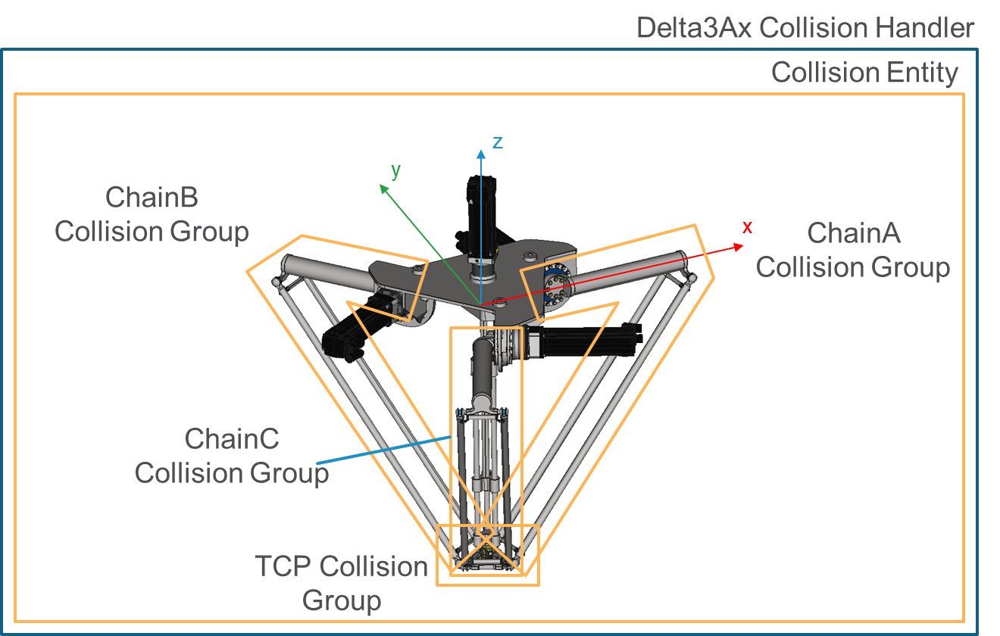

# ET\_Delta3AxCollisionGroupIndex – General Information

## Overview

|  |  |
| --- | --- |
| Type: | Enumeration |
| Available as of: | V1.0.0.0 |

## Description

This enumeration contains the indices of the groups configured by default by the collision handler of a Delta3Ax robot.

The optional additional axis is not included in such representation.

Chain and TCP groups for a Delta3Ax robot.

## Enumeration Elements

| Name | Value | Description |
| --- | --- | --- |
| None | 0 | - |
| ChainA | 1 | Index of the first chain group. |
| ChainB | 2 | Index of the second chain group. |
| ChainC | 3 | Index of the third chain group. |
| TCP | 4 | Index of the TCP group. |

EIO0000004468.00

© 2021

Schneider Electric.

All rights reserved.