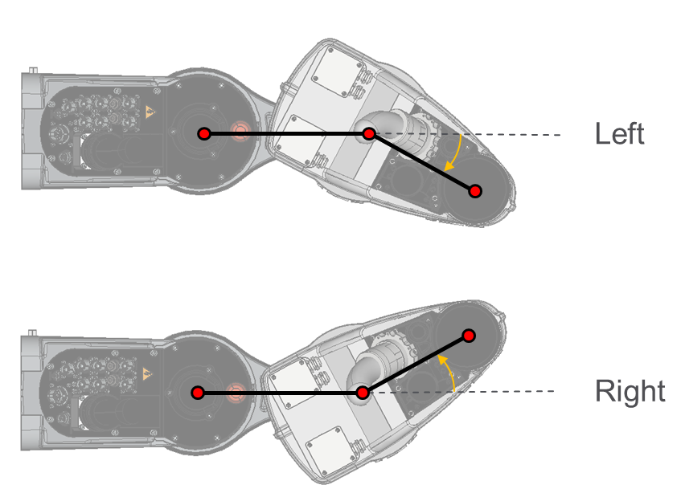

# ET\_ArmConfiguration – General Information

## Overview

|  |  |
| --- | --- |
| Type: | Enumeration |
| Available as of: | V1.0.0.0 |

## Description

The enumeration ET\_ArmConfiguration describes the possible arm configurations. This is used, for example, to define the configuration of the arm for a serial robot, like a SCARA.

Example for left and right arm configuration on a SCARA4Ax robot (top view).

## Enumeration Elements

| Name | Value | Description |
| --- | --- | --- |
| None | 0 | - |
| Left | 1 | Left configuration of the arm. |
| Right | 2 | Right configuration of the arm. |

EIO0000004468.00

© 2021

Schneider Electric.

All rights reserved.