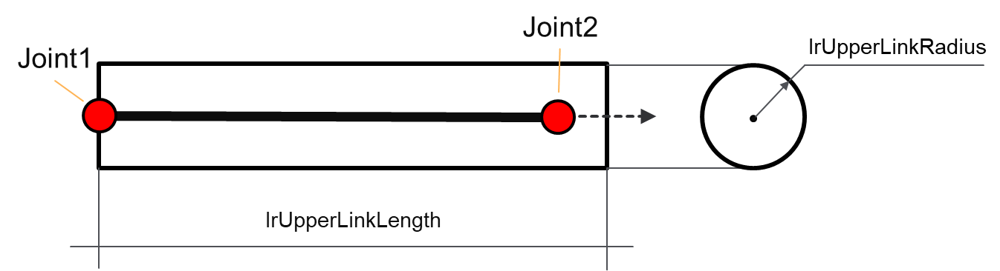
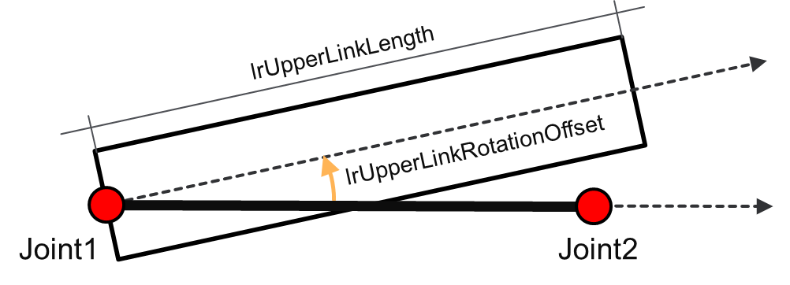
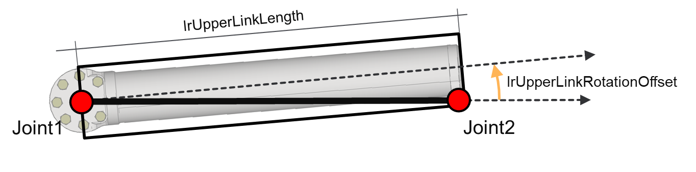
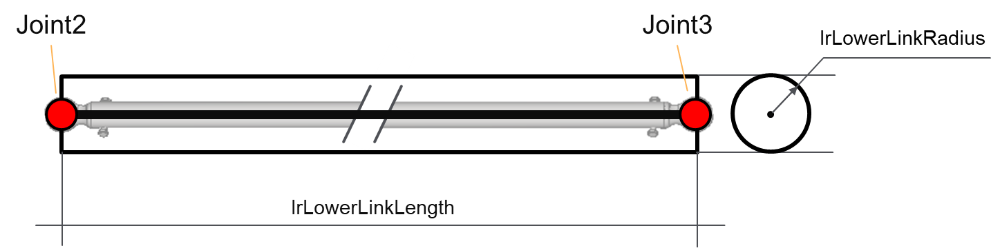
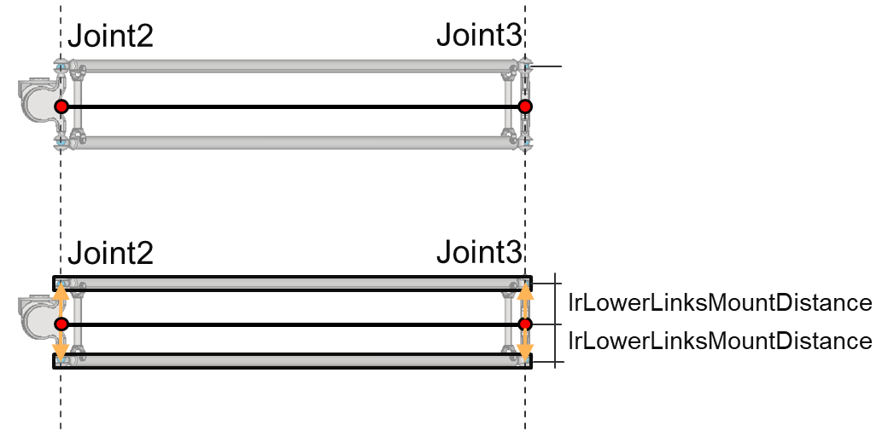
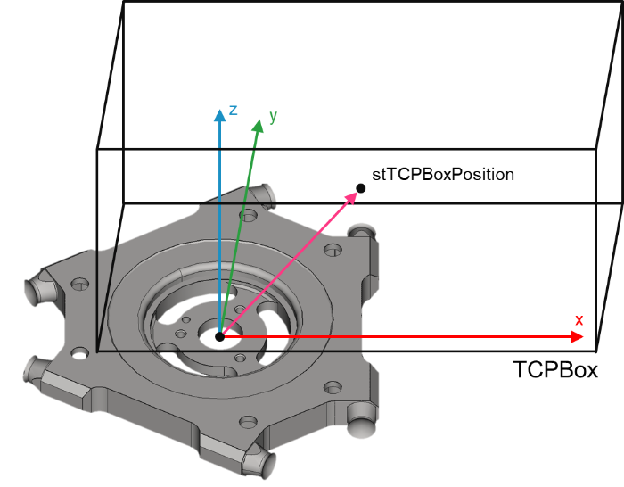
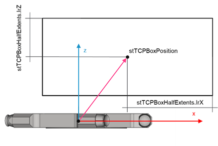

# ST\_Delta3AxGeometry – General Information

## Overview

|  |  |
| --- | --- |
| Type: | Data structure |
| Available as of: | V1.0.0.0 |
| Inherits from: | - |

## Description

A set of parameters describing the geometry of the robotic structure.

## Structure Elements

| Name | Data type | Description |
| --- | --- | --- |
| [lrUpperLinkLength](#ST_Delta3AxGeometry-9CD5944A__LrUpperLinkLength-9CE2A4F9) | LREAL | Length describing the geometry of the upper link; if null, the equivalent kinematic parameter is used instead |
| [lrUpperLinkRadius](#ST_Delta3AxGeometry-9CD5944A__LrUpperLinkRadius-9CE4548F) | LREAL | Radius describing the geometry of the upper link. |
| [lrUpperLinkRotationOffset](#ST_Delta3AxGeometry-9CD5944A__LrUpperLinkRotationOffset-9CE488D2) | LREAL | Angle describing the rotational offset of the upper link geometry compared with the kinematic representation. |
| [lrLowerLinkLength](#ST_Delta3AxGeometry-9CD5944A__LrLowerLinkLength-9CE59A84) | LREAL | Length describing the geometry of the lower link; if null, the equivalent kinematic parameter is used instead. |
| [lrLowerLinkRadius](#ST_Delta3AxGeometry-9CD5944A__LrLowerLinkRadius-9CE7F2A0) | LREAL | Radius describing the geometry of the lower link. |
| [lrLowerLinksMountDistance](#ST_Delta3AxGeometry-9CD5944A__LrLowerLinksMountDistance-9CE817F4) | LREAL | Distance between the parallel lower links. |
| [stTCPBoxPosition](#ST_Delta3AxGeometry-9CD5944A__StTCPBoxPosition-9CEB3477) | SE\_Math.ST\_Vector3D | Position of the TCP box with reference to the TCP frame. |
| [stTCPBoxHalfExtents](#ST_Delta3AxGeometry-9CD5944A__StTCPBoxHalfExtents-9CEB9DC0) | SE\_Math.ST\_Vector3D | Half extents of the TCP box. |

## lrUpperLinkLength

Length of the upper link starting from the Joint1 position. If lrUpperLinkRotationOffset is null, the upper link is aligned to the direction from the Joint1 to the Joint2 position.

The figure shows a representation of the lrUpperLinkLength and lrUpperLinkRadius parameters.

## lrUpperLinkRadius

Radius of the upper link.

## lrUpperLinkRotationOffset

Represents a fixed rotation offset around the axis of the upper link. It changes the direction of the link with reference to the direction from the Joint1 to the Joint2 position.

The figure illustrates the effect of the parameter lrUpperLinkRotationOffset.

This parameter allows to provide a realistic representation of the upper link geometry for a Delta3Ax robot since, most of the time, the segment Joint1–Joint2 is not aligned to the real upper link.

The following figure is an example for the use of the parameter lrUpperLinkRotationOffset.

## lrLowerLinkLength

Length of the lower link, considered along the direction from the Joint2 to the Joint3 position.

The following figure is a representation of the lrLowerLinkLength and lrLowerLinkRadius parameters:

## lrLowerLinkRadius

Radius of the lower link.

## lrLowerLinksMountDistance

This parameter is used to determine the distance of the two real lower links from the Joint2–Joint3 segment defined by the kinematics of the robot.

The following graphic is an example for the use of the parameter lrLowerLinksMountDistance.The view is rotated for a better representation (the leftmost object is the upper link)

## TCP Box

The TCP box is an Oriented Bounding Box (OBB) that can be used to encapsulate the TCP of the robot and eventually a tool (for example a gripper). To do so, it is required to provide the position of the center of the box with reference to the TCP frame and the half extents of the box.

## stTCPBoxPosition

* A 3D vector representing the position of the TCP box with reference to the TCP frame.
* The default value is a null vector, meaning that the center of the TCP box is coincident with the TCP position, at the origin of the TCP frame.

Effect of the parameter stTCPBoxPosition:

Effect of the parameter stTCPBoxPosition (XZ-plane view):

## stTCPBoxHalfExtents

Each element of this vector represents the half extents of the TCP Box along the relative axis.

Half extents along the X-, and Z-axes (XZ-plane view):

Half extents along the X-, and Y-axes (XY-plane view):

EIO0000004468.00

© 2021

Schneider Electric.

All rights reserved.