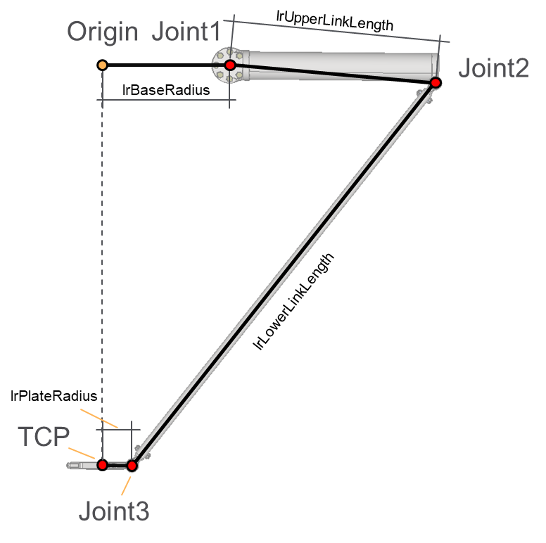
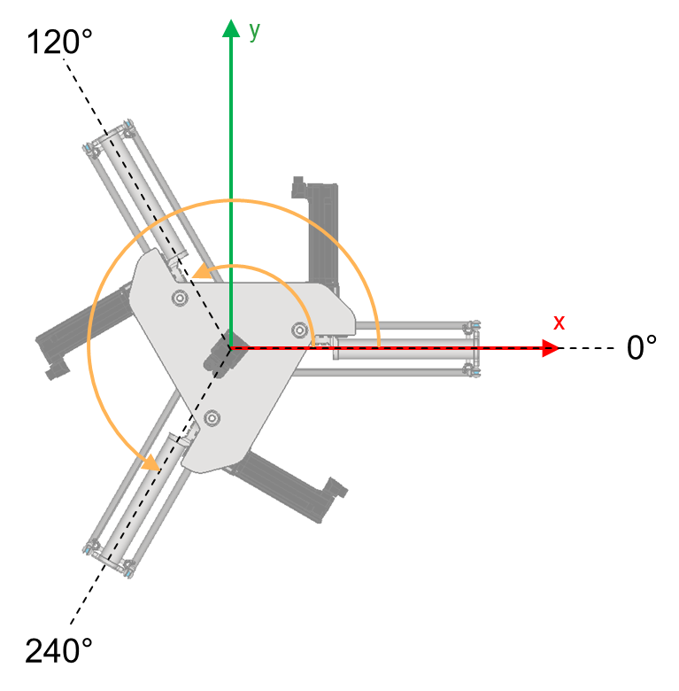

# ST\_Delta3AxKinematics – General Information

## Overview

|  |  |
| --- | --- |
| Type: | Data structure |
| Available as of: | V1.0.0.0 |
| Inherits from: | - |

## Description

A set of parameters used by the kinematics of the robot.

## Structure Elements

| Name | Data type | Description |
| --- | --- | --- |
| lrBaseRadius | LREAL | Base radius value for the robot. |
| lrUpperLinkLength | LREAL | The length of the upper link of the robot. |
| lrPlateRadius | LREAL | The plate radius for the robot. |
| alrChainAngles | ARRAY [1... Gc\_udiDelta3AxNumberOfJoints] OF LREAL | The angle of each chain with reference to the X-axis of the coordinate system of the robot. The default values are [0, 120, 240] degrees. |

Default set of chain angles for a Delta3Ax robot.

EIO0000004468.00

© 2021

Schneider Electric.

All rights reserved.