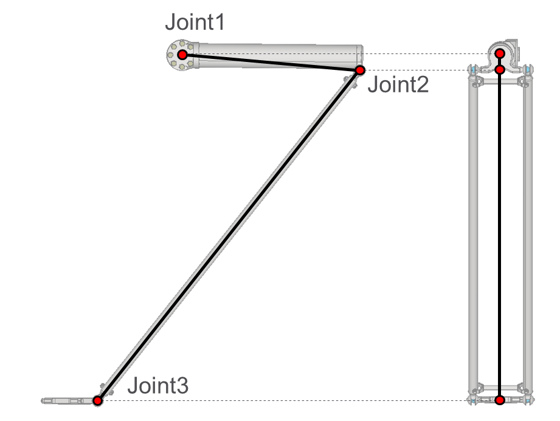
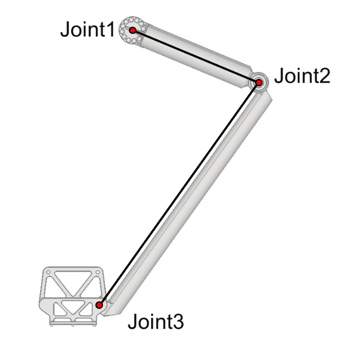

# ST\_DeltaChainDirectKinematicsData – General Information

## Overview

|  |  |
| --- | --- |
| Type: | Data structure |
| Available as of: | V1.0.0.0 |
| Inherits from: | - |

## Description

Contains the results of the direct kinematics performed on a single chain of a Delta robot structure.

The following figure represents Joint1, Joint2 and Joint3 positions for a chain of a Delta3Ax robot:

The following figure represents the Joint1, Joint2 and Joint3 positions for a chain of a Delta2Ax robot.

## Structure Elements

| Name | Data type | Description |
| --- | --- | --- |
| stJoint1Position | SE\_Math.ST\_Vector3D | Cartesian position of joint 1 of the chain. |
| stJoint2Position | SE\_Math.ST\_Vector3D | Cartesian position of joint 2 of the chain. |
| stJoint3Position | SE\_Math.ST\_Vector3D | Cartesian position of joint 3 of the chain. |

EIO0000004468.00

© 2021

Schneider Electric.

All rights reserved.