# ST\_Delta2AxGeometry – General Information

## Overview

|  |  |
| --- | --- |
| Type: | Data structure |
| Available as of: | V1.0.0.0 |
| Inherits from: | - |

## Description

A set of parameters describing the geometry of the robotic structure.

## Structure Elements

| Name | Data type | Description |
| --- | --- | --- |
| [alrUpperLinkLength](#ST_Delta2AxGeometryGeneralInformati-9EE7E971__AlrUpperLinkLength-9EEB0249) | ARRAY [1.. Gc\_udiDelta2AxNumberOfJoints] OF LREAL | Length describing the geometry of the upper link; if null, the equivalent kinematic parameter is used instead. |
| [alrUpperLinkRadius](#ST_Delta2AxGeometryGeneralInformati-9EE7E971__AlrUpperLinkRadius-9EEBADFD) | ARRAY [1.. Gc\_udiDelta2AxNumberOfJoints] OF LREAL | Radius of the upper links. |
| [astUpperLinkMountPositionOffset](#ST_Delta2AxGeometryGeneralInformati-9EE7E971__AstUpperLinkMountPositionOffset-9EEBE832) | ARRAY [1.. Gc\_udiDelta2AxNumberOfJoints] OF SE\_Math.ST\_Vector3D | Mount position offset for the upper links with reference to a frame with origin in the Joint1 position and with X-direction along the Joint1 to Joint2 vector. |
| [axParallelUpperLinks](#ST_Delta2AxGeometryGeneralInformati-9EE7E971__AxParallelUpperLinks-9EECE008) | ARRAY [1.. Gc\_udiDelta2AxNumberOfJoints] OF BOOL | TRUE if there are two parallel upper links. FALSE if a single link is created. |
| [alrLowerLinkLength](#ST_Delta2AxGeometryGeneralInformati-9EE7E971__AlrLowerLinkLength-9EEFB42B) | ARRAY [1.. Gc\_udiDelta2AxNumberOfJoints] OF LREAL | Length describing the geometry of the lower link; if null, the equivalent kinematic parameter is used instead. |
| [alrLowerLinkRadius](#ST_Delta2AxGeometryGeneralInformati-9EE7E971__AlrLowerLinkRadius-9EF06E66) | ARRAY [1.. Gc\_udiDelta2AxNumberOfJoints] OF LREAL | Radius of the lower links. |
| [astLowerLinkMountPositionOffset](#ST_Delta2AxGeometryGeneralInformati-9EE7E971__AstLowerLinkMountPositionOffset-9EF0CB0C) | ARRAY [1.. Gc\_udiDelta2AxNumberOfJoints] OF SE\_Math.ST\_Vector3D | Mount position offset for the lower links with reference to a frame with origin in the Joint1 position and with X-direction along the Joint1 to Joint2 vector. |
| [axParallelLowerLinks](#ST_Delta2AxGeometryGeneralInformati-9EE7E971__AxParallelLowerLinks-9EF20283) | ARRAY [1.. Gc\_udiDelta2AxNumberOfJoints] OF BOOL | TRUE if there are two parallel lower links. FALSE if a single link is created. |
| [stTCPBoxPosition](#ST_Delta2AxGeometryGeneralInformati-9EE7E971__StTCPBoxPosition-9EF7FDA1) | SE\_Math.ST\_Vector3D | Position of the TCP box with reference to the TCP frame. |
| [stTCPBoxHalfExtents](#ST_Delta2AxGeometryGeneralInformati-9EE7E971__StTCPBoxHalfExtents-9EF66826) | SE\_Math.ST\_Vector3D | Half extents of the TCP box. |

## Upper Link Frame

The Upper Link frame has the X-direction oriented as the vector pointing from the Joint1 to the Joint2 position, the Y-axis aligned to the rotational axis of the link and the Z-direction resulting from the right-hand rule.

## Lower Link Frame

The Lower Link frame has the X-direction oriented as the vector pointing from the Joint2 to the Joint3 position, the Y-axis aligned to the rotational axis of the link and the Z-direction resulting from the right-hand rule.

## alrUpperLinkLength

Array of lengths of the upper links. Each length is defined with reference to the upper link frame, starting from the Joint1 position and along the positive X-direction.

The following graphic represents the alrUpperLinkLength and alrUpperLinkRadius parameters for chain 1.

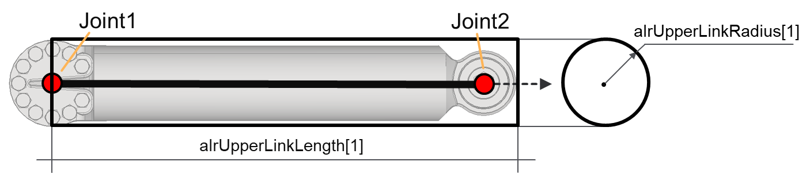

## alrUpperLinkRadius

Array of radiuses of the upper links.

## astUpperLinkMountPositionOffset

Each vector of the array represents a mount position offset with reference to the upper link frame.

The following graphic shows the effect of the parameter astUpperLinkMountPositionOffset for chain 1.

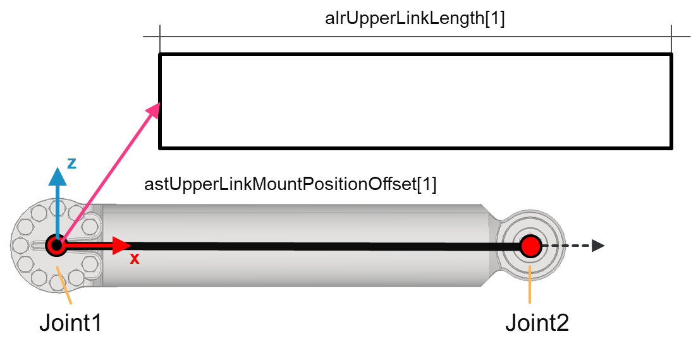

## axParallelUpperLinks

If an element of the array is set to TRUE there are two parallel upper links for the related chain. If astUpperLinkMountPositionOffset is not null, the second link is considered to be symmetric to the first one with reference to the XZ rotational plane of the link.

The graphic shows the effect of the parameter axParallelUpperLinks = TRUE for chain 1.

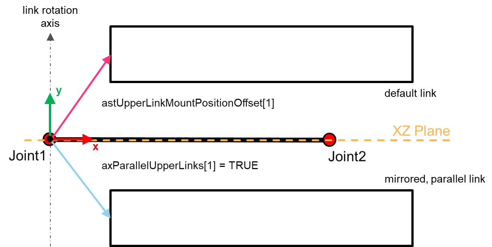

## alrLowerLinkLength

Describes the array of lengths of the lower links. Each length is defined with reference to the lower link frame, starting from the Joint2 position and along the positive X-direction.

The following figure represents the alrLowerLinkLength and alrLowerLinkRadius parameters for chain.

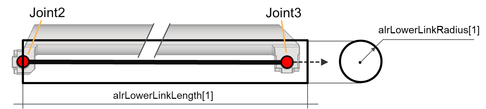

## alrLowerLinkRadius

Array of radiuses of the lower links.

## astLowerLinkMountPositionOffset

Each vector of the array represents a mount position offset with reference to the lower link frame.

The following graphic shows the effect of a null astLowerLinkMountPositionOffset parameter for chain 1.

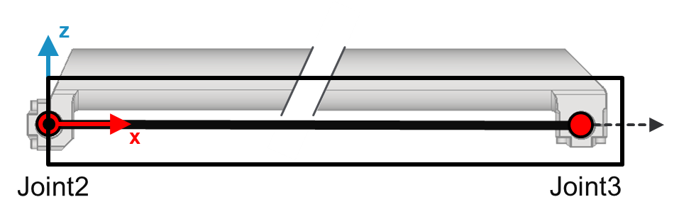

The following graphic shows the effect of the parameter astLowerLinkMountPositionOffset for chain 1.

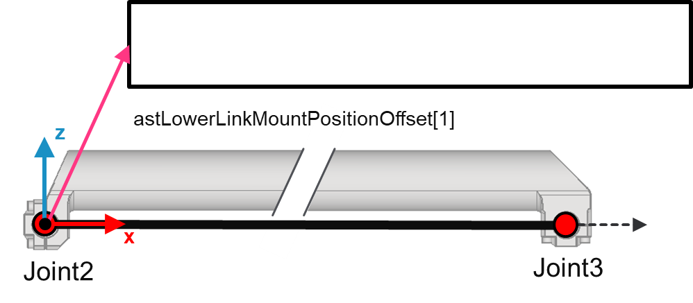

## axParallelLowerLinks

If an element of the array is set to TRUE, there are two parallel lower links for the related chain. If astLowerLinkMountPositionOffset is not null, the second link is considered to be symmetric to the first one with reference to the XZ rotational plane of the link.

The following graphic shows the effect of the parameter axParallelLowerLinks for chain 1.

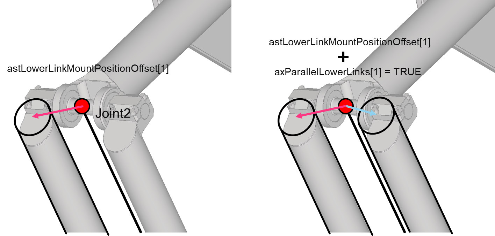

## TCP Box

The TCP box is an Oriented Bounding Box (OBB) that can be used to encapsulate the TCP of the robot and eventually a tool (for example a gripper). To do so, it is required to provide the position of the center of the box with reference to the TCP frame and the half extents of the box.

## stTCPBoxPosition

A 3D vector representing the position of the TCP box with reference to the TCP frame. The default value is a null vector, meaning that the center of the TCP box is coincident with the TCP position, at the origin of the TCP frame.

The following graphic presents the effect of the parameter stTCPBoxPosition (XZ plane view).

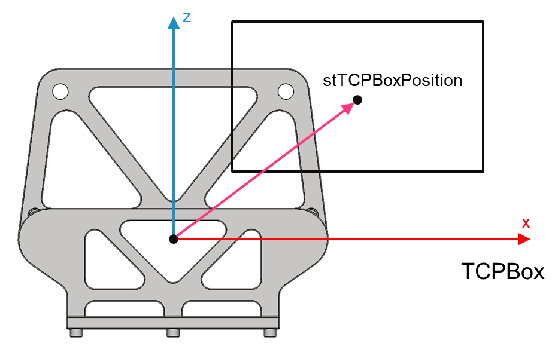

The following graphic presents the effect of the parameter stTCPBoxPosition  (XY plane view).

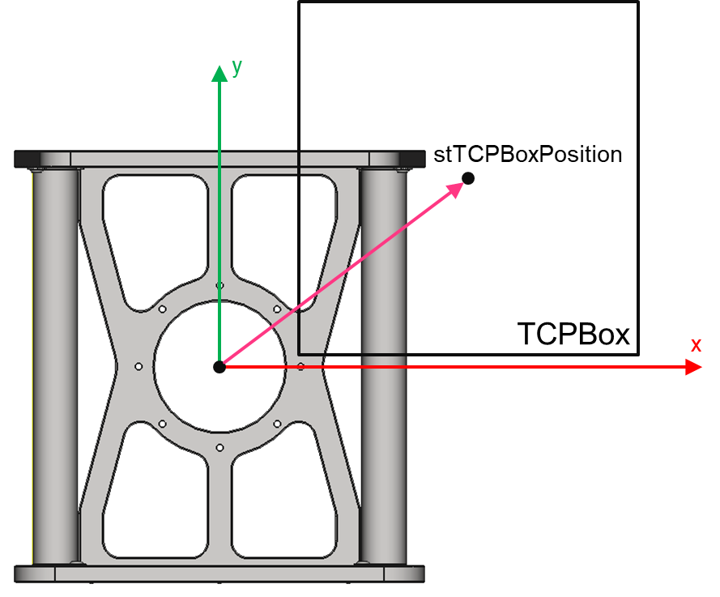

## stTCPBoxHalfExtents

Each element of this vector represents the half extents of the TCP Box along the relative axis.

The following graphics shows the half extents along the X and Z axes (XZ plane view):

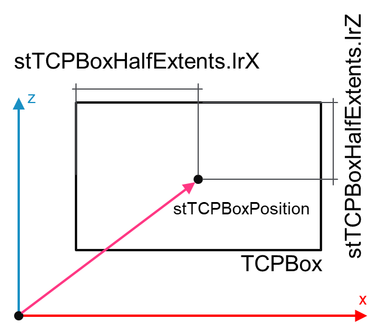

The following graphics shows the half extents along the X and Y axes (XY plane view):

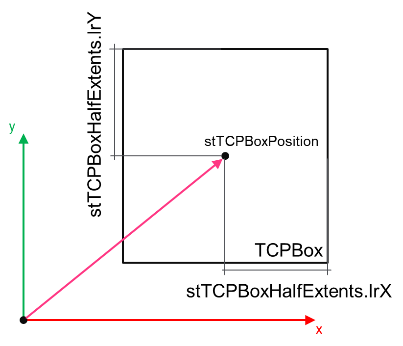

EIO0000004468.00

© 2021

Schneider Electric.

All rights reserved.