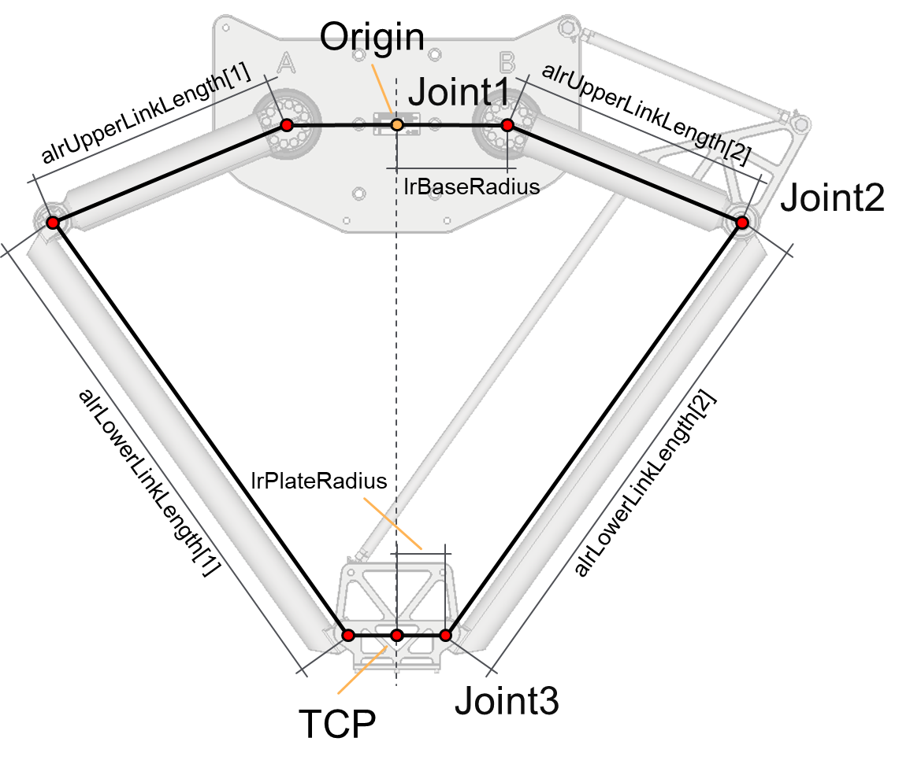

# ST\_Delta2AxKinematics – General Information

## Overview

|  |  |
| --- | --- |
| Type: | Data structure |
| Available as of: | V1.0.0.0 |
| Inherits from: | - |

## Description

A set of parameters used by the kinematics of the robot.

## Structure Elements

| Name | Data type | Description |
| --- | --- | --- |
| lrBaseRadius | LREAL | Base radius of the robot, that is the distance between the origin and one of the motors. |
| alrUpperLinkLength | ARRAY [1.. Gc\_udiDelta2AxNumberOfJoints] OF LREAL | Lengths of the upper links of the robot. |
| alrLowerLinkLength | ARRAY [1.. Gc\_udiDelta2AxNumberOfJoints] OF LREAL | Lengths of the lower links of the robot. |
| lrPlateRadius | LREAL | Plate radius of the robot, that is the distance between the TCP and the connection joint of one of the lower links. |

EIO0000004468.00

© 2021

Schneider Electric.

All rights reserved.