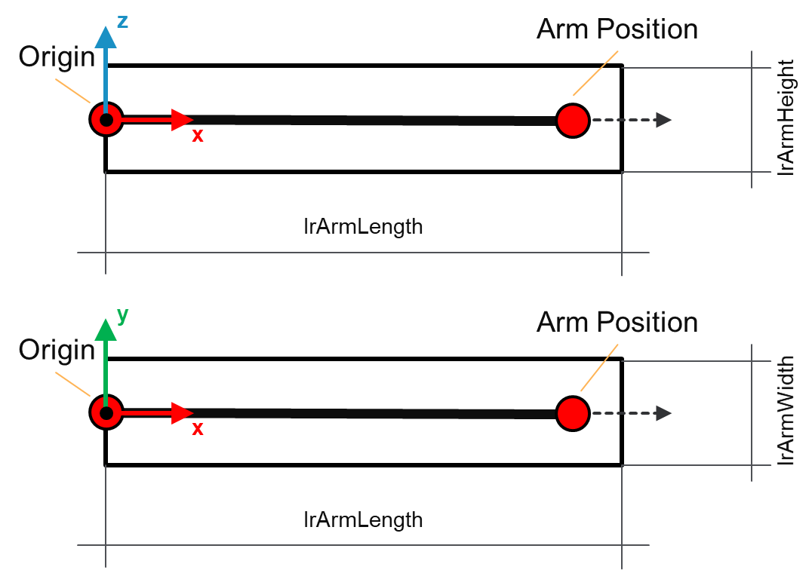
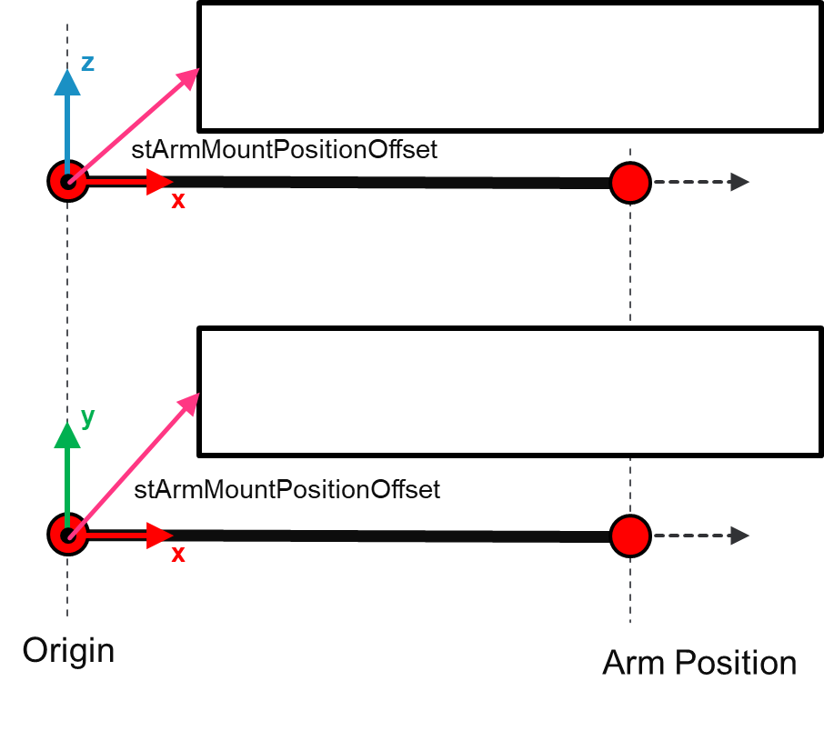
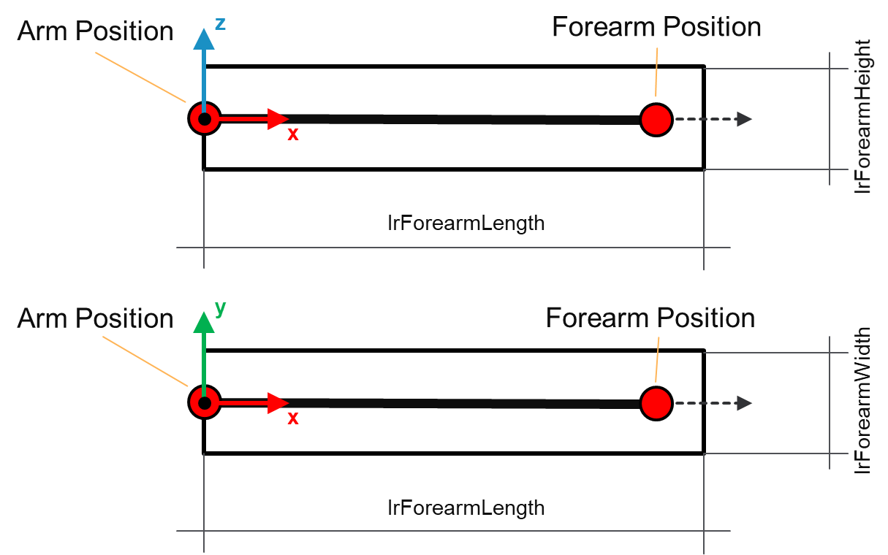
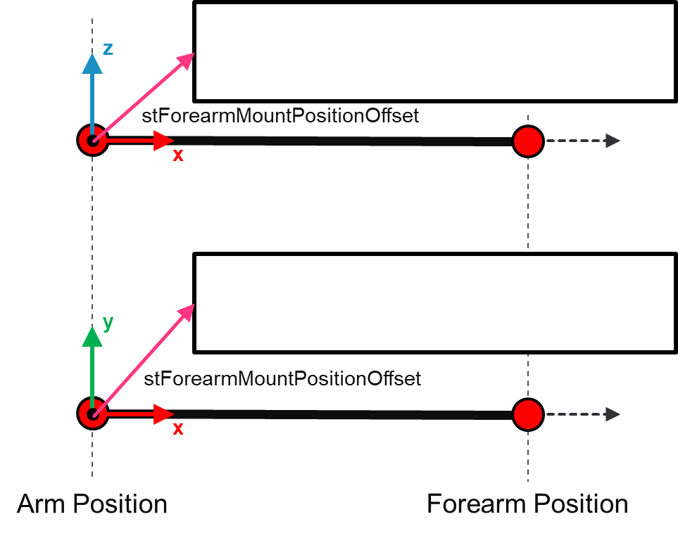
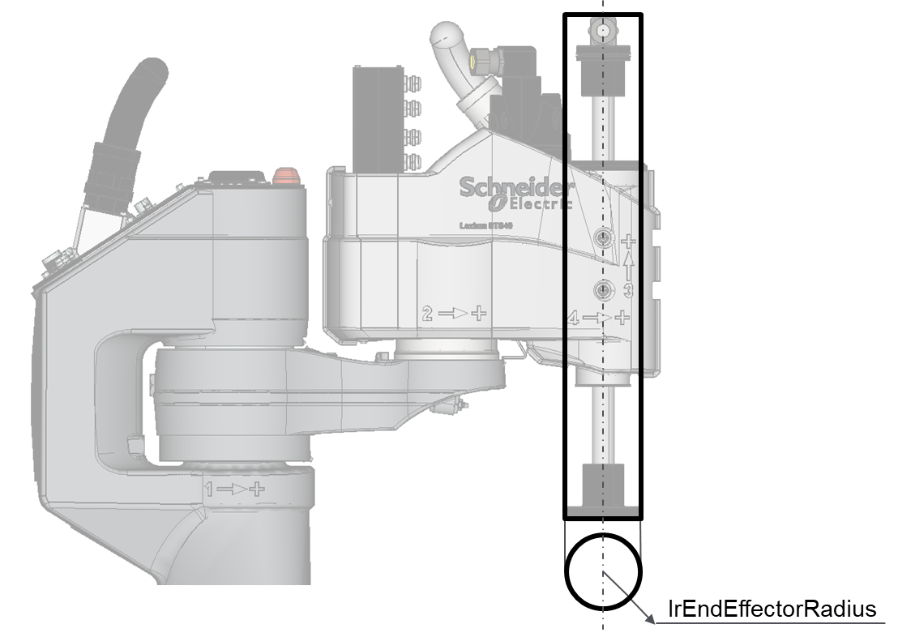
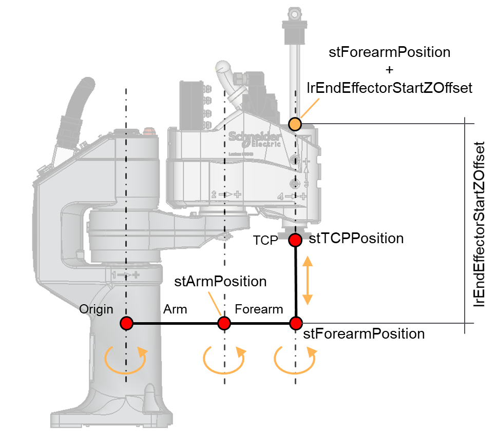
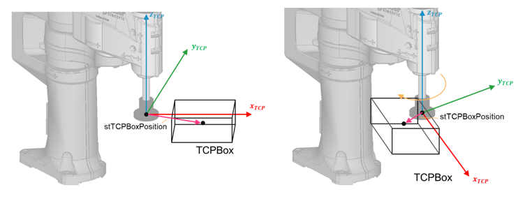

# ST\_SCARA4AxGeometry – General Information

## Overview

|  |  |
| --- | --- |
| Type: | Data structure |
| Available as of: | V1.0.0.0 |
| Inherits from: | - |

## Description

A set of parameters describing the geometry of the robotic structure.

## Structure Elements

| Name | Data type | Description |
| --- | --- | --- |
| [lrArmLength](#ST_SCARA4AxGeometryGeneralInformati-9F6C0310__LrArmLength-9F6E5C36) | LREAL | Arm link length. |
| [lrArmWidth](#ST_SCARA4AxGeometryGeneralInformati-9F6C0310__LrArmWidth-9F6E752B) | LREAL | Arm link width. |
| [lrArmHeight](#ST_SCARA4AxGeometryGeneralInformati-9F6C0310__LrArmHeight-9F6E8967) | LREAL | Arm link height. |
| [stArmMountPositionOffset](#ST_SCARA4AxGeometryGeneralInformati-9F6C0310__StArmMountPositionOffset-9F6EA4EB) | SE\_Math.ST\_Vector3D | Mount position offset of the arm. |
| [lrForearmLength](#ST_SCARA4AxGeometryGeneralInformati-9F6C0310__LrForearmLength-9F6FA964) | LREAL | Forearm length. |
| [lrForearmWidth](#ST_SCARA4AxGeometryGeneralInformati-9F6C0310__LrForearmWidth-9F6FAA66) | LREAL | Forearm width. |
| [lrForearmHeight](#ST_SCARA4AxGeometryGeneralInformati-9F6C0310__LrForearmHeight-9F6FCF85) | LREAL | Forearm height. |
| [stForearmMountPositionOffset](#ST_SCARA4AxGeometryGeneralInformati-9F6C0310__StForearmMountPositionOffset-9F6FD05E) | SE\_Math.ST\_Vector3D | Mount position offset of the forearm. |
| [lrEndEffectorRadius](#ST_SCARA4AxGeometryGeneralInformati-9F6C0310__LrEndEffectorRadius-9F73887E) | LREAL | Radius of the end-effector link. |
| [lrEndEffectorStartZOffset](#ST_SCARA4AxGeometryGeneralInformati-9F6C0310__LrEndEffectorStartZOffset-9F740101) | LREAL | Z-offset for the start position of the end-effector link. |
| [stTCPBoxPosition](#ST_SCARA4AxGeometryGeneralInformati-9F6C0310__StTCPBoxPosition-9F747E6A) | SE\_Math.ST\_Vector3D | Position of the TCP box with reference to the TCP frame. |
| [stTCPBoxHalfExtents](#ST_SCARA4AxGeometryGeneralInformati-9F6C0310__StTCPBoxHalfExtents-9F763DF7) | SE\_Math.ST\_Vector3D | Half extents of the TCP box. |

## ArmLinkFrame

The arm frame has the X-direction oriented as the vector moving from the origin to the arm position, the Z-axis aligned to the rotational axis of the first joint and the Y-direction resulting from the right-hand rule.

## ForearmLinkFrame

The Forearm frame has the X-direction oriented as the vector moving from the arm position to the forearm position, the Z-axis aligned to the rotational axis of the second joint and the Y-direction resulting from the right-hand rule.

## lrArmLength

Length of the arm link considered along the X-direction of the arm frame.

## lrArmWidth

Width of the arm link considered along the Y-direction of the arm frame.

## lrArmHeight

Height of the arm link considered along the Z-direction of the arm frame.

## stArmMountPositionOffset

This vector represents a mount position offset with reference to the arm link frame.

The following graphic shows a side view (XZ) and top view (XY) of the arm link of a SCARA4Ax robot.

The following graphic shows the parameter stArmMountPositionOffset for a SCARA4Ax robot:

## lrForearmLength

Length of the forearm link considered along the X-direction of the forearm frame.

## lrForearmWidth

Width of the forearm link considered along the Y-direction of the forearm frame.

## lrForearmHeight

Height of the forearm link considered along the Z-direction of the forearm frame.

## stForearmMountPositionOffset

This vector represents a mount position offset with reference to the forearm link frame.

The following graphic shows the side view (XZ) and top view (XY) of the forearm link of a SCARA4Ax robot:

The following graphic shows the parameter stForearmMountPositionOffset for a SCARA4Ax robot:

## lrEndEffectorRadius

Radius of the end-effector link.

The following graphic shows the parameter lrEndEffectorRadius for a SCARA4Ax robot:

## lrEndEffectorStartZOffset

By default, the top size of the end-effector link is at the position of the forearm. This value is added to the Z-coordinate of the forearm position.

The following graphic shows the parameter lrEndEffectorStartZOffset for a SCARA4Ax robot:

## TCP Box

The TCP box is an Oriented Bounding Box (OBB) that can be used to encapsulate the TCP of the robot and eventually a tool (for example a gripper). To do so, it is required to provide the position of the center of the box with reference to the TCP frame and the half extents of the box.

## stTCPBoxPosition

A 3D vector representing the position of the TCP box with reference to the TCP frame. The default value is a null vector, meaning that the center of the TCP box is coincident with the TCP position, at the origin of the TCP frame.

In the case of a SCARA4Ax robot, the TCP orientation is also considered: a rotation of the end-effector changes the orientation of the TCP frame and then causes the position stTCPBoxPosition to rotate accordingly.

The following graphic shows the effect of the parameter stTCPBoxPosition for a SCARA4Ax robot;

## stTCPBoxHalfExtents

Each element of this vector represents the half extents of the TCP Box along the relative axis.

The following graphic shows the half extents along the X-, and Z-axes (XZ-plane view):

The following graphic shows the half extents along the X- and Y-axes (XY-plane view):

EIO0000004468.00

© 2021

Schneider Electric.

All rights reserved.