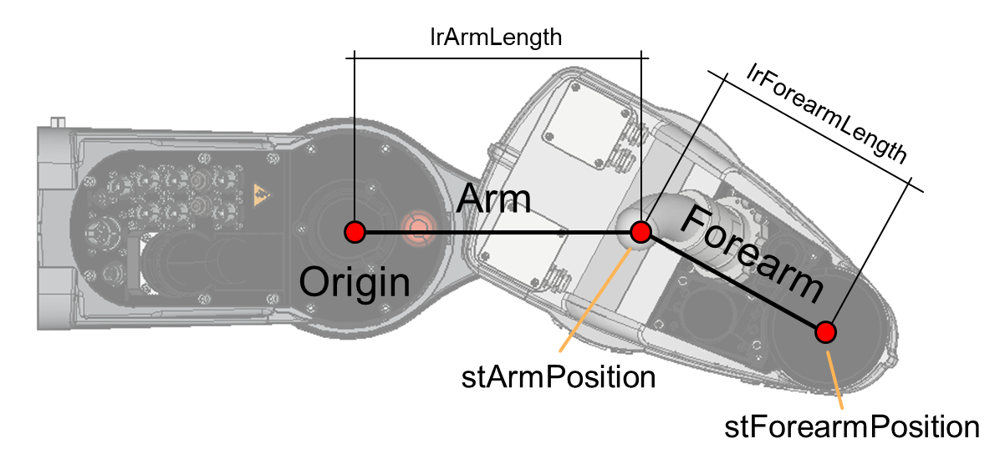

# ST\_SCARA4AxKinematics – General Information

## Overview

|  |  |
| --- | --- |
| Type: | Data structure |
| Available as of: | V1.0.0.0 |
| Inherits from: | - |

## Description

A set of parameters used by the kinematics of the robot.

The following graphic shows the Kinematic parameters for a SCARA4Ax robot:

## Structure Elements

| Name | Data type | Description |
| --- | --- | --- |
| lrArmLength | LREAL | The length of the arm of the robot. |
| lrForearmLength | LREAL | The length of the forearm of the robot. |

EIO0000004468.00

© 2021

Schneider Electric.

All rights reserved.