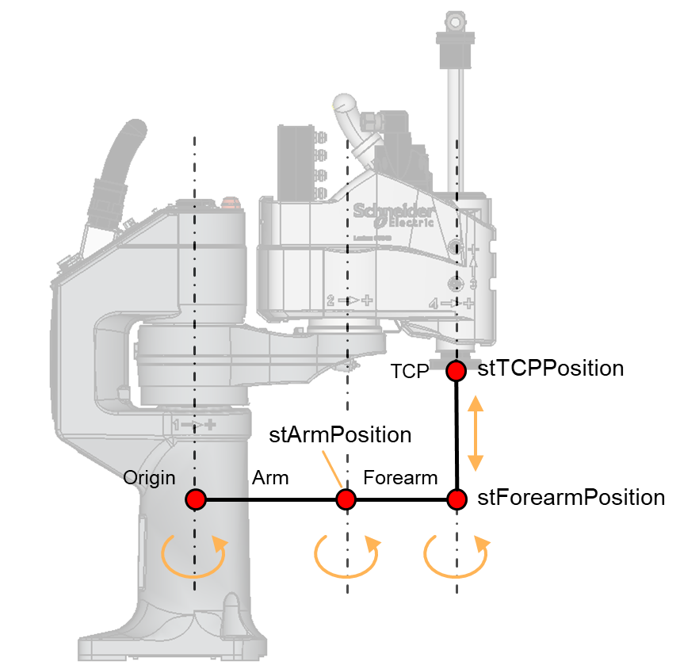

# ST\_SCARA4AxKinematicsResult – General Information

## Overview

|  |  |
| --- | --- |
| Type: | Data structure |
| Available as of: | V1.0.0.0 |
| Inherits from: | - |

## Description

Contains the results of the kinematics performed on a SCARA4Ax robot structure.

## Structure Elements

| Name | Data type | Description |
| --- | --- | --- |
| alrJointPositions | ARRAY [1..Gc\_udiSCARA4AxNumberOfJoints] OF LREAL | Joint positions used to evaluate the solution. |
| stArmPosition | SE\_Math.ST\_Vector3D | Position of the tip of the arm. |
| stForearmPosition | SE\_Math.ST\_Vector3D | Position of the tip of the forearm. |
| stTCPPosition | SE\_Math.ST\_Vector3D | Position of the TCP. |
| stTCPOrientation | SE\_Math.ST\_Matrix3D | Orientation of the TCP. |
| etShoulderConfiguration | [ET\_ArmConfiguration](ET_ShoulderConfigurationEnumerator-9BE27E95.html#ET_ShoulderConfigurationEnumerator-9BE27E95) | Configuration of the shoulder. |
| xIsResultValid | BOOL | TRUE if the result is valid, FALSE otherwise. |

EIO0000004468.00

© 2021

Schneider Electric.

All rights reserved.