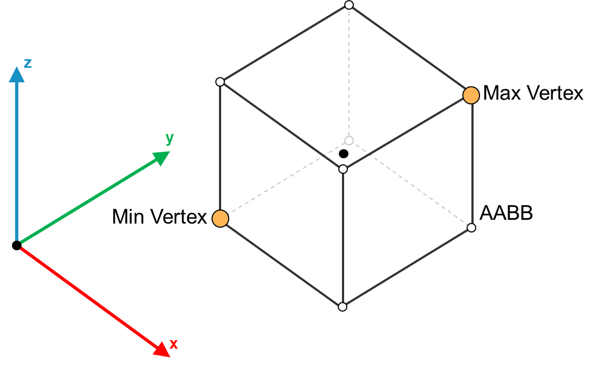

# IF\_AABB – SetMinMaxVertices (Method)

## Overview

|  |  |
| --- | --- |
| Type: | Method |
| Available as of: | V1.0.0.0 |

This chapter provides information on:

* [Task](#SetMinMaxVerticesMethod-A0FC7A02__Task-A3042115)
* [Description](#SetMinMaxVerticesMethod-A0FC7A02__Description-C486D7D5)
* [Interface](#SetMinMaxVerticesMethod-A0FC7A02__Interface-A0FD969B)

## Task

This method is used to initialize an AABB object by setting its minimum and maximum vertices; the full list of vertices, the center and the half extents of the AABB are evaluated accordingly.

## Description

This method can be called multiple times to reconfigure the object.

The following graphic shows the minimum and maximum vertices for an AABB collision object:

## Interface

Access: PUBLIC

| Input | Data type | Description |
| --- | --- | --- |
| i\_stMinVertex | SE\_Math.ST\_Vector3D | The minimum vertex among the vertices of the AABB object. |
| i\_stMaxVertex | SE\_Math.ST\_Vector3D | The maximum vertex among the vertices of the AABB object. |

| Output | Data type | Description |
| --- | --- | --- |
| q\_xError | BOOL | The output is set to TRUE if an error has been detected during the execution. |
| q\_etResult | [ET\_Result](ET_ResultEnumerator-9BCEF714.html#ET_ResultEnumerator-9BCEF714) | POU-specific output on the diagnostic; q\_xError = FALSE -> Status message; q\_xError = TRUE -> Diagnostic message. |
| q\_sResultMsg | STRING(80) | Event-triggered message that gives additional information on the diagnostic state. |

EIO0000004468.00

© 2021

Schneider Electric.

All rights reserved.