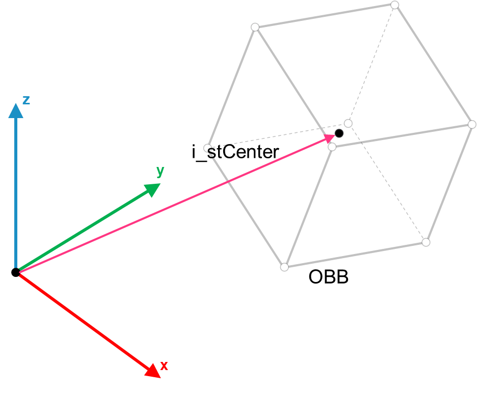
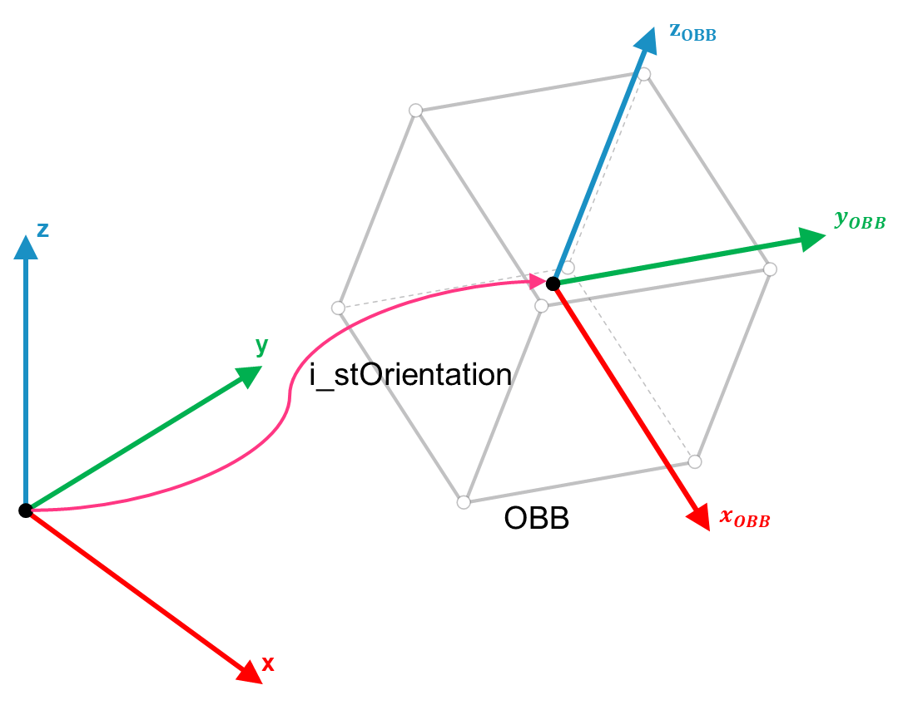
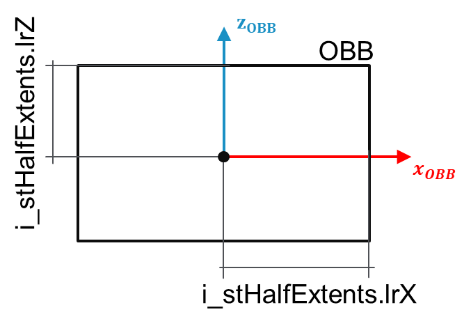
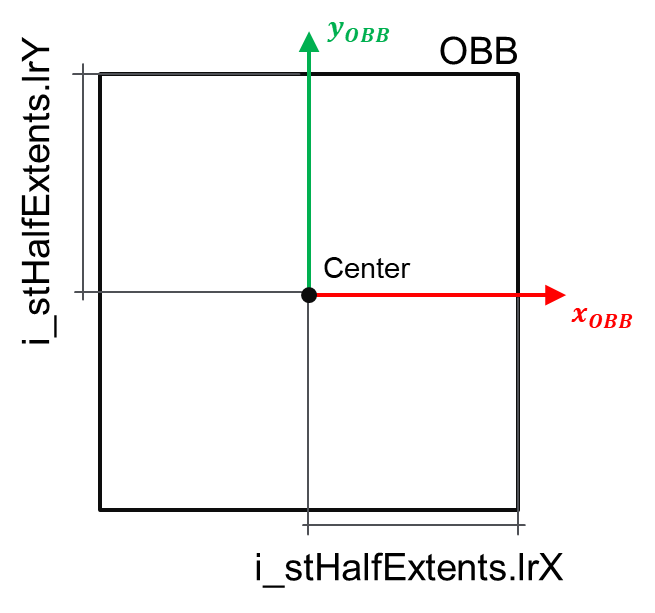

# IF\_OBB – SetCenterHalfExtentsOrientation (Method)

## Overview

|  |  |
| --- | --- |
| Type: | Method |
| Available as of: | V1.0.0.0 |

This chapter provides information on:

* [Task](#SetCenterHalfExtentsOrientationMeth-A27D15E9__Task-A306B325)
* [Description](#SetCenterHalfExtentsOrientationMeth-A27D15E9__Description-A27D6988)
* [Interface](#SetCenterHalfExtentsOrientationMeth-A27D15E9__Interface-A27DB514)

## Task

This method is used to initialize an OBB object by setting its center, half extents and orientation. The resulting list of vertices is evaluated accordingly.

## Description

This method can be called multiple times to reconfigure the object.

The function GEM.FC\_OrientationToRotationMatrix can be used for the conversion of the orientation from a roll, pitch and yaw representation to a 3D rotation matrix representation required by i\_stOrientation.

## Interface

Access: PUBLIC

| Input | Data type | Description |
| --- | --- | --- |
| [i\_stCenter](#SetCenterHalfExtentsOrientationMeth-A27D15E9__IstCenter-A27E35F8) | SE\_Math.ST\_Vector3D | The center of the OBB bounding volume. |
| i\_stHalfExtents | SE\_Math.ST\_Vector3D | Each element of this 3D vector represents the half extents of the OBB object along the X-, Y- and Z-axes of the OBB frame. |
| [i\_stOrientation](#SetCenterHalfExtentsOrientationMeth-A27D15E9__I_stOrientation-A27F604E) | SE\_Math.ST\_Matrix3D | Orientation of the OBB described as a rotation matrix. |

| Output | Data type | Description |
| --- | --- | --- |
| q\_xError | BOOL | The output is set to TRUE if an error has been detected during the execution. |
| q\_etResult | ET\_Result | POU-specific output on the diagnostic; q\_xError = FALSE -> Status message; q\_xError = TRUE -> Diagnostic message. |
| q\_sResultMsg | STRING(80) | Event-triggered message that gives additional information on the diagnostic state. |

## i\_stCenter

Describes the position of the center of the OBB with reference to a global coordinate system.

The following figure shows the position of the center of an OBB object.

## i\_stOrientation

Describes the orientation of the OBB with reference to a global coordinate system.

The following figure shows the orientation of an OBB object:

The following figure is a representation of the i\_stHalfExtents parameters (XZ-plane view):

The following figure is a representation of the i\_stHalfExtents parameters (XY-plane view):

EIO0000004468.00

© 2021

Schneider Electric.

All rights reserved.