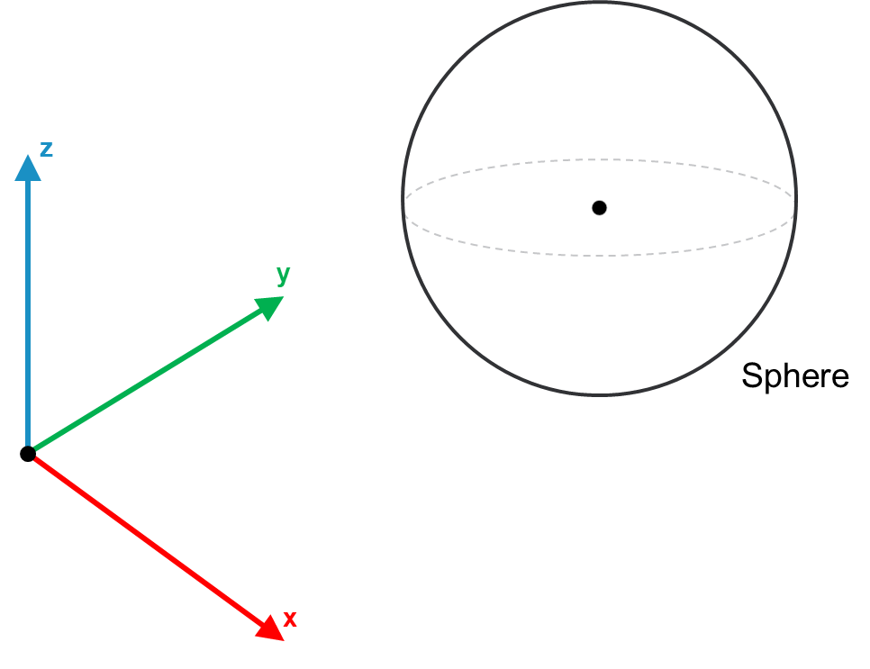

# IF\_Sphere – General Information

## Overview

|  |  |
| --- | --- |
| Type: | Interface |
| Available as of: | V1.0.0.0 |
| Inherits from: | - |

This chapter provides information on:

* [Task](#IF_SphereGeneralInformation-A284B825__Task-A285014F)
* [Description](#IF_SphereGeneralInformation-A284B825__Description-A2850C85)
* [Method SetCenterRadius](SetCenterRadiusGeneralInformation-A2886B35.html#SetCenterRadiusGeneralInformation-A2886B35)
* [Properties](#IF_SphereGeneralInformation-A284B825__Properties-A289CA89)

## Task

Interface for a Sphere collision object.

## Description

Interface for a Sphere collision object. A sphere is defined by the position of its center and its radius.

The following figure represents a Sphere object:

## Properties

| Name | Data type | Accessing | Description |
| --- | --- | --- | --- |
| rstCenter | REFERENCE TO SE\_Math.ST\_Vector3D | Get | Center of the Sphere object. |
| lrRadius | LREAL | Get | Radius of the Sphere object. |
| etType | [ET\_CollisionObjectType](ET_CollisionObjectTypeEnumerator-9BDA75F7.html#ET_CollisionObjectTypeEnumerator-9BDA75F7) | Get | This property describes the type of bounding volume implemented by the object. |
| xConfigured | BOOL | Get | The value of this property is TRUE if the object has been properly initialized, FALSE otherwise. |

EIO0000004468.00

© 2021

Schneider Electric.

All rights reserved.